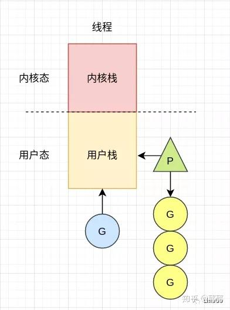
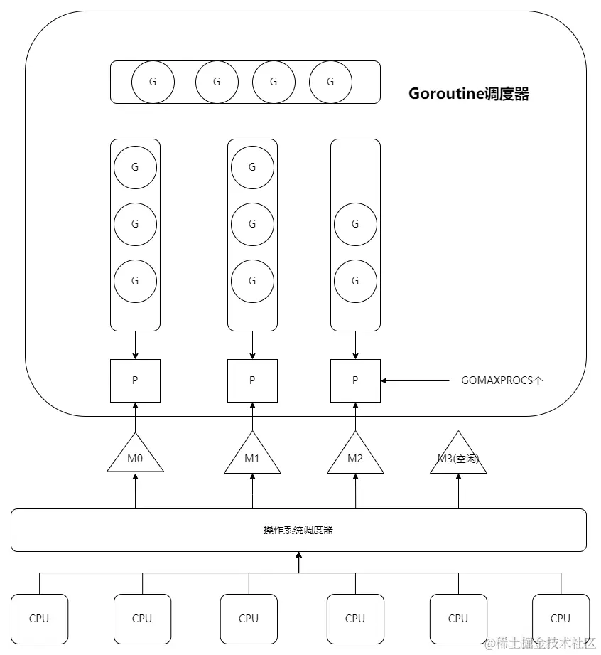
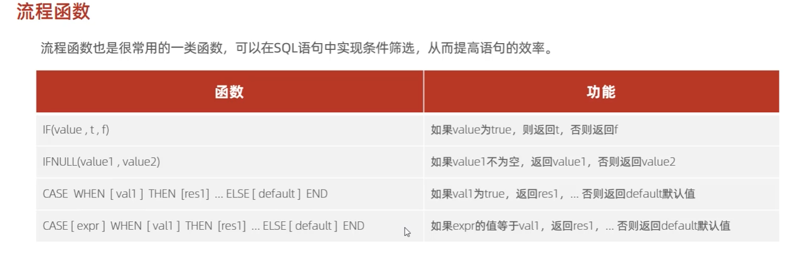
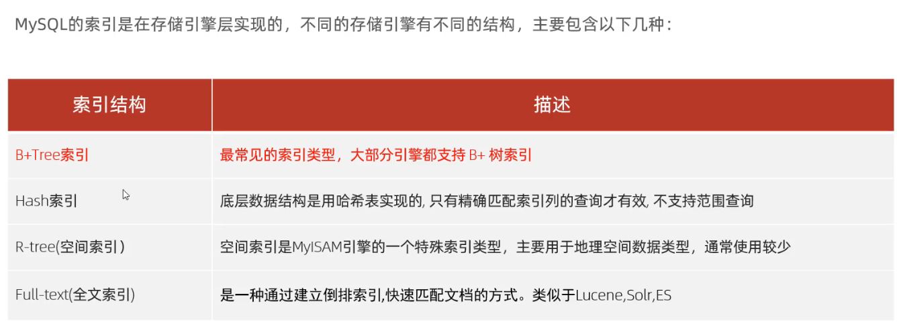
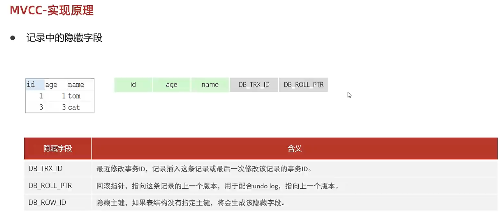
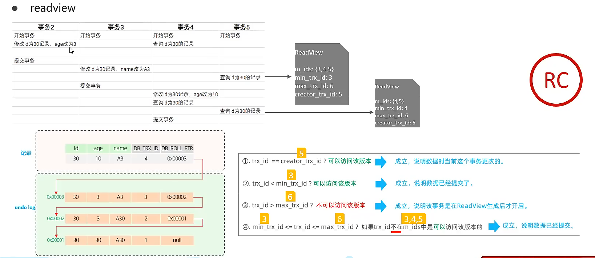

## Go

### 杂谈

#### 环境变量

Go 开发环境依赖于一些操作系统环境变量，你最好在安装 Go 之前就已经设置好他们。如果你使用的是 Windows 的话，你完全不用进行手动设置，Go 将被默认安装在目录 `c:/go` 下。这里列举几个最为重要的环境变量：

- **$GOROOT** 表示 Go 在你的电脑上的安装位置，它的值一般都是 `$HOME/go`，当然，你也可以安装在别的地方。
- **$GOARCH** 表示目标机器的处理器架构，它的值可以是 386、amd64 或 arm。
- **$GOOS** 表示目标机器的操作系统，它的值可以是 darwin、freebsd、linux 或 windows。
- **$GOBIN** 表示编译器和链接器的安装位置，默认是 `$GOROOT/bin`，如果你使用的是 Go 1.0.3 及以后的版本，一般情况下你可以将它的值设置为空，Go 将会使用前面提到的默认值。

Go 编译器支持交叉编译，也就是说你可以在一台机器上构建能够在不同操作系统和处理器架构上运行的应用程序，也就是说编写源代码的机器可以和目标机器有完全不同的特性（操作系统与处理器架构）。

为了区分本地机器和目标机器，你可以使用 `$GOHOSTOS` 和 `$GOHOSTARCH` 设置本地机器的操作系统名称和编译体系结构，这两个变量只有在进行交叉编译的时候才会用到，如果你不进行显示设置，他们的值会和本地机器（`$GOOS` 和 `$GOARCH`）一样。

- **$GOPATH** 默认采用和 `$GOROOT` 一样的值，但从 Go 1.1 版本开始，你必须修改为其它路径。它可以包含多个 Go 语言源码文件、包文件和可执行文件的路径，而这些路径下又必须分别包含三个规定的目录：`src`、`pkg` 和 `bin`，这三个目录分别用于存放源码文件、包文件和可执行文件。
- **$GOARM** 专门针对基于 arm 架构的处理器，它的值可以是 5 或 6，默认为 6。
- **$GOMAXPROCS** 用于设置应用程序可使用的处理器个数与核数

#### Runtime

尽管 Go 编译器产生的是本地可执行代码，这些代码仍旧运行在 Go 的 runtime（这部分的代码可以在 `runtime` 包中找到）当中。这个 runtime 类似 Java 和 .NET 语言所用到的虚拟机，它负责管理包括内存分配、垃圾回收（[第 10.8 节](https://github.com/unknwon/the-way-to-go_ZH_CN/blob/master/eBook/10.8.md)）、栈处理、goroutine、channel、切片 (slice)、map 和反射 (reflection) 等等。

#### 与C语言进行交互

工具 cgo 提供了对 FFI（外部函数接口）的支持，能够使用 Go 代码安全地调用 C 语言库，你可以访问 cgo 文档主页：http://golang.org/cmd/cgo。cgo 会替代 Go 编译器来产生可以组合在同一个包中的 Go 和 C 代码。在实际开发中一般使用 cgo 创建单独的 C 代码包。

如果你想要在你的 Go 程序中使用 cgo，则必须在单独的一行使用 `import "C"` 来导入，一般来说你可能还需要 `import "unsafe"`。

然后，你可以在 `import "C"` 之前使用注释（单行或多行注释均可）的形式导入 C 语言库（甚至有效的 C 语言代码），它们之间没有空行，例如：

```go
// #include <stdio.h>
// #include <stdlib.h>
import "C"
```

名称 "C" 并不属于标准库的一部分，这只是 cgo 集成的一个特殊名称用于引用 C 的命名空间。在这个命名空间里所包含的 C 类型都可以被使用，例如 `C.uint`、`C.long` 等等，还有 libc 中的函数 `C.random()` 等也可以被调用。

当你想要使用某个类型作为 C 中函数的参数时，必须将其转换为 C 中的类型，反之亦然，例如：

```go
var i int
C.uint(i) 		// 从 Go 中的 int 转换为 C 中的无符号 int
int(C.random()) // 从 C 中 random() 函数返回的 long 转换为 Go 中的 int
```

下面的 2 个 Go 函数 `Random()` 和 `Seed()` 分别调用了 C 中的 `C.random()` 和 `C.srandom()`。

示例 3.2 [c1.go](https://github.com/unknwon/the-way-to-go_ZH_CN/blob/master/eBook/examples/chapter_3/CandGo/c1.go)

```go
package rand

// #include <stdlib.h>
import "C"

func Random() int {
	return int(C.random())
}

func Seed(i int) {
	C.srandom(C.uint(i))
}
```

C 当中并没有明确的字符串类型，如果你想要将一个 `string` 类型的变量从 Go 转换到 C 时，可以使用 `C.CString(s)`；同样，可以使用 `C.GoString(cs)` 从 C 转换到 Go 中的 `string` 类型。

Go 的内存管理机制无法管理通过 C 代码分配的内存。

开发人员需要通过手动调用 `C.free` 来释放变量的内存：

```go
defer C.free(unsafe.Pointer(Cvariable))
```

### 核心架构和技术

#### const中的枚举

`iota` 可以被用作枚举值：

```go
const (
	a = iota
	b = iota
	c = iota
)
```


第一个 `iota` 等于 0，每当 `iota` 在新的一行被使用时，它的值都会自动加 1，并且没有赋值的常量默认会应用上一行的赋值表达式：

```go
// 赋值一个常量时，之后没赋值的常量都会应用上一行的赋值表达式
const (
	a = iota  // a = 0
	b         // b = 1
	c         // c = 2
	d = 5     // d = 5   
	e         // e = 5
)

// 赋值两个常量，iota 只会增长一次，而不会因为使用了两次就增长两次
const (
	Apple, Banana = iota + 1, iota + 2 // Apple=1 Banana=2
	Cherimoya, Durian                  // Cherimoya=2 Durian=3
	Elderberry, Fig                    // Elderberry=3, Fig=4

)

// 使用 iota 结合 位运算 表示资源状态的使用案例
const (
	Open = 1 << iota  // 0001
	Close             // 0010
	Pending           // 0100
)

const (
	_           = iota             // 使用 _ 忽略不需要的 iota
	KB = 1 << (10 * iota)          // 1 << (10*1)
	MB                             // 1 << (10*2)
	GB                             // 1 << (10*3)
	TB                             // 1 << (10*4)
	PB                             // 1 << (10*5)
	EB                             // 1 << (10*6)
	ZB                             // 1 << (10*7)
	YB                             // 1 << (10*8)
)
```

`iota` 也可以用在表达式中，如：`iota + 50`。在每遇到一个新的常量块或单个常量声明时， `iota` 都会重置为 0（ **简单地讲，每遇到一次 const 关键字，`iota` 就重置为 0** ）。

#### 位运算

位运算只能用于整数类型的变量，且需当它们拥有等长位模式时。

`%b` 是用于表示位的格式化标识符。

**二元运算符**

- 按位与 `&`：

  对应位置上的值经过和运算结果，具体参见和运算符（第 4.5.1 节），并将 T (true) 替换为 `1`，将 F (false) 替换为 `0`

  ```
    1 & 1 -> 1
    1 & 0 -> 0
    0 & 1 -> 0
    0 & 0 -> 0
  ```

  

- 按位或 `|`：

  对应位置上的值经过或运算结果，具体参见或运算符（第 4.5.1 节），并将 T (true) 替换为 `1`，将 F (false) 替换为 `0`

  ```
    1 | 1 -> 1
    1 | 0 -> 1
    0 | 1 -> 1
    0 | 0 -> 0
  ```

  

- 按位异或 `^`：

  对应位置上的值根据以下规则组合：

  ```
    1 ^ 1 -> 0
    1 ^ 0 -> 1
    0 ^ 1 -> 1
    0 ^ 0 -> 0
  ```

  

- 位清除 `&^`：将指定位置上的值设置为 `0`。

  ```
   package main
   import "fmt"
   func main() {
   	var x uint8 = 15
   	var y uint8 = 4
   	fmt.Printf("%08b\n", x &^ y);  // 00001011
   }
  ```

**一元运算符**

- 按位取反 `^`：*该运算符与异或运算符一同使用，即 `m^x`，对于无符号 `x` 使用 “全部位设置为 1” 的规则，对于有符号 `x` 时使用 `m=-1`*。在计算机中，正数负数都以的补码形式存在。而正数补码等于源码。

  ```go
  ^10 = -01 ^ 10 = -11 //十进制示意
  // 二进制与十进制关系：补码表示法
  // 正数的补码和原码相同。负数的补码是其原码按位取反后，加 1。
  // 10 = 0000 1010 , ^10 = 1111 0101 是负数
  // 1111 0101 的补码是0000 1011 
  // 负数的表示：取补码加负号 即binary(0000 1011) = 11, binary(1111 0101) = -11 = ^10
  ```

  符号位的变化使得按位取反后的数值遵循 `^a = -(a + 1)` 的规律（对于有符号整数）。

- 位左移 `<<`：

  - 用法：`bitP << n`。

  - `bitP` 的位向左移动 `n` 位，右侧空白部分使用 0 填充；如果 `n` 等于 2，则结果是 2 的相应倍数，即 2 的 `n` 次方。例如：

    ```
      1 << 10 // 等于 1 KB
      1 << 20 // 等于 1 MB
      1 << 30 // 等于 1 GB
    ```

    

- 位右移 `>>`：

  - 用法：`bitP >> n`。
  - `bitP` 的位向右移动 `n` 位，左侧空白部分使用 0 填充；如果 `n` 等于 2，则结果是当前值除以 2 的 n 次方。

当希望把结果赋值给第一个操作数时，可以简写为 `a <<= 2` 或者 `b ^= a & 0xffffffff`。

**位左移常见实现存储单位的用例**

使用位左移与 `iota` 计数配合可优雅地实现存储单位的常量枚举：

```
type ByteSize float64
const (
	_ = iota // 通过赋值给空白标识符来忽略值
	KB ByteSize = 1<<(10*iota)
	MB
	GB
	TB
	PB
	EB
	ZB
	YB
)
```

**在通讯中使用位左移表示标识的用例**

```go
type BitFlag int
const (
	Active BitFlag = 1 << iota // 1 << 0 == 1
	Send // 1 << 1 == 2
	Receive // 1 << 2 == 4
)

flag := Active | Send // == 3
```

#### 常见的进制前缀表示

| 前缀   | 进制             | 示例                 | 说明                           |
| ------ | ---------------- | -------------------- | ------------------------------ |
| `0x`   | 十六进制 (Hex)   | `0x1F` (31 十进制)   | `x` 大小写均可，表示 16 进制。 |
| `0`    | 八进制 (Octal)   | `075` (61 十进制)    | 不推荐使用，部分语言已弃用。   |
| `0b`   | 二进制 (Binary)  | `0b1011` (11 十进制) | 表示 2 进制，`b` 大小写均可。  |
| `0o`   | 八进制 (Octal)   | `0o71` (57 十进制)   | 更清晰的八进制表示 (Python)。  |
| 无前缀 | 十进制 (Decimal) | `42`                 | 默认数值形式 (10 进制)。       |

`\0` 开头，后跟 1-3 位八进制数。如`\101` 表示 `A`。

**`\u`** 前缀表示，4 位十六进制数，表示 BMP 范围字符（范围：`0000` 到 `FFFF`）。

 ```go 
 fmt.Println("\u4F60") // 输出：你
 ```

**`\U`** 总是跟 8 位十六进制数，表示完整 Unicode 范围，包括超出 BMP 的字符。

```
var ch int = '\u0041'
var ch2 int = '\u03B2'
var ch3 int = '\U00101234'
fmt.Printf("%d - %d - %d\n", ch, ch2, ch3) // integer 65 - 946 - 1053236
fmt.Printf("%c - %c - %c\n", ch, ch2, ch3) // character A - β - r
fmt.Printf("%X - %X - %X\n", ch, ch2, ch3) // UTF-8 bytes 41 - 3B2 - 101234
fmt.Printf("%U - %U - %U", ch, ch2, ch3) // UTF-8 code point U+0041 - U+03B2 - U+101234
```

#### 闭包

闭包是一个可以捕获其外部作用域（环境）变量的函数。它使得函数能够“记住”它创建时的外部状态，并在调用时继续访问和操作这些变量。这些被捕获的变量会随着闭包一起存在，直到闭包被销毁。闭包会保持对这些变量的引用，因此这些变量不会被销毁，直到闭包本身被销毁。

```go
func main() {
    // 创建一个闭包
    counter := createCounter()
    // 调用闭包，修改内部变量
    fmt.Println(counter()) // 输出: 1
    fmt.Println(counter()) // 输出: 2
    fmt.Println(counter()) // 输出: 3
}
// 返回一个闭包
func createCounter() func() int {
    count := 0
    // 这个匿名函数会捕获 `count` 变量
    return func() int {
        count++
        return count
    }
}
```

通过闭包可以实现只能用函数制定的方式操作变量，比如add()等

- **闭包**是一个函数，它不仅包括函数的代码，还包含对外部作用域中变量的引用。

- 它允许函数“记住”并操作创建它时的状态，直到闭包本身被销毁。

- 闭包广泛应用于数据封装、回调函数、延迟执行等场景。


### Syntax

#### 常见内置包

- `archive/tar` 和 `/zip-compress`：压缩（解压缩）文件功能。
- `fmt`-`io`-`bufio`-`path/filepath`-`flag`:  
	- `fmt`: 提供了格式化输入输出功能。  
	- `io`: 提供了基本输入输出功能，大多数是围绕系统功能的封装。  
	- `bufio`: 缓冲输入输出功能的封装。  
	- `path/filepath`: 用来操作在当前系统中的目标文件名路径。  
	- `flag`: 对命令行参数的操作。　　
- `strings`-`strconv`-`unicode`-`regexp`-`bytes`:  
	- `strings`: 提供对字符串的操作。  
	- `strconv`: 提供将字符串转换为基础类型的功能。
	- `unicode`: 为 unicode 型的字符串提供特殊的功能。
	- `regexp`: 正则表达式功能。  
	- `bytes`: 提供对字符型分片的操作。  
	- `index/suffixarray`: 子字符串快速查询。
- `math`-`math/cmath`-`math/big`-`math/rand`-`sort`:  
	- `math`: 基本的数学函数。  
	- `math/cmath`: 对复数的操作。  
	- `math/rand`: 伪随机数生成。  
	- `sort`: 为数组排序和自定义集合。  
	- `math/big`: 大数的实现和计算。  　　
- `container`-`/list-ring-heap`: 实现对集合的操作。  
	- `list`: 双链表。
	- `ring`: 环形链表。

##### container/list

> 双端链表包，官方实现
>
> ```go
> type List struct {
> 	root Element 
> 	len  int     
> }
> 
> type Element struct {
> 	next, prev *Element
> 	list *List
> 	Value any
> }
> ```

```go
package main
import (
	"container/list"
	"fmt"
)

func main() {
	// Create a new list and put some numbers in it.
	l := list.New()
	e4 := l.PushBack(4)
	e1 := l.PushFront(1)
	l.InsertBefore(3, e4)
	l.InsertAfter(2, e1)
	// Iterate through list and print its contents.
	for e := l.Front(); e != nil; e = e.Next() {
		fmt.Println(e.Value)
	}
}
```


#### 数组与切片和字符串

```go
var b = [...]int{1, 2, 3}  // var a [3]int  这是数组的声明方式 固定长度，不可修改内容，只可以整体覆盖
var b = []int {1,2,3}// 切片，长度可变，内容可变
```

>go中的中文每字3字节，而符号和英文是1字节，直接用for range进行遍历会按照 Unicode 字符来遍历字符串

```go
// 字符串定义 字符串结构由两个信息组成：第一个是字符串指向的底层字节数组，第二个是字符串的字节的长度。
type StringHeader struct {
    Data uintptr
    Len  int
}
```


>```go
>str := "世界,123"
>for i, c := range str {
>    fmt.Printf("%d %c\n", i, char)
>}
>//0 世
>//3 界
>//6 ,
>//7 1
>//8 2
>//9 3
>
>for i := 0; i < len(str); i++ {
>	fmt.Println(i, str[i])
>}
>//0 228
>//1 184
>//2 150
>//3 231
>//4 149
>//5 140
>//6 44
>//7 49
>//8 50
>//9 51
>```
>
>例1 ,数组下标的索引值无法确定。

**切片**

```go
type SliceHeader struct {
    Data uintptr
    Len  int
    Cap  int
}
```

`x := []int{2,3,5,7,11}` 和 `y := x[1:3]`


`var a = []int{1,2,3} `

`a = append([]int{0}, a...)`

>在开头一般都会导致内存的重新分配，而且会导致已有的元素全部复制 1 次。因此，从切片的开头添加元素的性能一般要比从尾部追加元素的性能差很多。


**整形变量打印**

使用fmt包打印一个数值时，我们可以用%d、%o或%x参数控制输出的进制格式，就像下面的例子：

```Go
o := 0666
fmt.Printf("%d %[1]o %#[1]o\n", o) // "438 666 0666"
x := int64(0xdeadbeef)
fmt.Printf("%d %[1]x %#[1]x %#[1]X\n", x)
// Output:
// 3735928559 deadbeef 0xdeadbeef 0XDEADBEEF
```

请注意fmt的两个使用技巧。通常Printf格式化字符串包含多个%参数时将会包含对应相同数量的额外操作数，但是%之后的`[1]`副词告诉Printf函数再次使用第一个操作数。第二，%后的`#`副词告诉Printf在用%o、%x或%X输出时生成0、0x或0X前缀。

####  `strings` 和 `strconv` 包

`HasPrefix()` 判断字符串 `s` 是否以 `prefix` 开头：

```go
strings.HasPrefix(s, prefix string) bool
```

`HasSuffix()` 判断字符串 `s` 是否以 `suffix` 结尾：

```go
strings.HasSuffix(s, suffix string) bool
```

`Contains()` 判断字符串 `s` 是否包含 `substr`：

```go
strings.Contains(s, substr string) bool
```

`Index()` 返回字符串 `str` 在字符串 `s` 中的索引（`str` 的第一个字符的索引），`-1` 表示字符串 `s` 不包含字符串 `str`：

```
strings.Index(s, str string) int
```

`LastIndex()` 返回字符串 `str` 在字符串 `s` 中最后出现位置的索引（`str` 的第一个字符的索引），`-1` 表示字符串 `s` 不包含字符串 `str`：

```
strings.LastIndex(s, str string) int
```

`Replace()` 用于将字符串 `str` 中的前 `n` 个字符串 `old` 替换为字符串 `new`，并返回一个新的字符串，如果 `n = -1` 则替换所有字符串 `old` 为字符串 `new`：

```
strings.Replace(str, old, new string, n int) string
```

`Count()` 用于计算字符串 `str` 在字符串 `s` 中出现的非重叠次数：

```
strings.Count(s, str string) int
```

`Repeat()` 用于重复 `count` 次字符串 `s` 并返回一个新的字符串：

```
strings.Repeat(s, count int) string
```

`ToLower()` 将字符串中的 Unicode 字符全部转换为相应的小写字符：

```
strings.ToLower(s) string
```

`Join()` 用于将元素类型为 string 的 slice 使用分割符号来拼接组成一个字符串：

```go
strings.Join(sl []string, sep string) string //在数组间添加sep连接为字符串，对应的是Split相同用法
```

```go
package main

import (
	"fmt"
	"strings"
)

func main() {
	str := "The quick brown fox jumps over the lazy dog"
	sl := strings.Fields(str)
	fmt.Printf("Splitted in slice: %v\n", sl)
	for _, val := range sl {
		fmt.Printf("%s - ", val)
	}
	fmt.Println()
	str2 := "GO1|The ABC of Go|25"
	sl2 := strings.Split(str2, "|")
	fmt.Printf("Splitted in slice: %v\n", sl2)
	for _, val := range sl2 {
		fmt.Printf("%s - ", val)
	}
	fmt.Println()
	str3 := strings.Join(sl2,";")
	fmt.Printf("sl2 joined by ;: %s\n", str3)
}    
```

输出：

```
Splitted in slice: [The quick brown fox jumps over the lazy dog]
The - quick - brown - fox - jumps - over - the - lazy - dog -
Splitted in slice: [GO1 The ABC of Go 25]
GO1 - The ABC of Go - 25 -
sl2 joined by ;: GO1;The ABC of Go;25
```

**字符串和数字的转换：**

`strconv.Itoa(i int) string` 返回数字 `i` 所表示的字符串类型的十进制数。

`strconv.Atoi(s string) (i int, err error)` 将字符串转换为 `int` 型。

`strconv.ParseFloat(s string, bitSize int) (f float64, err error)` 将字符串转换为 `float64` 型。

`strconv.FormatFloat(f float64, fmt byte, prec int, bitSize int) string` 将 64 位浮点型的数字转换为字符串，其中 `fmt` 表示格式（其值可以是 `'b'`、`'e'`、`'f'` 或 `'g'`），`prec` 表示精度，`bitSize` 则使用 32 表示 `float32`，用 64 表示 `float64`。

#### 输入：`bufio` 包

```go
func main() {
    counts := make(map[string]int)
    input := bufio.NewScanner(os.Stdin)
    for input.Scan() {
        counts[input.Text()]++
    }
    // NOTE: ignoring potential errors from input.Err()
    for line, n := range counts {
        if n > 1 {
            fmt.Printf("%d\t%s\n", n, line)
        }
    }
}
```

继续来看 `bufio` 包，它使处理输入和输出方便又高效。`Scanner` 类型是该包最有用的特性之一，它读取输入并将其拆成行或单词；通常是处理行形式的输入最简单的方法。

程序使用短变量声明创建 `bufio.Scanner` 类型的变量 `input`。

```go
input := bufio.NewScanner(os.Stdin)
```

该变量从程序的标准输入中读取内容。每次调用 `input.Scan()`，即读入下一行，并移除行末的换行符；读取的内容可以调用 `input.Text()` 得到。`Scan` 函数在读到一行时返回 `true`，不再有输入时返回 `false`。

这个例子引入了 `ReadFile` 函数（来自于`io/ioutil`包），其读取指定文件的全部内容，`strings.Split` 函数把字符串分割成子串的切片。（`Split` 的作用与前文提到的 `strings.Join` 相反。）

```go
func main() {
    counts := make(map[string]int)
    for _, filename := range os.Args[1:] {
        data, err := ioutil.ReadFile(filename)
        if err != nil {
            fmt.Fprintf(os.Stderr, "dup3: %v\n", err)
            continue
        }
        for _, line := range strings.Split(string(data), "\n") {
            counts[line]++
        }
    }
    for line, n := range counts {
        if n > 1 {
            fmt.Printf("%d\t%s\n", n, line)
        }
    }
}

```

>%d          十进制整数
>%x, %o, %b  十六进制，八进制，二进制整数。
>%f, %g, %e  浮点数： 3.141593 3.141592653589793 3.141593e+00
>%t          布尔：true或false
>%c          字符（rune） (Unicode码点)
>%s          字符串
>%q          带双引号的字符串"abc"或带单引号的字符'c'
>%v          变量的自然形式（natural format）
>%T          变量的类型
>%%          字面上的百分号标志（无操作数）

#### 时间：`time`包

`time` 包为我们提供了一个数据类型 `time.Time`（作为值使用）以及显示和测量时间和日期的功能函数。

当前时间可以使用 `time.Now()` 获取，或者使用 `t.Day()`、`t.Minute()` 等等来获取时间的一部分；你甚至可以自定义时间格式化字符串，例如： `fmt.Printf("%02d.%02d.%4d\n", t.Day(), t.Month(), t.Year())` 将会输出 `21.07.2011`。

`Duration` 类型表示两个连续时刻所相差的纳秒数，类型为 `int64`。`Location` 类型映射某个时区的时间，UTC 表示通用协调世界时间。

一般的格式化设计是通过对于一个标准时间的格式化描述来展现的，这听起来很奇怪（`02 Jan 2006 15:04` 是 Go 语言的诞生时间且自定义格式化时必须以此时间为基准），但看下面这个例子你就会一目了然：

```
fmt.Println(t.Format("02 Jan 2006 15:04")) 
```


####  二叉树实现插入排序

```go
type tree struct {
	value       int
	left, right *tree
}

func add(t *tree, value int) *tree {
	if t == nil {
		t = new(tree)
		t.value = value
		return t
	}
	if value < t.value {
		t.left = add(t.left, value)
	} else {
		t.right = add(t.right, value)
	}
	return t
}

func appendValue(values []int, t *tree) []int {
	if t != nil {
		values = appendValue(values, t.left)
		values = append(values, t.value)
		values = appendValue(values, t.right)
	}
	return values
}

func Sort(values []int) {
	var root *tree
	for _, v := range values {
		root = add(root, v)
	}
	appendValue(values[:0], root)
}

func main() {
	var arr = []int{1, 9, 8, 5, 6, 1, 2, 3}
	Sort(arr)
	fmt.Println(arr)
}
```

#### channel 常见操作

```go
ch := make(chan int) // 不带缓冲区
ch := make(chan int, 10) // 带缓冲区，缓冲区满之前，即使没有接收方，发送方不阻塞
close(ch)  // 关闭 channel
ch <- v //向通道发送值 v

// 从通道中接收值
<-ch // 忽略接收值
v := <-ch // 接收值并赋值给变量 v
v, beforeClosed := <-ch // 接收操作可以有 2 个返回值。
//beforeClosed 代表 v 是否是信道关闭前发送的。true 代表是信道关闭前发送的，false 代表信道已经关闭。如果一个信道已经关闭，<-ch 将永远不会发生阻塞，但是我们可以通过第二个返回值 beforeClosed 得知信道已经关闭，作出相应的处理。
```

**channel 的三种状态和三种操作结果**

| 操作     | 空值(nil) | 非空已关闭 | 非空未关闭       |
| :------- | :-------- | :--------- | :--------------- |
| 关闭     | panic     | panic      | 成功关闭         |
| 发送数据 | 永久阻塞  | panic      | 阻塞或成功发送   |
| 接收数据 | 永久阻塞  | 永不阻塞   | 阻塞或者成功接收 |

### 字符串拼接

#### benchmark测试

>在 Go 语言中，字符串(string) 是不可变的，拼接字符串事实上是创建了一个新的字符串对象。如果代码中存在大量的字符串拼接，对性能会产生严重的影响。
>
>常见的字符串拼接方式包括：`+` , `fmt.Sprintf`, `strings.Builder`, `bytes.Buffer`, `[]byte`

```go
const letterBytes = "abcdefghijklmnopqrstuvwxyzABCDEFGHIJKLMNOPQRSTUVWXYZ"

func randomString(n int) string {
	b := make([]byte, n)
	for i := range b {
		b[i] = letterBytes[rand.Intn(len(letterBytes))]
	}
	return string(b)
}

func plusConcat(n int, str string) string {
	s := ""
	for i := 0; i < n; i++ {
		s += str
	}
	return s
}
func sprintfConcat(n int, str string) string {
	s := ""
	for i := 0; i < n; i++ {
		s = fmt.Sprintf("%s%s", s, str)
	}
	return s
}
func builderConcat(n int, str string) string {
	var builder strings.Builder
	for i := 0; i < n; i++ {
		builder.WriteString(str)
	}
	return builder.String()
}
func bufferConcat(n int, s string) string {
	buf := new(bytes.Buffer)
	for i := 0; i < n; i++ {
		buf.WriteString(s)
	}
	return buf.String()
}
func byteConcat(n int, str string) string {
	buf := make([]byte, 0)
	for i := 0; i < n; i++ {
		buf = append(buf, str...)
	}
	return string(buf)
}
func preByteConcat(n int, str string) string { // 容量已知
	buf := make([]byte, 0, n*len(str))
	for i := 0; i < n; i++ {
		buf = append(buf, str...)
	}
	return string(buf)
}
```

```go
func benchmark(b *testing.B, f func(int, string) string) {
    // 每个 benchmark 用例中，生成了一个长度为 10 的字符串，并拼接 1w 次
	var str = randomString(10)
	for i := 0; i < b.N; i++ {
		f(10000, str)
	}
}
func BenchmarkPlusConcat(b *testing.B)    { benchmark(b, plusConcat) }
func BenchmarkSprintfConcat(b *testing.B) { benchmark(b, sprintfConcat) }
func BenchmarkBuilderConcat(b *testing.B) { benchmark(b, builderConcat) }
func BenchmarkBufferConcat(b *testing.B)  { benchmark(b, bufferConcat) }
func BenchmarkByteConcat(b *testing.B)    { benchmark(b, byteConcat) }
func BenchmarkPreByteConcat(b *testing.B) { benchmark(b, preByteConcat) }
```

>从基准测试的结果来看，使用 `+` 和 `fmt.Sprintf` 的效率是最低的，和其余的方式相比，性能相差约 1000 倍，而且消耗了超过 1000 倍的内存。当然 `fmt.Sprintf` 通常是用来格式化字符串的，一般不会用来拼接字符串。
>
>`strings.Builder`、`bytes.Buffer` 和 `[]byte` 的性能差距不大，而且消耗的内存也十分接近，性能最好且消耗内存最小的是 `preByteConcat`，这种方式预分配了内存，在字符串拼接的过程中，不需要进行字符串的拷贝，也不需要分配新的内存，因此性能最好，且内存消耗最小。
>
>综合易用性和性能，一般推荐使用 `strings.Builder` 来拼接字符串。

#### 背后的原理

`strings.Builder` 和 `+` 性能和内存消耗差距如此巨大，是因为两者的内存分配方式不一样。

字符串在 Go 语言中是不可变类型，占用内存大小是固定的，当使用 `+` 拼接 2 个字符串时，生成一个新的字符串，那么就需要开辟一段新的空间，新空间的大小是原来两个字符串的大小之和。拼接第三个字符串时，再开辟一段新空间，新空间大小是三个字符串大小之和，以此类推。假设一个字符串大小为 10 byte，拼接 1w 次，需要申请的内存大小为：

```
10 + 2 * 10 + 3 * 10 + ... + 10000 * 10 byte = 500 MB 
```

**而 `strings.Builder`，`bytes.Buffer`，包括切片 `[]byte` 的内存是以倍数申请的**。例如，初始大小为 0，当第一次写入大小为 10 byte 的字符串时，则会申请大小为 16 byte 的内存（恰好大于 10 byte 的 2 的指数），第二次写入 10 byte 时，内存不够，则申请 32 byte 的内存，第三次写入内存足够，则不申请新的，以此类推。

### GMP

> G：表示goroutine，存储了goroutine的执行stack信息、goroutine状态以及goroutine的任务函数等；另外G对象是`可以重用`的。
>
> M（Machine）: 代表着真正的执行计算资源，物理 Processor。
>
>  P：表示逻辑processor，P 的数量决定了系统内最大可并行的 G 的数量（前提：系统的物理cpu核数 >= P的数量）；P的最大作用还是其拥有的各种G对象队列、链表、一些cache和状态。 

#### 线程、进程和协程

进程与[线程](https://zhida.zhihu.com/search?content_id=146143200&content_type=Article&match_order=1&q=线程&zhida_source=entity)的区别是什么？这是一个老生长谈的一道面试题。处于不同层面对该问题的理解也大不相同。对于用户层面来说，**进程就是一块运行起来的程序，线程就是程序里的一些并发的功能**。对于操作系统层面来说，标准回答是“**进程是资源分配的最小单位，线程是cpu调度的最小单位**”。接下来先从操作系统层面介绍一下进程与线程。

**进程**

在程序启动时，操作系统会给该程序分配一块内存空间，对于程序但看到的是一整块连续的内存空间，称为[虚拟内存空间](https://zhida.zhihu.com/search?content_id=146143200&content_type=Article&match_order=1&q=虚拟内存空间&zhida_source=entity)，落实到操作系统内核则是一块一块的内存碎片的东西。为的是节省内核空间，方便对内存管理。


就这片内存空间，又划分为用户空间与内核空间，用户空间只用于用户程序的执行，若要执行各种IO操作，就会通过系统调用等进入内核空间进行操作。每个进程都有自己的[PID](https://zhida.zhihu.com/search?content_id=146143200&content_type=Article&match_order=1&q=PID&zhida_source=entity)，可以通过ps命令查看某个进程的pid，进入/proc/可以查看该进程的详细信息，如[cgroup](https://zhida.zhihu.com/search?content_id=146143200&content_type=Article&match_order=1&q=cgroup&zhida_source=entity)，进程资源大小等信息。


**线程**

线程是进程的一个执行单元，一个进程可以包含多个线程，只有拥有了线程的进程才会被CPU执行，所以一个进程最少拥有一个主线程。


由于多个线程可以共享同一个进程的内存空间，线程的创建不需要额外的虚拟内存空间，线程之间的切换也就少了如进程切换的切换页表，切换虚拟地址空间此类的巨大开销。

至于进程切换为什么较大，简单理解是因为进程切换要保存的现场太多如寄存器，栈，代码段，执行位置等，而线程切换只需要上下文切换，保存线程执行的上下文即可。线程的的切换只需要保存线程的执行现场(程序计数器等状态)保存在该线程的栈里，CPU把栈指针，指令寄存器的值指向下一个线程。相比之下线程更加轻量级。

**可以说进程面向的主要内容是内存分配管理，而线程主要面向的CPU调度。**

**协程**

虽然线程比进程要轻量级，但是每个线程依然占有1M左右的空间，在高并发场景下非常吃机器内存，比如构建一个http服务器，如果一个每来一次请求分配一个线程，请求数暴增容易OOM，而且线程切换的开销也是不可忽视的。同时，线程的创建与销毁同样是比较大的系统开销，因为是由内核来做的，解决方法也有，可以通过线程池或协程来解决。

协程是用户态的线程，比线程更加的轻量级，操作系统对其没有感知，之所以没有感知是由于协程处于线程的用户栈能感知的范围，是由用户创建的而非操作系统。



如一个进程可拥有以有多个线程一样，一个线程也可以拥有多个协程。协程之于线程如同线程之于cpu，拥有自己的协程队列，每个协程拥有自己的栈空间，在协程切换时候只需要保存协程的上下文，开销要比内核态的线程切换要小很多。


#### 模型


> M代表一个工作线程，在M上有一个P和G，P是绑定到M上的，G是通过P的调度获取的，在某一时刻，一个M上只有一个G（g0除外）。在P上拥有一个G队列，里面是已经就绪的G，是可以被调度到线程栈上执行的协程，称为运行队列。

**GMP模型的组成**：G（Goroutine）、M（Machine）、P（Processor）

- **全局G队列**：存放等待运行的G。
- **P的本地G队列**：存放不超过256个G。当新建协程时优先将G存放到本地队列，本地队列满了后将一半的G移动到全局队列。
- **M**：内核态线程，线程想要运行协程需要先获取一个P，从P的本地G队列中获取G。当本地队列为空时，会尝试从全局队列或其他P的本地G列表中偷取G。
- **P列表**：程序启动时创建GOMAXPROCS个P，并保存在数组中。

**调度器**

**调度器与OS调度器结合** :  Go的Goroutine调度器与操作系统调度器结合，OS调度器负责将线程分配给CPU执行。



#### 设计策略

- **复用线程的两个策略**：
  - **Work Stealing机制**：当本线程没有可执行的G时，优先从全局G队列中获取一批G。如果全局队列中没有，则尝试从其他P的G队列中偷取G。
  - **Hand Off机制**：当本线程因G进行系统调用等阻塞时，线程会释放绑定的P，把P转移给其他空闲的M执行。
- **利用并行**：有GOMAXPROCS个P，则可以有同样数量的线程并行执行。
- **抢占式调度**：Goroutine是协作式的，一个协程只有让出CPU才能让下一个协程执行，而Goroutine执行超过10ms就会强制让出CPU，防止其他协程饿死。
- **特殊的G0和M0**：
  - **G0**：每次启动一个M都会创建的第一个Goroutine，仅用于调度，不指向任何可执行的函数。每个M都有一个自己的G0，在调度或系统调用时使用G0的栈空间。
  - **M0**：启动程序后的第一个主线程，负责执行初始化操作和启动第一个Goroutine，此后与其他M一样。

#### 调度策略

- 创建两步：
  - 通过`go func()`创建一个协程。
  - 新创建的协程优先保存在P的本地G队列，如果本地队列满了，会将P本地队列中的一半G打乱顺序移入全局队列。


- **唤醒获取**：
  - 创建G时运行的G会尝试唤醒其他的PM组合去执行。假设G2唤醒了M2，M2绑定了P2，但P2本地队列没有G，此时M2为自旋线程。M2便会尝试从全局队列中获取G。
- **偷取**：
  - 假设P的本地队列和全局队列都空了，会从其他P偷取一半G到自己的本地队列执行。
- **切换逻辑**：
  - G1运行完后，M上运行的协程切换回G0，G0负责调度时协程的切换。先从P的本地队列获取G2，从G0切换到G2，从而实现M的复用。
- **自旋**：
  - 自旋线程会占用CPU时间，但创建销毁线程也会消耗CPU时间，系统最多有GOMAXPROCS个自旋线程，其余的线程会在休眠M队列里。
- **系统调用**：
  - 当G进行系统调用时会进入内核态被阻塞，GM会绑定在一起进行系统调用。M会释放绑定的P，把P转移给其他空闲的M执行。当系统调用结束时，GM会尝试获取一个空闲的P。
- **阻塞处理**：
  - 当G因channel或network I/O阻塞时，不会阻塞M，当超过10ms时M会寻找其他可运行的G。
- **公平性**：
  - 调度器每调度61次时，会尝试从全局队列里取出待运行的Goroutine来运行，如果没有找到，就去其他P偷一些Goroutine来执行。

#### GMP模型的优势

1. **高效的资源利用**：通过在用户态进行调度，避免了频繁的上下文切换带来的开销，充分利用CPU资源。
2. **轻量级并发**：Goroutine比线程更加轻量级，可以启动大量的Goroutine而不会消耗大量内存。
3. **自动调度**：Go运行时自动管理Goroutine的调度，无需程序员手动干预，简化了并发编程的复杂度。

#### 面试常见

##### 基本概念

1. **线程的内核态和用户态**：
   - 线程分为“内核态”和“用户态”。用户态线程即协程，必须绑定一个内核态线程。CPU只负责处理内核态线程。
2. **调度器**：
   - 在Go中，线程是运行Goroutine的实体。调度器的功能是将可运行的Goroutine分配到工作线程上。
3. **映射关系**：
   - 在Go语言中，线程与协程的映射关系是多对多的。这样避免了多个协程对应一个线程时出现的无法使用多核和并发的问题。Go的协程是协作式的，只有让出CPU资源才能调度。如果一个协程阻塞，只有一个线程在运行，其他协程也会被阻塞。


##### 三个概念

1. **全局队列**：
   - 存放等待运行的Goroutine。
2. **本地队列**：
   - 每个P（处理器）都有一个本地队列，存放不超过256个Goroutine。新建协程时优先放入本地队列，本地队列满了则将一半的G移入全局队列。
3. **GMP**：
   - **G**：Goroutine，Go语言中的协程。
   - **M**：Machine，内核态线程，运行Goroutine的实体。
   - **P**：Processor，处理器，包含运行Goroutine的资源和本地队列。


##### 设计策略

**复用线程**：

- **Stealing机制**：当一个线程没有可执行的G时，会从全局队列或其他P的本地队列中偷取G来执行。
- **Hand off机制**：当一个线程因G进行系统调用等阻塞时，线程会释放绑定的P，把P转移给其他空闲的M执行。

**P并行**：

- 有GOMAXPROCS个P，代表最多有这么多个线程并行执行。

**抢占式调度**：

- Goroutine执行超过10ms就会强制让出CPU，防止其他协程饿死。

**特殊的G0和M0**：

- **G0**：每个M启动时创建的第一个Goroutine，仅用于调度，不执行用户代码。每个M都有一个G0。
- **M0**：程序启动后的第一个主线程，负责初始化操作和启动第一个Goroutine。

##### 调度策略

> 创建、唤醒、偷取、切换、自旋、阻塞、公平性


## Web

#### HTTP状态码

[HTTP 响应状态码 - HTTP | MDN](https://developer.mozilla.org/zh-CN/docs/Web/HTTP/Status)

HTTP/1.1协议中定义了5类状态码， 状态码由三位数字组成，第一个数字定义了响应的类别

- 1XX 提示信息 - 表示请求已被成功接收，继续处理
- 2XX 成功 - 表示请求已被成功接收，理解，接受
- 3XX 重定向 - 要完成请求必须进行更进一步的处理
- 4XX 客户端错误 - 请求有语法错误或请求无法实现
- 5XX 服务器端错误 - 服务器未能实现合法的请求

HTTP状态码列表:

| 状态码  | 状态码英文名称                  | 中文描述                                                     |
| :------ | :------------------------------ | :----------------------------------------------------------- |
| 100     | Continue                        | 继续。客户端应继续其请求                                     |
| 101     | Switching Protocols             | 切换协议。服务器根据客户端的请求切换协议。只能切换到更高级的协议，例如，切换到HTTP的新版本协议 |
|         |                                 |                                                              |
| **200** | **OK**                          | **请求成功。一般用于GET与POST请求**                          |
| 201     | Created                         | 已创建。成功请求并创建了新的资源                             |
| 202     | Accepted                        | 已接受。已经接受请求，但未处理完成                           |
| 203     | Non-Authoritative Information   | 非授权信息。请求成功。但返回的meta信息不在原始的服务器，而是一个副本 |
| 204     | No Content                      | 无内容。服务器成功处理，但未返回内容。在未更新网页的情况下，可确保浏览器继续显示当前文档 |
| 205     | Reset Content                   | 重置内容。服务器处理成功，用户终端（例如：浏览器）应重置文档视图。可通过此返回码清除浏览器的表单域 |
| 206     | Partial Content                 | 部分内容。服务器成功处理了部分GET请求                        |
|         |                                 |                                                              |
| 300     | Multiple Choices                | 多种选择。请求的资源可包括多个位置，相应可返回一个资源特征与地址的列表用于用户终端（例如：浏览器）选择 |
| 301     | Moved Permanently               | 永久移动。请求的资源已被永久的移动到新URI，返回信息会包括新的URI，浏览器会自动定向到新URI。今后任何新的请求都应使用新的URI代替 |
| 302     | Found                           | 临时移动。与301类似。但资源只是临时被移动。客户端应继续使用原有URI |
| 303     | See Other                       | 查看其它地址。与301类似。使用GET和POST请求查看               |
| 304     | Not Modified                    | 未修改。所请求的资源未修改，服务器返回此状态码时，不会返回任何资源。客户端通常会缓存访问过的资源，通过提供一个头信息指出客户端希望只返回在指定日期之后修改的资源 |
| 305     | Use Proxy                       | 使用代理。所请求的资源必须通过代理访问                       |
| 306     | Unused                          | 已经被废弃的HTTP状态码                                       |
| 307     | Temporary Redirect              | 临时重定向。与302类似。使用GET请求重定向                     |
|         |                                 |                                                              |
| **400** | **Bad Request**                 | **客户端请求的语法错误，服务器无法理解**                     |
| 401     | Unauthorized                    | 请求要求用户的身份认证                                       |
| 402     | Payment Required                | 保留，将来使用                                               |
| 403     | Forbidden                       | 服务器理解请求客户端的请求，但是拒绝执行此请求               |
| **404** | **Not Found**                   | **服务器无法根据客户端的请求找到资源（网页）。通过此代码，网站设计人员可设置"您所请求的资源无法找到"的个性页面** |
| 405     | Method Not Allowed              | 客户端请求中的方法被禁止                                     |
| 406     | Not Acceptable                  | 服务器无法根据客户端请求的内容特性完成请求                   |
| 407     | Proxy Authentication Required   | 请求要求代理的身份认证，与401类似，但请求者应当使用代理进行授权 |
| 408     | Request Time-out                | 服务器等待客户端发送的请求时间过长，超时                     |
| 409     | Conflict                        | 服务器完成客户端的 PUT 请求时可能返回此代码，服务器处理请求时发生了冲突 |
| 410     | Gone                            | 客户端请求的资源已经不存在。410不同于404，如果资源以前有现在被永久删除了可使用410代码，网站设计人员可通过301代码指定资源的新位置 |
| 411     | Length Required                 | 服务器无法处理客户端发送的不带Content-Length的请求信息       |
| 412     | Precondition Failed             | 客户端请求信息的先决条件错误                                 |
| 413     | Request Entity Too Large        | 由于请求的实体过大，服务器无法处理，因此拒绝请求。为防止客户端的连续请求，服务器可能会关闭连接。如果只是服务器暂时无法处理，则会包含一个Retry-After的响应信息 |
| 414     | Request-URI Too Large           | 请求的URI过长（URI通常为网址），服务器无法处理               |
| 415     | Unsupported Media Type          | 服务器无法处理请求附带的媒体格式                             |
| 416     | Requested range not satisfiable | 客户端请求的范围无效                                         |
| 417     | Expectation Failed（预期失败）  | 服务器无法满足请求头中 Expect 字段指定的预期行为。           |
| 418     | I'm a teapot                    | 状态码 418 实际上是一个愚人节玩笑。它在 RFC 2324 中定义，该 RFC 是一个关于超文本咖啡壶控制协议（HTCPCP）的笑话文件。在这个笑话中，418 状态码是作为一个玩笑加入到 HTTP 协议中的。 |
|         |                                 |                                                              |
| 500     | Internal Server Error           | 服务器内部错误，无法完成请求                                 |
| 501     | Not Implemented                 | 服务器不支持请求的功能，无法完成请求                         |
| 502     | Bad Gateway                     | 作为网关或者代理工作的服务器尝试执行请求时，从远程服务器接收到了一个无效的响应 |
| 503     | Service Unavailable             | 由于超载或系统维护，服务器暂时的无法处理客户端的请求。延时的长度可包含在服务器的Retry-After头信息中 |
| 504     | Gateway Time-out                | 充当网关或代理的服务器，未及时从远端服务器获取请求           |
| 505     | HTTP Version not supported      | 服务器不支持请求的HTTP协议的版本，无法完成处理               |


#### HttpHandler

``` go
// Http2 is an e-commerce server with /list and /price endpoints.
package main

import (
	"fmt"
	"log"
	"net/http"
)

func main() {
	db := database{"shoes": 50, "socks": 5}
	log.Fatal(http.ListenAndServe("localhost:8000", db))
}

type dollars float32

func (d dollars) String() string { return fmt.Sprintf("$%.2f", d) }

type database map[string]dollars

//!+handler
func (db database) ServeHTTP(w http.ResponseWriter, req *http.Request) {
	switch req.URL.Path {
	case "/list":
		for item, price := range db {
			fmt.Fprintf(w, "%s: %s\n", item, price)
		}
	case "/price":
		item := req.URL.Query().Get("item")
		price, ok := db[item]
		if !ok {
			w.WriteHeader(http.StatusNotFound) // 404
			fmt.Fprintf(w, "no such item: %q\n", item)
			return
		}
		fmt.Fprintf(w, "%s\n", price)
	default:
		w.WriteHeader(http.StatusNotFound) // 404
		fmt.Fprintf(w, "no such page: %s\n", req.URL)
	}
}

//!-handler
//run main.go and http://localhost:8080/price/?item=sock 
```

#### 单点登录（SSO, Single Sign-On）

单点登录是一种允许用户在多个系统或服务间使用同一套凭证登录的机制。在单点登录的场景下，**退出操作**需要同时让所有已登录的系统和服务都失效，而不仅仅是本地服务。

**通知 SSO 服务：**

- 通知 SSO 服务注销当前用户的会话。

- 通常这涉及调用 SSO 服务的 API，例如：

  ```go
  go复制代码err := ssoClient.Logout(userID)
  if err != nil {
      ctx.JSON(http.StatusInternalServerError, gin.H{
          "code": 500,
          "msg":  "Failed to logout from SSO",
      })
      return
  }
  ```

**销毁本地会话：**

- 清理本地的 Token 或用户会话信息，例如：
  - 删除 Token。
  - 从 Redis 或数据库中清除会话数据。

**通知其他系统注销：**

- 如果用户已登录到其他子系统，需要通过回调或通知机制让这些系统也注销当前用户。
- 例如，SSO 服务可能会发送回调请求到每个子系统，子系统接收到通知后处理用户退出。

**返回全局注销结果：**

- 如果所有子系统的注销操作都成功，向用户返回成功响应。
- 如果某些子系统的注销失败，可以记录日志并返回部分成功的状态。

#### [Go代码的执行流程](https://github.com/astaxie/build-web-application-with-golang/blob/master/zh/03.4.md)

通过对http包的分析之后，现在让我们来梳理一下整个的代码执行过程。

- 首先调用Http.HandleFunc

  按顺序做了几件事：

  1 调用了DefaultServeMux的HandleFunc

  2 调用了DefaultServeMux的Handle

  3 往DefaultServeMux的map[string]muxEntry中增加对应的handler和路由规则

- 其次调用http.ListenAndServe(":9090", nil)

  按顺序做了几件事情：

  1 实例化Server

  2 调用Server的ListenAndServe()

  3 调用net.Listen("tcp", addr)监听端口

  4 启动一个for循环，在循环体中Accept请求

  5 对每个请求实例化一个Conn，并且开启一个goroutine为这个请求进行服务go c.serve()

  6 读取每个请求的内容w, err := c.readRequest()

  7 判断handler是否为空，如果没有设置handler（这个例子就没有设置handler），handler就设置为DefaultServeMux

  8 调用handler的ServeHttp

  9 在这个例子中，下面就进入到DefaultServeMux.ServeHttp

  10 根据request选择handler，并且进入到这个handler的ServeHTTP

  ```
    mux.handler(r).ServeHTTP(w, r)
  ```

  

  11 选择handler：

  A 判断是否有路由能满足这个request（循环遍历ServeMux的muxEntry）

  B 如果有路由满足，调用这个路由handler的ServeHTTP

  C 如果没有路由满足，调用NotFoundHandler的ServeHTTP

#### 文件上传

```go
package main

import (
	"crypto/md5"
	"fmt"
	"html/template"
	"io"
	"log"
	"net/http"
	"os"
	"strconv"
	"strings"
	"time"
)

func sayhelloName(w http.ResponseWriter, r *http.Request) {
	r.ParseForm() //解析url传递的参数，对于POST则解析响应包的主体（request body）
	//注意:如果没有调用ParseForm方法，下面无法获取表单的数据
	fmt.Println(r.Form) //这些信息是输出到服务器端的打印信息
	fmt.Println("path", r.URL.Path)
	fmt.Println("scheme", r.URL.Scheme)
	fmt.Println(r.Form["url_long"])
	for k, v := range r.Form {
		fmt.Println("key:", k)
		fmt.Println("val:", strings.Join(v, ""))
	}
	fmt.Fprintf(w, "Hello astaxie!") //这个写入到w的是输出到客户端的
}

func login(w http.ResponseWriter, r *http.Request) {
	fmt.Println("method:", r.Method) //获取请求的方法
	if r.Method == "GET" {
		timestamp := strconv.Itoa(time.Now().Nanosecond())
		hashWr := md5.New()
		hashWr.Write([]byte(timestamp))
		token := fmt.Sprintf("%x", hashWr.Sum(nil))

		t, _ := template.ParseFiles("c:/Code/GO/test/login.html")
		t.Execute(w, token)
	} else {
		//请求的是登陆数据，那么执行登陆的逻辑判断
		r.ParseForm()
		token := r.Form.Get("token")
		if token != "" {
			//验证token的合法性
		} else {
			//不存在token报错
		}
		fmt.Println("username length:", len(r.Form["username"][0]))
		fmt.Println("username:", template.HTMLEscapeString(r.Form.Get("username"))) //输出到服务器端
		fmt.Println("password:", template.HTMLEscapeString(r.Form.Get("password")))
		template.HTMLEscape(w, []byte(r.Form.Get("username"))) //输出到客户端
	}
}

// 处理/upload 逻辑
func upload(w http.ResponseWriter, r *http.Request) {
	fmt.Println("method:", r.Method) //获取请求的方法
	if r.Method == "GET" {
		crutime := time.Now().Unix()
		h := md5.New()
		io.WriteString(h, strconv.FormatInt(crutime, 10))
		token := fmt.Sprintf("%x", h.Sum(nil))

		t, _ := template.ParseFiles("c:/Code/GO/test/upload.html")
		t.Execute(w, token)
	} else {
		r.ParseMultipartForm(32 << 20)
		file, handler, err := r.FormFile("uploadfile")
		if err != nil {
			fmt.Println(err)
			return
		}
		defer file.Close()
		fmt.Fprintf(w, "%v", handler.Header)
		f, err := os.OpenFile("./test/"+handler.Filename, os.O_WRONLY|os.O_CREATE, 0666) // 此处假设当前目录下已存在test目录
		if err != nil {
			fmt.Println(err)
			return
		}
		defer f.Close()
		io.Copy(f, file)
	}
}

func main() {
	http.HandleFunc("/", sayhelloName) //设置访问的路由
	http.HandleFunc("/login", login)   //设置访问的路由
	http.HandleFunc("/upload", upload)
	err := http.ListenAndServe(":9090", nil) //设置监听的端口

	if err != nil {
		log.Fatal("ListenAndServe: ", err)
	}

}
```


#### 字符串分割与匹配

```go
#按指定字符串进行分割
arr := strings.Split(s,sep)
s	要分割的字符串。
sep	字符串的分割符。
返回分割后的字符串 数组。

words := strings.Split("123 456 789"," ")
# [123,456,789]
```

```
#使用空格分隔
arr := strings.Fields("123 456 789")
# [123,456,789]
```

#### 使用sort包进行排序

>sort包的底层实现是多种排序的算法，例如快排，插入等等。调用时并不公开，也无需定义用那种算法。
>sort包内部会根据实际情况，自动选择最高效的排序算法。
>
>使用的时候仅仅需要三要素：序列长度，比较方式，交换方式：Len，Less,Swap

```
#实现（Sort）
//定义序列类型
type TestStringList []string
//定义排序三要素
func (t TestStringList) Len() int { ... }
func (t TestStringList) Less(i,j int) bool { ... }
func (t TestStringList) Swap(i,j int)  { ... }
//进行排序
sort.Sort(TestStringList)
//根据定义的排序规则取反
sort.Sort(sort.Reverse(TestStringList))

#实例
//元素个数
func (t TestStringList) Len() int {
    return len(t)
}
//比较结果
func (t TestStringList) Less(i, j int) bool {
    return t[i] < t[j]
}
//交换方式
func (t TestStringList) Swap(i, j int) {
    t[i], t[j] = t[j], t[i]
}
stringList := TestStringList{
        "1-php",
        "2-java",
        "3-golang",
        "4-c",
        "5-cpp",
        "6-python",
    }
sort.Sort(stringList)
//[1-php 2-java 3-golang 4-c 5-cpp 6-python]
```

Slice同样也可以进行排序，仅仅需要一个回调函数确定排序方式

```
 sort.Slice(arr,func(i,j int){
        return arr[i]<arr[j]
    })
```

#### 字符串和int类型相互转换

* string转成int：

  ```int, err := strconv.Atoi(string)```

* string转成int64：

  `` int64, err := strconv.ParseInt(string, 10, 64)``

* int转成string：
  `string := strconv.Itoa(int)`
* int64转成string：
  `string := strconv.FormatInt(int64,10)`

#### [Socke编程]([build-web-application-with-golang/zh/08.1.md at master · astaxie/build-web-application-with-golang (github.com)](https://github.com/astaxie/build-web-application-with-golang/blob/master/zh/08.1.md))

**net包/TCP**

go的net包对IP定义如下

```
type IP []byte
```

将string转换为net.IP类型`ParseIP(s string)`

```go
addr := net.ParseIP(name)
```

服务器和客户端交互的channel定义，用于读写数据

```
func (c *TCPConn) Write(b []byte) (int, error)
func (c *TCPConn) Read(b []byte) (int, error)
```

一个TCP的地址信息表示为,通过ResolveTCPAddr获取地址

```
type TCPAddr struct {
	IP IP
	Port int
	Zone string // IPv6 scoped addressing zone
}
```

```
func ResolveTCPAddr(net, addr string) (*TCPAddr, os.Error)
```

- net参数是"tcp4"、"tcp6"、"tcp"中的任意一个，分别表示TCP(IPv4-only), TCP(IPv6-only)或者TCP(IPv4, IPv6的任意一个)。
- addr表示域名或者IP地址，例如"[www.google.com:80](http://www.google.com/)" 或者"127.0.0.1:22"。

 

**客户端建立TCP连接**

```
func DialTCP(network string, laddr, raddr *TCPAddr) (*TCPConn, error)
```

- network参数是"tcp4"、"tcp6"、"tcp"中的任意一个，分别表示TCP(IPv4-only)、TCP(IPv6-only)或者TCP(IPv4,IPv6的任意一个)
- laddr表示本机地址，一般设置为nil
- raddr表示远程的服务地址

 ```go
 
 package main
 
 import (
 	"fmt"
 	"io/ioutil"
 	"net"
 	"os"
 )
 
 func main() {
 	if len(os.Args) != 2 {
 		fmt.Fprintf(os.Stderr, "Usage: %s host:port ", os.Args[0])
 		os.Exit(1)
 	}
 	service := os.Args[1]
 	tcpAddr, err := net.ResolveTCPAddr("tcp4", service)
 	checkError(err)
 	conn, err := net.DialTCP("tcp", nil, tcpAddr)
 	checkError(err)
 	_, err = conn.Write([]byte("HEAD / HTTP/1.0\r\n\r\n"))
 	checkError(err)
     // go 1.6之后弃用的读通道方法
 	// result, err := ioutil.ReadAll(conn)
 	result := make([]byte, 256)
 	_, err = conn.Read(result)
 	checkError(err)
 	fmt.Println(string(result))
 	os.Exit(0)
 }
 func checkError(err error) {
 	if err != nil {
 		fmt.Fprintf(os.Stderr, "Fatal error: %s", err.Error())
 		os.Exit(1)
 	}
 }
 
 ```

**服务端建立TCP连接**

```go
func ListenTCP(network string, laddr *TCPAddr) (*TCPListener, error)
func (l *TCPListener) Accept() (Conn, error)
```

同样的是来自net中的交互函数声明，参数与上相同。下是一个时间同步服务，端口为7777

```go
package main

import (
    "fmt"
    "os"
    "time"
    "net"
)

func main() {
    service := ":7777"
    tcpAddr, err := net.ResolveTCPAddr("tcp", service)
    checkError(err)
    listener, err := net.ListenTCP("tcp", tcpAddr)
    checkError(err)
    for {
        conn, err := listener.Accept()
        if err != nil {
            continue
        }
        daytime := time.Now().String()
        conn.Write([]byte(daytime))
        conn.Close()
    }
}

func checkError(err error) {
    if err != nil {
        fmt.Fprintf(os.Stderr, "Fatal error: %s", err.Error())
        os.Exit(1)
    }
}
```


当客户端对本地地址127.0.0.1:7777进行访问时，返回时间。但是这是单线程任务。

```go

package main

import (
	"fmt"
	"net"
	"os"
	"time"
)

func main() {
	service := ":1200"
	tcpAddr, err := net.ResolveTCPAddr("tcp4", service)
	checkError(err)
	listener, err := net.ListenTCP("tcp", tcpAddr)
	checkError(err)
	for {
		conn, err := listener.Accept()
		if err != nil {
			continue
		}
		go handleClient(conn)
	}
}

func handleClient(conn net.Conn) {
	defer conn.Close()
	daytime := time.Now().String()
	conn.Write([]byte(daytime)) // don't care about return value
	// we're finished with this client
}
func checkError(err error) {
	if err != nil {
		fmt.Fprintf(os.Stderr, "Fatal error: %s", err.Error())
		os.Exit(1)
	}
}

```

通过go routine 将业务处理分离到`handleClient`

`	conn.SetReadDeadline(time.Now().Add(2 * time.Minute))` // set 2 minutes timeout

当客户端超过一段时间没有发送请求时，conn自动给关闭。在使用`	read_len, err := conn.Read(request)`读取数据时，request需要设定固定长度，并且每次读取完之后需要清空。

`	request := make([]byte, 128)` // set maxium request length to 128B to prevent flood attack

**控制TCP连接**

TCP有很多连接控制函数，我们平常用到比较多的有如下几个函数：

```
func DialTimeout(net, addr string, timeout time.Duration) (Conn, error)
```

设置建立连接的超时时间，客户端和服务器端都适用，当超过设置时间时，连接自动关闭。

```
func (c *TCPConn) SetReadDeadline(t time.Time) error
func (c *TCPConn) SetWriteDeadline(t time.Time) error
```

用来设置写入/读取一个连接的超时时间。当超过设置时间时，连接自动关闭。

```
func (c *TCPConn) SetKeepAlive(keepalive bool) os.Error
```

设置keepAlive属性。操作系统层在tcp上没有数据和ACK的时候，会间隔性的发送keepalive包，操作系统可以通过该包来判断一个tcp连接是否已经断开，在windows上默认2个小时没有收到数据和keepalive包的时候认为tcp连接已经断开，这个功能和我们通常在应用层加的心跳包的功能类似。

[**UDP socket**](https://github.com/astaxie/build-web-application-with-golang/blob/master/zh/08.1.md#udp-socket)

与tcp相比，UDP在对多个客户端请求数据包的方式不同，缺少了对客户端连接请求的Accept函数。

```go
func ResolveUDPAddr(net, addr string) (*UDPAddr, os.Error)
func DialUDP(net string, laddr, raddr *UDPAddr) (c *UDPConn, err os.Error)
func ListenUDP(net string, laddr *UDPAddr) (c *UDPConn, err os.Error)
func (c *UDPConn) ReadFromUDP(b []byte) (n int, addr *UDPAddr, err os.Error)
func (c *UDPConn) WriteToUDP(b []byte, addr *UDPAddr) (n int, err os.Error)
```

客户端和服务器的代码除了函数名字几乎一致

#### [Websocket]([build-web-application-with-golang/zh/08.2.md at master · astaxie/build-web-application-with-golang (github.com)](https://github.com/astaxie/build-web-application-with-golang/blob/master/zh/08.2.md))

相比于传统的HTTP，websocket可以持续连接，而不是为了即时通信采用轮询的方式定时发送请求进行刷新。优势如下

- 一个Web客户端只建立一个TCP连接
- Websocket服务端可以推送(push)数据到web客户端.
- 有更加轻量级的头，减少数据传送量

**REST**

>REST是一种架构风格，汲取了WWW的成功经验：无状态，以资源为中心，充分利用HTTP协议和URI协议，提供统一的接口定义，使得它作为一种设计Web服务的方法而变得流行。在某种意义上，通过强调URI和HTTP等早期Internet标准，REST是对大型应用程序服务器时代之前的Web方式的回归。目前Go对于REST的支持还是很简单的，通过实现自定义的路由规则，我们就可以为不同的method实现不同的handle，这样就实现了REST的架构。**REST就是根据不同的method访问同一个资源的时候实现不同的逻辑处理。**

**RPC(Remote Procedure Call Protocol)**

- 在分布式系统中，允许一个计算机程序调用另一个计算机程序上的函数或方法，就像本地函数调用一样。这使得程序能够协同工作，执行分布在不同计算机上的任务。
- RPC 可以用于构建分布式系统的各个组件，例如，在微服务架构中，各个微服务之间可以通过 RPC 进行通信。
- 它允许客户端和服务端在网络上进行通信，执行远程的计算任务。例如，在示例中，客户端可以请求服务端执行数学运算。

#### 网络安全

**CSRF攻击：跨站请求伪造**

> 攻击者利用用户已登录的状态，通过伪造请求诱导用户执行不知情的操作，例如在受害者已登录到某个网站后，通过钓鱼链接触发 CSRF 攻击，执行一些未经授权的操作，但不能直接访问或窃取 Cookie。

要完成一次CSRF攻击，受害者必须依次完成两个步骤 ：

- 1.登录受信任网站A，并在本地生成Cookie 。
- 2.在不退出A的情况下，访问危险网站B。

CSRF攻击主要是因为Web的隐式身份验证机制，Web的身份验证机制虽然可以保证一个请求是来自于某个用户的浏览器，但却无法保证该请求是用户批准发送的。

预防操作：

- 正确使用GET,POST,COOKIE。

​		GET用于不改变资源属性，仅仅返回资源

​		POST用于发送表单，改变属性，或一些别的事情，将所有设计用户权限的操作设置为POST

- 在非GET请求中增加伪随机数

  - 为每个用户生成一个唯一的cookie token，所有表单都包含同一个伪随机值,这种方案最简单，因为攻击者不能获得第三方的Cookie(理论上)，所以表单中的数据也就构造失败，但是由于用户的Cookie很容易由于网站的XSS漏洞而被盗取，所以这个方案必须要在没有XSS的情况下才安全。

  - 每个请求使用验证码，这个方案是完美的，因为要多次输入验证码，所以用户友好性很差，所以不适合实际运用。

  - 不同的表单包含一个不同的伪随机值


生成随机数token

```
h := md5.New()
io.WriteString(h, strconv.FormatInt(crutime, 10))
io.WriteString(h, "ganraomaxxxxxxxxx")
token := fmt.Sprintf("%x", h.Sum(nil))

t, _ := template.ParseFiles("login.gtpl")
t.Execute(w, token)
```

输出token

```
<input type="hidden" name="token" value="{{.}}">
```

验证token

```
r.ParseForm()
token := r.Form.Get("token")
if token != "" {
	//验证token的合法性
} else {
	//不存在token报错
}
```

>**同源策略**
>
>1. **域名不同**: 同源策略要求网页中的 JavaScript 只能访问与其来源相同的域名，协议和端口。如果网页来自 example.com，它只能与 example.com 下的资源进行交互。
>2. **Cookie 安全性**: 在同源策略中，浏览器的 Cookie 存储是域名敏感的。这意味着 JavaScript 无法直接访问不属于当前网页域名的 Cookie。
>3. **XHR (XMLHttpRequest) 限制**: XMLHttpRequest（一种用于创建和发送 HTTP 请求的 JavaScript API）也受到同源策略的限制，因此它不能跨域发送请求。

#### Gin


```go
r := gin.Default()
r.GET("/path", func(c *gin.Context) {
    id := c.Param("id") // url路径获取
    //user := c.Query("user") // params参数获取 ?user="  "
    user := c.DefaultQuery("user", "admin") // 设置未传参时的默认user
    pwd := c.Query("pwd")
    c.JSON(200, gin.H{
        "id":   id,
        "user": user,
        "pwd":  pwd,
    })
})

r.POST("/path/:id", func(c *gin.Context) {
    user := c.DefaultPostForm("user", "admin") //post中的默认参数设置
    pwd := c.PostForm("pwd")
    c.JSON(200, gin.H{
        "user": user,
        "pwd":  pwd,
    })
})
r.Run("8008")//运行服务器 
```

##### 数据头和绑定

`omitempty` 是 Go 语言中的一个 JSON 标签选项，用于在序列化结构体为 JSON 时省略字段值为其零值的字段。

**`-`** ：忽略字段，不进行序列化或反序列化。

gorm标签：用于数据库操作

> `primaryKey` ：标记字段为主键。示例：`gorm:"primaryKey"`
>
> `unique`作用：为字段设置唯一约束。`gorm:"unique"`
>
> `index`为字段创建索引。示例：`gorm:"index"`
>
> `not null`：设置字段为非空。示例：`gorm:"not null"`

```go
type Response struct {
	Code    int    `json:"code"`
	Message string `json:"message,omitempty"`
	Data    string `json:"data,omitempty"` //允许为空
    Field2 string `json:"-"` // 忽略该字段
}
```

- `application/x-www-form-urlencoded`请求通常用于普通的表单提交，例如使用 `<form>` 元素提交的表单数据。数据会以 URL 编码的方式传输

  ```go
  type EmployeeLogin struct {
      UserName string `form:"username" binding:"required"`
      Password string `form:"password" binding:"required"`
  }
  // form:"field_name" 标签指定了字段在表单中的名称。
  // binding:"required" 是 Gin 提供的验证规则，表示字段必须存在，不能为空。
  ```

- `multipart/form-data`

  `multipart/form-data` 是用于文件上传和表单数据提交的编码类型。可以将文件字段使用 `FormFile` 类型来接收文件，并将其他表单字段使用普通类型（如 `string`、`int` 等）接收。文件字段需要使用 `binding:"required"` 或 `binding:"omitempty"` 来验证其是否上传。

  ```go
  type EmployeeLogin struct {
      UserName string  `form:"username" binding:"required"`
      Password string  `form:"password" binding:"required"`
      ProfilePic *multipart.FileHeader `form:"profile_pic" binding:"required"` // 用来接收上传的文件
  }
  ```

  >ctx.FormFile("profile_pic") 用来获取上传的文件，你可以处理文件，比如保存到磁盘。
  >也可以使用 ctx.SaveUploadedFile(file, "destination_path") 来将上传的文件保存到指定路径。

- `application/json`

  ```go
  type EmployeeLogin struct {
      UserName string  `json:"username" binding:"required"`
      Password string  `json:"password" binding:"required"`
  }
  ```

  

##### 数据绑定方法

`ShouldBind` 是最常用的方法，它会根据请求的 `Content-Type` 自动选择合适的绑定方式。

`ShouldBindWith` 允许你指定自定义的绑定规则，适用于需要精确控制绑定行为的场景。

`ShouldBindJSON` 适用于处理 JSON 数据，且明确要求请求体为 JSON。

`ShouldBindQuery` 和 `ShouldBindHeader` 分别用于从 URL 查询参数和请求头中绑定数据。

- ShouldBind

>根据请求的 `Content-Type` 自动选择合适的绑定方式。它支持以下几种常见的 `Content-Type` 类型：
>
>`application/json`：将请求体中的 JSON 数据绑定到 Go 结构体。
>
>`application/x-www-form-urlencoded`：将 URL 编码的表单数据绑定到 Go 结构体。
>
>`multipart/form-data`：将表单数据（包括文件）绑定到 Go 结构体。
>
>**如果解析成功，它返回 `nil`，否则返回绑定错误。**

- ShouldBindWith

> `ShouldBindWith` 允许你使用自定义的 `binding` 规则进行数据绑定。通过传入 `binding` 参数，你可以使用自定义的验证规则或不同的绑定器（比如 `binding.Form`, `binding.JSON` 等）来处理请求数据。这个方法通常用于更复杂的场景，比如需要自定义验证或自定义数据解析的场景。
>
> 可以显式地指定使用 `binding.JSON` 来绑定 JSON 数据，或者使用 `binding.Form` 来绑定表单数据。

```go
func (ec *EmployeeController) Log(ctx *gin.Context) {
	code := e.SUCCESS
	employeeLogin := request.EmployeeLogin{}
	err := ctx.ShouldBindWith(&employeeLogin, binding.JSON)
	if err != nil {
		code = e.ERROR
		ctx.JSON(http.StatusBadRequest, common.Result{
			Code: e.ERROR,
			Data: err.Error(),
		})
		return
	}
	ctx.JSON(http.StatusOK, common.Result{
		Code: code,
		Data: nil,
	})
}
```

- ShouldBindJSON

> `ShouldBindJSON` 是专门用于处理 `application/json` 类型的请求体，它会将 JSON 格式的数据直接绑定到 Go 结构体。

- ShouldBindQuery

>`ShouldBindQuery` 用于从 URL 查询参数中绑定数据。例如，`/api/v1/login?username=admin&password=secret` 这样的 URL 查询参数可以被绑定到 Go 结构体的字段中。

- ShouldBindHeader

> `ShouldBindHeader` 用于从请求头中绑定数据。如果你希望从 HTTP 请求头中获取某些信息并绑定到结构体的字段中，可以使用 `ShouldBindHeader`。

- Bind

>`Bind` 方法与 `ShouldBind` 类似，也会尝试将请求中的数据绑定到结构体中，但与 `ShouldBind` 的不同之处在于，**`Bind` 在绑定失败时会直接返回 400 错误并终止处理流程**，也就是说，`Bind` 会自动将错误处理完毕，而不需要你手动检查和返回错误。
>
> **立即返回错误并终止处理**：如果绑定失败，`Bind` 会立即返回 400 错误，并不会像 `ShouldBind` 那样返回错误供你手动处理。
>
>**不需要手动错误检查**：`Bind` 自动处理错误，如果绑定失败，它会直接通过 `AbortWithStatusJSON` 返回错误响应。

##### gin-swagger

> 根目录执行`swag init`后会生成docs的文件夹
>
> 访问http://localhost:8080/swagger/index.htm

```go
import (
    swaggerFiles "github.com/swaggo/files"
    ginSwagger "github.com/swaggo/gin-swagger"
    _ "project/docs" // 导入生成的 Swagger 文档
)

func main(){
	r := gin.Default()
	r.GET("/swagger/*any", ginSwagger.WrapHandler(swaggerFiles.Handler))
	r.Run(":8080")
})
```

##### 逻辑外键

>  以 菜品 `dish ` 和 菜品口味`dish_flavor  ` 两张表为例：
>
> golang中定义的菜品和口味对象如下，其中菜品表没有包含风味`Flavors`这一项，而是在数据库中用另一张表进行存储。
>
> **因此在服务层虽然Dish看起来是一个具有口味属性的对象，但是在查询时需要查询两张没有外键联系的表。**

```go
type Dish struct {
	Id          uint64    `json:"id" gorm:"primaryKey;AUTO_INCREMENT"`
	Name        string    `json:"name"`
	CategoryId  uint64    `json:"categoryId"`
	Price       float64   `json:"price"`
	Image       string    `json:"image"`
	Description string    `json:"description"`
	Status      int       `json:"status"`
	CreateTime  time.Time `json:"createTime"`
	UpdateTime  time.Time `json:"updateTime"`
	CreateUser  uint64    `json:"createUser"`
	UpdateUser  uint64    `json:"updateUser"`
	// 一对多
	Flavors []DishFlavor `json:"flavors"` // 数据库中没有这一项
}

type DishFlavor struct {
	Id     uint64 `json:"id"`      //口味id
	DishId uint64 `json:"dish_id"` //菜品id
	Name   string `json:"name"`    //口味主题 温度|甜度|辣度
	Value  string `json:"value"`   //口味信息 可多个
}
```

```go
// 未使用preload时 ，写两条sql来实现逻辑外键的查询
var dish model.Dish
dish.Id = id
// 不需要显示指定表名，gorm可以通过model.Dish结构体结构出表名字，并且表以id为主键，赋值id后可以简化Where的查找
err = d.db.WithContext(ctx).First(&dish).Error // 查询菜品
err = d.db.WithContext(ctx).Where("dish_id = ?", dish.Id).Find(&dish.Flavors).Error //查询口味表

// 使用preload时 ， 一条sql完成 	注意：其中关联字段要符合外键命名:dish_flaovr
err = dd.db.WithContext(ctx).Preload("Flavors").Find(&dish).Error
```

实际上是由`gorm`完成了一步转换的操作，当使用 `Preload("Flavors")` 时，GORM 会生成如下的 SQL 查询：

```mysql
SELECT * FROM dish WHERE id = ?;
SELECT * FROM dish_flavor WHERE dish_id = ?;
```

##### 服务基础信息（main.go)

```go
// @title           Swagger Example API
// @version         1.0
// @description     入门使用例子

// @host localhost:8080 
// @BasePath /api/vi #默认路由

// # 将jwtToken在swagger的请求中放入header中的token字段
// @securityDefinitions.apikey jwtAuth
// @in header
// @name token
```

##### api信息(controller中各个接口前)

>// @summary 接口简介
>// @Description 接口描述
>// @Accept json --> 可生成的MIME类型，既接收类型
>// @Produce json --> 可生成的MIME类型，既响应返回类型
>// @Param user body domain.UserStruct "传入参数是struct"
>// @Param status path string true "员工状态"
>// Success 200 {object} Response --> 成功后返回数据结构
>// Failure 400 {object} ResponseError --> 失败后返回数据结构
>// @Router /check [get] --> 路由地址及请求方法
>传参类型
>Get：分为Query和Path两种参数，分别位于http请求中的路由和?部分。比如`/admin/employee/status/:status?id=1` , 其中表示将status嵌入到路由中，而id则是单独的query参数
>
>Post：放在Body中，分为不同的格式如JSON和FORM等

```go
// @AddEmployee 注册员工接口
// @Security jwtAuth ->
// @Tags Employee
// @Produce json
// @Params data body request.EmployeeDTO "新增员工信息"
// @Success 200 {object} common.Result{} "success"
// @Router /admin/employee/ [post]
func (ec *EmployeeController) AddEmployee(ctx *gin.Context) {}
```

##### sql 语句

> 通常绑定context来进行生命周期和超时限制

```go
type CategoryDao struct {
	db *gorm.DB
}

func (c *CategoryDao) Insert(ctx context.Context, category model.Category) error {
	return c.db.WithContext(ctx).Create(&category).Error
}
```


#### 日志

##### Viper

> `Viper` 是一个非常流行的 Go 配置管理库，广泛用于在 Go 项目中加载、解析和管理配置文件。它提供了一种灵活的方式来读取配置，可以处理多种格式（JSON、YAML、TOML、INI 等），并支持从环境变量、命令行标志等多个来源加载配置。

**初始化并加载配置文件**

```go
package main
import (
    "github.com/spf13/viper"
    "log"
)
func main() {
    // 创建 Viper 实例
    v := viper.New()
    // 设置配置文件路径和格式
    v.SetConfigName("config") // 配置文件名（不带扩展名）
    v.AddConfigPath(".")      // 配置文件路径
    v.SetConfigType("json")   // 配置文件类型，可以是 json, yaml, toml 等
    // 读取配置文件
    if err := v.ReadInConfig(); err != nil {
        log.Fatalf("Error reading config file, %s", err)
    }
    // 获取配置信息
    appName := v.GetString("app.name")
    port := v.GetInt("app.port")
    // fmt.Printf("App Name: %s, Port: %d\n", appName, port)
}
```

**从环境变量中读取配置**

```go 
viper.SetEnvPrefix("MYAPP") // 设置环境变量前缀
viper.AutomaticEnv()        // 自动从环境变量加载配置

// 读取环境变量 MYAPP_PORT
port := viper.GetInt("PORT")
fmt.Println("Port from env:", port)
```

`SetEnvPrefix` 用于设置环境变量的前缀，例如 `MYAPP_PORT`。

`AutomaticEnv` 会自动将环境变量和配置项匹配。

**从命令行参数加载配置**

```go
func main() {
    // 定义命令行标志
    flag.String("config", "config.yaml", "path to config file")
    flag.Parse()

    viper.BindPFlag("config", flag.Lookup("config"))

    // 获取命令行参数
    configPath := viper.GetString("config")
    fmt.Println("Config path:", configPath)
}
```

##### Logrus

> `Logrus` 是 Go 语言中一个非常流行的日志库，提供了强大的日志功能，包括结构化日志、不同日志级别支持、多个日志输出目的地等。与标准库 `log` 不同，`logrus` 提供了更加灵活和功能丰富的日志记录方式，适用于开发和生产环境中的日志管理。

**日志级别（Log Levels）**： `Logrus` 提供了常见的日志级别，如 `Debug`, `Info`, `Warn`, `Error`, `Fatal`, 和 `Panic`，使得在不同的环境中可以灵活控制日志的详细程度。

**结构化日志（Structured Logging）**： `Logrus` 支持结构化日志输出，即日志内容可以以键值对的形式输出，方便进行日志分析和处理。

**多个日志输出目的地**： `Logrus` 允许你将日志输出到多个目的地（如控制台、文件、HTTP 服务器等）。

**钩子（Hooks）**： 你可以通过 `Logrus` 的钩子机制，将日志信息发送到不同的目的地，或者在日志记录时做一些特定的处理。

**日志格式（Log Formatting）**： `Logrus` 支持多种日志格式，包括标准的文本格式、JSON 格式等。你可以根据需求自定义日志格式。

`go get github.com/sirupsen/logrus`

```go
import "github.com/sirupsen/logrus"
logrus.Info("This is an info message") // 记录一般信息。
logrus.Warn("This is a warning message")// 记录警告信息。
logrus.Error("This is an error message")// 记录错误信息。
logrus.Fatal("This is a fatal message") // 记录致命错误，logrus.Fatal 会调用 os.Exit(1) 终止程序。
logrus.Panic("This is a panic message") // 记录错误信息并引发 panic，会导致程序崩溃。
```

`Logrus` 支持钩子（Hooks）机制，让你在日志记录之前或之后执行一些额外操作。例如，你可以在记录日志之前将日志发送到远程服务器。

```go
type MyHook struct{}

func (hook *MyHook) Levels() []logrus.Level {
    return logrus.AllLevels
}

func (hook *MyHook) Fire(entry *logrus.Entry) error {
    // 发送日志到远程服务器，或做一些额外的操作
    fmt.Println("Sending log to server:", entry.Message)
    return nil
}

func main() {
    logrus.AddHook(&MyHook{})
    logrus.Info("This will also trigger the hook.")
}

```


#### Redis

```go
redis-server #cmd 开启redis服务端 默认6379端口
netstat -an | findstr 6379 查看运行情况
```

## Algorithm

### 堆和栈

栈（Stack）和堆（Heap）是两种用于内存管理的不同区域，它们在使用方式和管理策略上有显著的区别。了解它们的区别对于理解程序的内存管理和性能优化非常重要。以下是它们之间的主要区别：

 **栈（Stack）**

1. **内存分配和释放**：
   - 栈内存的分配和释放由编译器自动管理，通常是在函数调用时进行分配，在函数返回时进行释放。这是一种非常高效的内存管理方式。
2. **存储内容**：
   - 栈主要用于存储局部变量、函数调用参数、返回地址等。栈上的内存分配方式是连续的，按照先入后出的顺序管理。
3. **速度**：
   - 栈内存的分配和释放非常快，因为它遵循严格的LIFO（Last In First Out）顺序，不需要复杂的管理和查找。
4. **内存大小**：
   - 栈的大小通常比较小，并且是固定的（在程序启动时确定）。这意味着栈上不能存储太多或太大的数据。
5. **线程安全**：
   - 每个线程有自己的栈，因此栈内存是线程安全的，不需要额外的同步机制。

**堆（Heap）**

1. **内存分配和释放**：
   - 堆内存的分配和释放由程序员或垃圾收集器管理。程序员需要显式地分配内存（如使用 `new` 或 `make`），并且在不再使用时释放内存（在 Go 中由垃圾收集器自动管理）。
2. **存储内容**：
   - 堆用于存储需要在多个函数之间共享的数据或生命周期超过函数调用的数据。堆上的内存可以在任何时候分配和释放，适用于动态和不确定大小的内存需求。
3. **速度**：
   - 堆内存的分配和释放相对较慢，因为它需要复杂的内存管理机制，如内存碎片整理和垃圾回收。
4. **内存大小**：
   - 堆的大小通常较大，并且是动态的（可以根据需要增长），这使得它适合存储大量或大型数据。
5. **线程安全**：
   - 堆内存是共享的，需要通过同步机制来保证线程安全。这增加了并发编程的复杂性。

**代码中的双堆实现栈**

```go
type CQueue struct {
	inStack, outStack []int // outStack用于模拟栈输出
}

func Constructor() CQueue {
	return CQueue{inStack: []int{}, outStack: []int{}}
}
 
func (this *CQueue) AppendTail(value int) {
	// 直接将元素压入 inStack
	this.inStack = append(this.inStack, value)
}

func (this *CQueue) DeleteHead() int {
	if len(this.outStack) == 0 {
		for len(this.inStack) > 0 { // 将inStack中的数以后进先出的输出到outStack(栈)
			this.outStack = append(this.outStack, this.inStack[len(this.inStack)-1])
			this.inStack = this.inStack[:len(this.inStack)-1]
		}
	}
	if len(this.outStack) == 0 {
		return -1 //没有元素
	}
    // 从 outStack 中弹出元素，模拟删除队列头部元素
	res := this.outStack[len(this.outStack)-1]
	this.outStack = this.outStack[:len(this.outStack)-1]
	return res
}

```


### 位运算技巧

**最低位1的获取/- b的二进制表示**

我们可以用 b & (−b) 得到 b 二进制表示中最低位的 1，这是因为 (−b) 在计算机中以补码的形式存储，它等于 ∼b+1。b 如果和 ∼b 进行按位与运算，那么会得到 0，但是当 ∼b 增加 1 之后，最低位的连续的 1 都变为 0，而最低位的 0 变为 1，对应到 b 中即为最低位的 1，因此当 b 和 ∼b+1 进行按位与运算时，只有最低位的 1 会被保留；

- *b* & (−*b*) 可以获得 *b* 的二进制表示中的最低位的 1 的位置；
- *b* & (*b*−1) 可以将 *b* 的二进制表示中的最低位的 1 置成 0。

### 逃逸分析（Escape Analysis）

**Go编译器通过逃逸分析来决定变量是分配在栈上还是堆上**。以下是逃逸分析的一些关键点：

1. **局部变量**：如果一个变量只在函数内部使用，并且不会被外部引用，那么它会被分配在栈上。
2. **逃逸变量**：如果一个变量的引用被传递到函数外部（如通过指针或闭包），或者生命周期超出当前函数的范围，则它会逃逸到堆上。
3. **优势**：逃逸分析可以提高内存管理的效率。栈上的内存分配和释放开销较低，使用栈可以减少垃圾回收的压力和频率，从而提高程序性能。

### KMP算法 

**匹配字符串问题**:给你两个字符串 `文本串haystack` 和 `模式串needle` ，请你在 `haystack` 字符串中找出 `needle` 字符串的第一个匹配项的下标（下标从 0 开始）。如果 `needle` 不是 `haystack` 的一部分，则返回 `-1` 。

通过构建最长相等先后缀来加速字符串匹配的过程，next数组记录的就是最长公共前后缀的长度，next[i]表示到i位置为止，最长的相等前后缀，如

next[0] = 0 因为只有一个数

next[3] = 1 因为next[3]=next[0]=A且next[2]!=next[1]


next数组的获取可以用自身迭代加速

> n为文本串长度，m为模式串长度，因为在匹配的过程中，根据前缀表不断调整匹配的位置，可以看出匹配的过程是O(n)，之前还要单独生成next数组，时间复杂度是O(m)。所以整个KMP算法的时间复杂度是O(n+m)的。

**前缀表的加速原理**是，跳过next表中前缀后缀相同的部分


上述红色部分的计算跳过长度的公式为**跳过的个数=匹配上字符串长度-重复字符串长度(查表)**，一切的加速都是在模式串和next表上进行的。

**next表**的迭代加速获取方式：

如果next[0], next[1], ... next[x-1]均已知，那么如何求出 next[x] ？

我们已经知道next[x-1],标记 `next[x-1]=temp` 为重复的前后缀个数 ,则可以讨论A[temp]和A[x]的值，分2种情况讨论：

> A[temp]表示前缀的相同部分最后一个数的下一个数，这是数组下标的trick,因为temp是相同前后缀长度，而下标从0开始，带入后会相差1，正好表示需要比较的位置，A[x]表示最后一个数
>
> 

- A[temp]等于A[x]，也就是说在前一个next结果上又多了一个字符串相同的长度，因此`next[x] = next[x-1]+1`
- **当A[temp]和A[x]不相等的时候**，我们需要缩小temp,`把temp变成next[temp-1]`，直到A[temp]=A[x]为止。*这种迭代加速的目的是跳过不匹配字符，并且从上一个匹配字符的相同前后缀*


最后得到的匹配长度同样是`next[x] = next[x-1]+1`，`ABA 长度为3`

```go
func strStr(haystack, needle string) int {
	n, m := len(haystack), len(needle)
	if m == 0 {
		return 0
	}
    
    // getNext表
	next := make([]int, m)
	for i, j := 1, 0; i < m; i++ {
        // 找到A[temp]等于A[x]的时候，j就是temp
		for j > 0 && needle[i] != needle[j] {
			j = next[j-1]
		}
        // next[x] = next[x-1]+1
		if needle[i] == needle[j] {
			j++
		}
		next[i] = j  // j是temp=next[x-1]
	}
    
    // 加速匹配
    //i 是 haystack（大字符串）中的当前索引
	//j 是 needle（模式字符串）中的当前索引
	for i, j := 0, 0; i < n; i++ {
		for j > 0 && haystack[i] != needle[j] {
			j = next[j-1]	// 将模式串匹配上的数量更新
		}
		if haystack[i] == needle[j] {
			j++   		// 模式串和原串当前位置匹配
		}
		if j == m { // 模式串全部匹配
			return i - m + 1
		}
	}
	return -1
}
```

> KMP 算法通过利用 `next` 数组来避免重复匹配，在匹配过程中高效地跳过已经匹配的部分，使得时间复杂度降为 O(n + m)，其中 n 是 `haystack` 的长度，m 是 `needle` 的长度。这段代码展示了如何利用 `next` 数组在匹配过程中进行跳跃以提高效率。

### 二分查找

二分查找大于等于target的最小数

```go
// lowerBound 返回最小的满足 nums[i] >= target 的下标 i
// 如果数组为空，或者所有数都 < target，则返回 len(nums)
// 要求 nums 是非递减的，即 nums[i] <= nums[i + 1]
func lowerBound(nums []int, target int) int {
    left, right := 0, len(nums)-1 // 闭区间 [left, right]
    for left <= right { // 区间不为空
        // 循环不变量：
        // nums[left-1] < target
        // nums[right+1] >= target
        mid := left + (right-left)/2
        if nums[mid] >= target {
            right = mid - 1 // 范围缩小到 [left, mid-1]
        } else {
            left = mid + 1 // 范围缩小到 [mid+1, right]
        }
    }
    // 循环结束后 left = right+1
    // 此时 nums[left-1] < target 而 nums[left] = nums[right+1] >= target
    // 所以 left 就是第一个 >= target 的元素下标
    return left
}
```


### 排序算法

**稳定排序**：冒泡排序、插入排序、归并排序、计数排序、桶排序、基数排序

**不稳定排序**：快速排序、选择排序、堆排序


#### 冒泡排序(stable)

```go
func bubble(list []int) []int {
    //用来判断是否完成了排序
    flag:=true
    len := len(list)
    for i:=0;i<len-1;i++{
        //预设这一轮没发生数的交换,在比较中，如果发生了数的交换，则把flag置为false
        flag=true
        for j:=0;j<len-1-i;j++{
            if list[j]>list[j+1]{
                //在这一轮中有数的交换
                flag=false
                list[j],list[j+1] = list[j+1],list[j]
            }
        }
        //如果这一轮中没有数的交换，就表示已经排序完成，直接跳出循环
        if flag{
            break
        }
    }
    return list
}
```

>冒泡稳定的原因：因为它在交换相邻元素时只会交换两个元素的顺序，而不会改变相等元素的相对位置。

#### 选择排序（unstable）

> 第一次从待排序的数据元素中选出最小（或最大）的一个元素，存放在序列的起始位置，然后再从剩余的未排序元素中寻找到最小（大）元素，然后放到已排序的序列的末尾。以此类推，直到全部待排序的数据元素的个数为零。选择排序是不稳定的排序方法

```go
func compare(list []int) []int {
    len := len(list)
    for i:=0;i<len-1;i++{
        for j:=i+1;j<len;j++{
            if list[i]>list[j]{
                list[j],list[i] = list[i],list[j]
            }
        }
    }
    return list
}
```

对于 `arr=[5,8,5,2,9]` ，我们知道第一遍选择第1个元素5会和2交换，那么原序列中两个5的相对前后顺序就被破坏了，所以选择排序是一个不稳定的排序算法。

#### 插入排序

时间复杂度O(n2) 空间复杂度O(1)

```go
func insertSort(nums []int) {
    if nums == nil || len(nums) <= 1 {
       return
    }
    //对第i个数，将其插入到前i-1个有序数组的某一位置
    //对于增序排列，遍历从i=j+1一直到比它小的第一个数进行插入，如果比它大就交换位置
    for i := 1; i < len(nums); i++ {
       for j := i - 1; j >= 0 && nums[j] > nums[j+1]; j-- {
          swap(nums, j, j+1)
       }
    }
}
//交换i和j位置元素，不使用新内存
func swap(nums []int, i, j int) {
    nums[i] = nums[i] ^ nums[j]
    nums[j] = nums[i] ^ nums[j]
    nums[i] = nums[i] ^ nums[j]
}
```


#### 快速排序

##### hoare方法

其单趟排序的思路是：取区间中最左或最右边的元素为key，定义两个变量，这里假设是i和j，j从区间的最右边向左走，找到比key小的元素就停下。i从最左边向右走，找到比key大的元素就停下。然后交换i和j所指向的元素，重复上面的过程，直到i,j相遇，此时i,j相遇的位置就是key排序后待的位置。

>设定哨兵piovt，将数组于等于它的和大于它的放在它的左边和右边。
>
>1） 左侧数组长度 i ，若[i]<=privot，[i]和<=区的下一个数进行交换，<=区右扩，i++
>
>2） [i]>num,i++
>
>本质就是将<=区逐渐向右扩展，直到数组索引越界
>
>实现方式为将数组中第一个数设为pivot，将大于和小于它的数从中间分开变为[ piovt,{小于},{大于}]，然后将piovt和小于区最右边的一个数进行交换。得到[{小于},piovt,{大于}]，然后分别对{小于}{大于}在使用该算法(哨兵分区，再将哨兵放到中间)
>

```
func QuickSort(arr []int, left, right int) {
	if left >= right {
		return
	}
	i, j := left, right
	pivot := arr[i]
	for i < j {
		for i < j && arr[j] >= pivot {
			j--
		}
		arr[i] = arr[j]
		for i < j && arr[i] <= pivot {
			i++
		}
		arr[j] = arr[i]
	}
	arr[i] = pivot
	QuickSort(arr, left, i-1)
	QuickSort(arr, i+1, right)
}
```

2.挖坑法

这个方法单趟排序的思路是：取最左或最右边的元素为key，假设把这个位置“挖空”，让最右边的q向左走，直到遇到比key小的数，将其放到key的位置，自己的位置变“空”。直到pq相遇，那么这个位置就是最终的坑位，再将key填入这个坑位，就完成了一趟排序。

```go
func QuickSort(arr []int, left, right int) int {
    key := left  //取最左边的元素作为key
    privot := arr[left]
    for left < right {
        for left < right && arr[right] >= privot {  //从右往左找，找到比privot小的就停下来
            right--
        }
        arr[key] = arr[right]   //将元素填入坑内
        key = right    //更新坑的位置
        for left < right && arr[left] <= privot {   //从左往右找，找到比privot大的就停下来
            left++
        }
        arr[key] = arr[left]
        key = left
    }
    arr[key] = privot
    return key  
}
```

##### 快慢指针法

取最左边的数为key，定义两个快慢指针，都从key的下一位往右走，fast每走一步判断一下它指向的元素是否小于key，若小于则交换fast和slow位置的元素，并且让slow向前走，直到fast走到底，结束循环。最后让slow和key位置的值交换。再返回key的位置。

```go
func Partition(arr []int, left, right int) int {
    key := left   //取最左边的为key
    fast := key+1 //快指针
    slow := key   //慢指针
    for fast <= right {
        if arr[fast] < arr[key] {   //当快指针指向元素小于key就交换
            arr[slow], arr[fast] = arr[fast], arr[slow]
            slow++
        }
        fast++
    }
    arr[key], arr[slow] = arr[slow], arr[key]   //慢指针回退一位再交换
    return slow   //返回key的位置
}

func QuickSort(arr []int, left, right int) {
    if left < right {
        // 对数组进行分区，并获取基准位置
        pivot := Partition(arr, left, right)
        // 递归对左右子数组进行排序
        QuickSort(arr, left, pivot-1)
        QuickSort(arr, pivot+1, right)
    }
}
```

##### 快排2.0版本(荷兰国旗)

数组按哨兵分为三部分，然后将哨兵交换放到大于区的第一个位置


效率略高于1.0，由于等于部分被单独拿出来，再次迭代大小区的长度就会减少


```go
// partition3Way 实现荷兰国旗划分，返回等于区间的左右边界
func partition3Way(arr []int, left, right int) (int, int) {
	if left >= right {
		return left, right
	}

	pivot := arr[right]   // 选取最右边元素作为基准值
	lt, gt := left, right // lt 指向小于 pivot 的区域，gt 指向大于 pivot 的区域
	i := left             // 遍历指针

	for i <= gt {
		if arr[i] < pivot {
			arr[i], arr[lt] = arr[lt], arr[i] // 交换，把小的数放到左边
			lt++
			i++
		} else if arr[i] > pivot {
			arr[i], arr[gt] = arr[gt], arr[i] // 交换，把大的数放到右边
			gt--
		} else {
			i++ // 相等的情况，直接移动 i
		}
	}

	return lt, gt // 返回等于 pivot 的区间
}

// quickSort3Way 实现基于荷兰国旗的快速排序
func quickSort3Way(arr []int, left, right int) {
	if left >= right {
		return
	}

	lt, gt := partition3Way(arr, left, right) // 进行三向划分

	quickSort3Way(arr, left, lt-1)  // 递归处理小于区
	quickSort3Way(arr, gt+1, right) // 递归处理大于区
}

func main() {
	arr := []int{5, 3, 8, 2, 5, 7, 1, 5, 6, 4}
	quickSort3Way(arr, 0, len(arr)-1)
	fmt.Println(arr) // 输出: [1 2 3 4 5 5 5 6 7 8]
}

```


##### 快排3.0

随机选择一个数交换在最右边，从而实现统计上的O（n*logn）

```go
import "math/rand"

func sortArray(nums []int) []int {
  quick(&nums, 0, len(nums) - 1)
  return nums
}

func quick(arr *([]int), i, j int) {
  if i >= j {return}
  mid := partition(arr, i, j)
  quick(arr, i, mid - 1)
  quick(arr, mid + 1, j)
}

func partition(arr *([]int), i int, j int) int {
  p := rand.Intn(j - i + 1) + i  // 随机选取“支点”
  nums := *arr
  nums[i], nums[p]  = nums[p], nums[i]
  for i < j {
    for nums[i] < nums[j] && i < j { j-- }  // 修改原来的 nums[j] >= nums[i]，增加交换频率
    if (i < j) {
      nums[i], nums[j] = nums[j], nums[i]
      i++
    }
    for nums[i] < nums[j] && i < j { i++ }  // 修改原来的 nums[j] >= nums[i]，增加交换频率
    if i < j {
      nums[i], nums[j] = nums[j], nums[i]
      j--
    }
  }
  return i
}
```

#### 归并排序

整体是简单递归，左边排好序，右边排好序，让整体有序。

将数组内的左右两侧有序数组合并为新的有序数组，不断迭代子数组，直到数组只有一个元素(L==R)

时间复杂度O(N*logN)，空间复杂度O(N)

```go
func mergeSort(nums []int, left, right int) {
    if left == right {
       return
    }
    // a>>1 等效于 a/2 都是向下取整的除法
    mid := left + (right-left)>>1
    mergeSort(nums, left, mid)
    mergeSort(nums, mid+1, right)
    merge(nums, left, mid, right)
}

func merge(nums []int, left, mid, right int) {
    // 将nums从left到mid 从mid+1到right的 左右两部分有序list进行归并merge
    // 具体为顺序遍历左右侧list，若左侧小于等于右侧则将左侧元素放入新list，使左侧指针位置++，否则放入右侧元素，令右侧指针++
    
    // 新建list大小用于存放挨个放进去的元素
    temp := make([]int, right-left+1)
    
    // m,n分别为左侧和右侧起始下标
    m, n := left, mid+1
    
    // pos为新list的下标 如果使用append不需要该变量
    pos := 0
    
    //遍历两个数组直到其中一个index指针越界
    for m <= mid && n <= right {
       // go不支持三元表达式和nums[i++]类似操作
       // nums[m]<=nums[n] ? temp[pos++] = nums[n++]:temp[pos++] = nums[m++]
       if nums[m] <= nums[n] {
          temp[pos] = nums[m]
          pos++
          m++
       } else {
          temp[pos] = nums[n]
          pos++
          n++
       }
    }
    for m <= mid {
       temp[pos] = nums[m]
       pos++
       m++
    }
    for n <= right {
       temp[pos] = nums[n]
       pos++
       n++
    }
    
    // 此时temp已经完成了归并，是左右侧排序后的结果，将其粘贴回原数组
    for i := 0; i < len(temp); i++ {
       nums[left+i] = temp[i]
    }
}
```

```go
// 递归实现归并算法
func sortArray(nums []int) []int {
	// 归并排序，基于比较，稳定算法，时间O(nlogn)，空间O(logn) | O(n)
	// 基于递归的归并-自上而下的合并，另有非递归法的归并(自下而上的合并)
	// 都需要开辟一个大小为n的数组中转
	// 将数组分为左右两部分，递归左右两块，最后合并，即归并
	// 如在一个合并中，将两块部分的元素，遍历取较小值填入结果集
	// 类似两个有序链表的合并，每次两两合并相邻的两个有序序列，直到整个序列有序
	merge := func(left, right []int) []int {
		res := make([]int, len(left)+len(right))
		var l,r,i int
		// 通过遍历完成比较填入res中
		for l < len(left) && r < len(right) {
			if left[l] <= right[r] {
				res[i] = left[l]
				l++
			} else {
				res[i] = right[r]
				r++
			}
			i++
		}
		// 如果left或者right还有剩余元素，添加到结果集的尾部
		copy(res[i:], left[l:])
		copy(res[i+len(left)-l:], right[r:])
		return res
	}
	var sort func(nums []int) []int
	sort = func(nums []int) []int {
		if len(nums) <= 1 {
			return nums
		}
		// 拆分递归与合并
		// 分割点
		mid := len(nums)/2
		left := sort(nums[:mid])
		right := sort(nums[mid:])
		return merge(left, right)
	}
	return sort(nums)
}

// 非递归实现归并算法
func sortArray(nums []int) []int {
	// 归并排序-非递归实现，利用变量，自下而上的方式合并
	// 时间O(nlogn)，空间O(n)
	if len(nums) <= 1 {return nums}
	merge := func(left, right []int) []int {
		res := make([]int, len(left)+len(right))
		var l,r,i int
		// 通过遍历完成比较填入res中
		for l < len(left) && r < len(right) {
			if left[l] <= right[r] {
				res[i] = left[l]
				l++
			} else {
				res[i] = right[r]
				r++
			}
			i++
		}
		// 如果left或者right还有剩余元素，添加到结果集的尾部
		copy(res[i:], left[l:])
		copy(res[i+len(left)-l:], right[r:])
		return res
	}
	i := 1 //子序列大小初始1
	res := make([]int, 0)
	// i控制每次划分的序列长度
	for i < len(nums) {
		// j根据i值执行具体的合并
		j := 0
		// 按顺序两两合并，j用来定位起始点
		// 随着序列翻倍，每次两两合并的数组大小也翻倍
		for j < len(nums) {
			if j+2*i > len(nums) {
				res = merge(nums[j:j+i], nums[j+i:])
			} else {
				res = merge(nums[j:j+i], nums[j+i:j+2*i])
			}
			// 通过index控制每次将合并的数据填入nums中
			// 重填入的次数和合并及二叉树的高度相关
			index := j
			for _, v := range res {
				nums[index] = v
				index++
			}
			j = j + 2*i
		}
		i *= 2
	}
	return nums
}
```

#### 堆排序

```go
// 大根堆是指每个结点的值大于等于其左右孩子的值
// 某个数处在index的位置上，将其向上更新，不断与父节点进行比较[(i-1)/2]
func heapInsert(arr []int, index int) {
    // 但它父亲存在且它的值大于它的父亲
    for arr[index] > arr[(index-1)/2] {
       swap(arr, index, (index-1)/2)
       index = (index - 1) / 2
    }
}
```

```go
// 某个数在index的位置上，能否向下移动
func heapify(arr []int, index, heapSize int) {
    left := index*2 + 1
    var largest int
    for left < heapSize {
       // 比较两个孩子中谁的值大，将下标给largest,left为左孩子,left+1为右孩子
       // 且判断有没有孩子，若左孩子不存在，则一定没有孩子
       if arr[left+1] > arr[left] {
          largest = left + 1
       } else {
          largest = left
       }

       // 比较父[index]和子[largest]之间谁的值大，下标给largest
       if arr[largest] > arr[index] {
          // 子大于父，交换父子值，将index放到子位置上，继续寻找大于其的父结点
          swap(arr, largest, index)
          index = largest
          left = index*2 + 1
       } else {
          // 父大于等于子，则不用交换，直接退出
          break
       }
    }

}
```

```go
func heapSort(arr []int) {
	if arr == nil || len(arr) < 2 {
		return
	}
	for i := 0; i < len(arr); i++ {
		// 分成大根堆 O(logN)
		heapInsert(arr, i)
	}
	// 堆中元素heapSize个
	heapSize := len(arr) - 1

	// 交换堆顶(最大)，堆尾(最小)的元素的数组值，并将heapSize--来去掉堆中最小元素的下标(最大数出堆)
	// 从而将最后一个数置为数组中最大的元素

	swap(arr, 0, heapSize)
	heapSize--
	// heapSize表示堆能访问到的位置，此时堆顶元素为最小值，需要依次与其子结点进行比较
	for heapSize > 0 {
		// 通过递归以该最小值为堆顶的大根堆，重新得到正确的大分堆
		heapify(arr, 0, heapSize)
		// 将次大元素依次放置于len(arr)-heapSize的位置上。完成排序
		swap(arr, 0, heapSize)
		heapSize--
	}

}
```

```go
func swap(nums []int, i, j int) {
    if i == j {
       return
    }
    nums[i] ^= nums[j]
    nums[j] ^= nums[i]
    nums[i] ^= nums[j]
}
func main() {
	nums := []int{2, 5, 4, 7, 8, 1, 6, 7, 9, 1, 0, 6, 11}
	heapSort(nums)
	fmt.Println(nums)
}
```


```go
// leetcode
func sortArray(nums []int) []int {
    // 堆排序-大根堆，升序排序，基于比较交换的不稳定算法，时间O(nlogn)，空间O(1)-迭代建堆
	// 遍历元素时间O(n)，堆化时间O(logn)，开始建堆次数多些，后面次数少 
	// 主要思路：
	// 1.建堆，从非叶子节点开始依次堆化，注意逆序，从下往上堆化
	// 建堆流程：父节点与子节点比较，子节点大则交换父子节点，父节点索引更新为子节点，循环操作
	// 2.尾部遍历操作，弹出元素，再次堆化
	// 弹出元素排序流程：从最后节点开始，交换头尾元素，由于弹出，end--，再次对剩余数组元素建堆，循环操作
	// 建堆函数，堆化
	var heapify func(nums []int, root, end int)
	heapify = func(nums []int, root, end int) {
		// 大顶堆堆化，堆顶值小一直下沉
		for {
			// 左孩子节点索引
			child := root*2 + 1
			// 越界跳出
			if child > end {
				return
			}
			// 比较左右孩子，取大值，否则child不用++
			if child < end && nums[child] <= nums[child+1] {
				child++
			}
			// 如果父节点已经大于左右孩子大值，已堆化
			if nums[root] > nums[child] {
				return
			}
			// 孩子节点大值上冒
			nums[root], nums[child] = nums[child], nums[root]
			// 更新父节点到子节点，继续往下比较，不断下沉
			root = child
		}
	}
	end := len(nums)-1
	// 从最后一个非叶子节点开始堆化
	for i:=end/2;i>=0;i-- {
		heapify(nums, i, end)
	}
	// 依次弹出元素，然后再堆化，相当于依次把最大值放入尾部
    // 注意：至此大根堆已经完成，剩下的是数组排序，依次从堆中依次弹出最大元素（即堆顶元素），并将其放到数组的末尾，从而完成排序的过程。
	for i:=end;i>=0;i-- {
		nums[0], nums[i] = nums[i], nums[0]
		end-- // 堆顶放到末尾再将堆数量减少来模拟出堆
		heapify(nums, 0, end) // 原末尾数现在位于堆顶，需要向下heapify
	}
	return nums
}
```


#### 小根堆实现

```go
// MinHeap 小根堆结构
type MinHeap struct {
    data []int
}

// Push 插入元素到堆
func (h *MinHeap) Push(val int) {
    h.data = append(h.data, val)
    h.HeapifyUp(len(h.data) - 1) // 维护堆性质
}

// HeapifyUp 从底部向上调整
func (h *MinHeap) HeapifyUp(index int) {
    parent := (index - 1) / 2
    for index > 0 && h.data[index] < h.data[parent] {
       h.data[index], h.data[parent] = h.data[parent], h.data[index]
       index = parent
       parent = (index - 1) / 2
    }
}

// Pop 弹出最小值（堆顶元素）
func (h *MinHeap) Pop() (int, bool) {
    if len(h.data) == 0 {
       return 0, false // 堆为空
    }

    minV := h.data[0] // 取出堆顶元素
    h.data[0] = h.data[len(h.data)-1]
    h.data = h.data[:len(h.data)-1] // 移除最后一个元素
    h.HeapifyDown(0)                // 维护堆性质

    return minV, true
}

// HeapifyDown 从顶部向下调整
func (h *MinHeap) HeapifyDown(index int) {
    size := len(h.data)
    for {
       left := 2*index + 1
       right := 2*index + 2
       smallest := index

       if left < size && h.data[left] < h.data[smallest] {
          smallest = left
       }
       if right < size && h.data[right] < h.data[smallest] {
          smallest = right
       }

       if smallest == index {
          break // 已经是最小堆，不需要调整
       }

       h.data[index], h.data[smallest] = h.data[smallest], h.data[index]
       index = smallest
    }
}
```


#### 桶排序

一种特殊的排序算法，不属于比较排序。工作的原理是将数组分到有限数量的桶里。每个桶再个别排序（有可能再使用别的排序算法或是以递归方式继续使用桶排序进行排序），最后依次把各个桶中的记录列出来记得到有序序列。当要被排序的数组内的数值是均匀分配的时候，桶排序使用线性时间（Θ(n)）。但桶排序并不是比较排序，不受到O(n log n)下限的影响。

```go
func sortArray(nums []int) []int {
    // 桶排序，基于哈希思想的外排稳定算法，空间换时间，时间O(n+k)
	// 相当于计数排序的改进版，服从均匀分布，先将数据分到有限数量的桶中，
	// 每个桶分别排序，最后将非空桶的数据拼接起来
	var bucket func(nums []int, bucketSize int) []int
	bucket = func(nums []int, bucketSize int) []int {
		if len(nums) < 2 {
			return nums
		}
		// 获取最大最小值
		minAndMax := func(nums []int) (min, max int) {
			minNum := math.MaxInt32
			maxNum := math.MinInt32
			for i:=0;i<len(nums);i++ {
				if nums[i] < minNum {
					minNum = nums[i]
				}
				if nums[i] > maxNum {
					maxNum = nums[i]
				}
			}
			return minNum, maxNum
		}
		min_, max_ := minAndMax(nums)
		// 定义桶
		// 构建计数桶
		bucketCount := (max_-min_)/bucketSize + 1
		buckets := make([][]int, bucketCount)
		for i:=0;i<bucketCount;i++ {
			buckets[i] = make([]int, 0)
		}
		// 装桶-排序过程
		for i:=0;i<len(nums);i++ {
			// 桶序号
			bucketNum := (nums[i]-min_) / bucketSize
			buckets[bucketNum] = append(buckets[bucketNum], nums[i])
		}
		// 桶中排序
		// 上述装桶完成，出桶填入元素组
		index := 0
		for _, bucket := range buckets {
			sort.Slice(bucket, func(i, j int) bool {
				return bucket[i] < bucket[j]
			})
			for _, num := range bucket {
				nums[index] = num
				index++
			}
		}
		return nums
	}
	// 定义桶中的数量
	var bucketSize int = 2
	return bucket(nums, bucketSize)
}

```

#### 基数排序

```go
// 桶排序之基数排序
// 根据数组中的数据的每一位大小排序
// 首先从个位数上的值进行升序排列(入桶出桶)
// 然后从十位、百位...直到最大位进行升序排列
func radixSort(arr []int, L, R int, digit int) {
    // L,R分别表示数组需要排序的左右边界
    // digit表示最大数的位数
    // radix表示十进制，即用10个桶进行分类
    const radix int = 10
    i, j := 0, 0
    // 有多少个数准备多少个辅助空间
    bucket := make([]int, R-L+1)
    // 按位数从低到高进行排序
    for d := 1; d <= digit; d++ {
       count := make([]int, radix)
       for i = L; i <= R; i++ {
          // 将所有数的第d位统计次数
          j = getdigit(arr[i], d)
          count[j]++
       }
       for i = 1; i < radix; i++ {
          // 取前缀和作为新的值
          // count[0]表示当前位(d位)是0数字有多少个
          // count[1]表示当前位(d位)是0和1的数字有多少个
          // count[i]表示当前位(d位)是(0~i)的数字有多少个
          count[i] += count[i-1]
       }
       // 得到有序数组bucket
       for i = R; i >= L; i-- {
          // 从数组最右边开始遍历，依次弹出到bucket中
          // bucket为hash类型的数据结构，将第d位上的值准确映射到有序位置
          j = getdigit(arr[i], d)
          bucket[count[j]-1] = arr[i]
          count[j]--
       }
       // 将arr的排序部分更新为bucket排序后的值
       for i, j = L, 0; i <= R; i, j = i+1, j+1 {
          arr[i] = bucket[j]
       }
    }
}
```

```go
func getdigit(x, d int) int {
    // 返回数x的第d位数
    // 如getdigit(123456,2) => 5
    return (x / (int(math.Pow(10, float64(d-1)))) % 10)
}
func maxdigit(x []int) (res int) {
    // 计算数组最大数的位数
    max := math.MinInt
    for _, k := range x {
       if max < k {
          max = k
       }
    }
    for max != 0 {
       res++
       max /= 10
    }
    return
}
func main() {
	nums := []int{2, 5, 4, 7, 8, 1, 6, 7, 9, 1, 0, 6, 11}
	radixSort(nums, 0, len(nums)-1, maxdigit(nums))
	fmt.Println(nums)
	//[0 1 1 2 4 5 6 6 7 7 8 9 11]
}
```

**计数排序**

>桶排序之计数排序
>应用范围较窄，如统计职工年龄等范围较小的场景
>年龄的范围属于[0,200]，因此建立hash表用作次数索引
>arr[i]表示i岁的职工个数，遍历数组建立hash表后
>取最小前缀和就是排序后的数组下标(降序排序)

```go
func sortArray(nums []int) []int {
    // 计数排序，基于哈希思想的稳定外排序算法，空间换时间，时间O(n)，空间O(n)
	// 数据量大时，空间占用大
	// 空间换时间，通过开辟额外数据空间存储索引号记录数组的值和数组额个数
	// 思路：
	// 1.找出待排序的数组的最大值和最小值
	// 2.创建数组存放各元素的出现次数，先于[min, max]之间
	// 3.统计数组值的个数
	// 4.反向填充数组，填充时注意,num[i]=j+min，
	// j-前面需要略过的数的个数，两个维度，依次递增的数j++，一个是重复的数的计数j-不变
	if len(nums) == 0 {
		return nums
	}
	// 获取最大最小值
	minAndMax := func(nums []int) (min,max int) {
		minNum := math.MaxInt32
		maxNum := math.MinInt32
		for i:=0;i<len(nums);i++ {
			if nums[i] < minNum {
				minNum = nums[i]
			}
			if nums[i] > maxNum {
				maxNum = nums[i]
			}
		}
		return minNum, maxNum
	}
	min_, max_ := minAndMax(nums)
	// 中转数组存放遍历元素
	// 空间只需要min-max
	tmpNums := make([]int, max_-min_+1)
	// 遍历原数组
	for i:=0;i<len(nums);i++ {
		tmpNums[nums[i]-min_]++
	}
	// 遍历中转数组填入原数组
	j := 0
	for i:=0;i<len(nums);i++ {
		// 如果对应数字cnt=0，说明可以计入下一位数字
		for tmpNums[j] == 0 {
			j++
		}
		// 填入数字
		nums[i] = j + min_
		// 填一个数字，对应数字cnt--
		tmpNums[j]--
	}
	return nums
}

```

#### 工程上排序的优化

比如快排中左右边界差较小时(<60)，直接使用插入排序，对于小样本排序更有优势。如

```go
func QuickSort(arr []int, left, right int) {
	if left >= right {
		return
	}
	if left>right-60{
		插入排序()
	}
    //快排操作
	QuickSort(左侧)
	QuickSort(右侧)
}
```

### 链表算法

自定义链表

```go
type Node struct {
    value int
    next  *Node
}
type listNode struct {
    Head *Node
}
```

```go
// 返回链表头
func InitialListNode() *listNode {
    return &listNode{Head: &Node{}}
}
// 链表尾部新增
func AppendListNode(h *listNode, value int) {
    cur := h.Head
    for cur.next != nil {
       cur = cur.next
    }
    cur.next = &Node{value, nil}
}
// 链表插入新增
func InsertListNode(h *listNode, index, value int) {
    cur := h.Head
    for i := 1; i < index && cur.next != nil; i++ {
       cur = cur.next
    }
    next := cur.next
    cur.next = &Node{value, nil}
    cur.next.next = next
}
// 链表打印
func PrintListNode(h listNode) {
    cur := h.Head.next
    for cur != nil {
       fmt.Print(cur.value, ",")
       cur = cur.next
    }
    fmt.Println()
}
// 链表删除指定值第一个结点
func DeleteListNode(h *listNode, value int) {
    cur := h.Head
    for cur.next != nil && cur.next.value != value {
       cur = cur.next
    }
    if cur.next.value == value {
       cur.next = cur.next.next
       return
    }
}
// 链表倒序
func ReverseListNode(h *listNode) *listNode {
    pre := h.Head.next
    cur := pre.next
    next := cur.next
    pre.next = nil
    for next != nil {
       cur.next = pre
       pre = cur
       cur = next
       next = cur.next
    }
    cur.next = pre
    return &listNode{Head: &Node{next: cur}}
}
```

**倒序链表，插入法逆序**

```go
func reverse(Node head) {
        if (head == null || head.next == null) {
            return;
        }
        Node cur = null;
        Node next = null;
        // 当前从第二个开始 2
        cur = head.next.next;
        // 第一个节点变为尾
        head.next.next = null;
        while (cur != null) {
            next = cur.next;
            cur.next = head.next;
            head.next = cur;
            cur = next;
        }
    }
```

**链表判断环存在**

* 哈希表，将所有路过的结点放入哈希表并自增其值，当第二次路过同一结点时，该节点为入环结点。若全遍历后无重复结点则无环。额外空间复杂度O(N)
* 快慢指针，快指针走两步，慢指针走一步，第一次快慢指针相遇后将快指针置于链表中第一个结点，然后快慢指针都走一步，再次相遇为入环结点。

```go
// 返回第一个入环结点，若无环返回nil
func LoopEntryNode(h *listNode) *listNode {
    // cur 为环上第一个结点
    cur := h.Head.next
    if cur == nil || cur.next == nil || cur.next.next == nil {
        // 环为空或者环中仅含一个结点或环中两个结点不互链
        return nil
    }
    fast := cur.next.next
    slow := cur.next
    // 第一次相遇 fast走两步 slow走一步
    for fast != slow {
        if fast.next.next == nil || slow.next == nil {
            // 遍历链表无环
            return nil
        }
        fast = fast.next.next
        slow = slow.next
    }
    // 第二次相遇,fast每次走一步
    fast = cur
    for fast != slow {
        fast = fast.next
        slow = slow.next
    }
    return &listNode{fast}
}
```

### 跳表

>跳表（Skip List）是一种用于实现有序数据结构的高效数据结构，常用于替代平衡树。它在常规的链表基础上增加了多层索引，使得查找操作能在 O(logn) 时间复杂度内完成，通常比平衡树（如 AVL 树、红黑树）实现要简单，且能提供良好的性能。
>
>跳表通过多级索引来减少查找的范围，每一层链表上的节点都指向下一层的节点，形成一个多级跳跃的结构。

**多层链表**：跳表是一系列链表的集合，每个链表包含一个节点的指针，这些链表从底层到顶部逐渐减少。

**节点结构**：每个节点有多个指针，指向不同层级的下一个节点。

**插入与查找**：在跳表中，插入和查找操作都通过多层索引快速定位目标节点，平均时间复杂度为 O(log⁡n)。


>为什么Redis中的有序集合用跳表而非红黑树来实现呢？
>
>1.对于插入，删除，查找 以及 输出有序序列 这几个操作，红黑树也可以完成，时间复杂度 与 用跳表实现是相同的。 但是，对于按照区间查找数据这个操作（比如 [20,300]）,红黑树的效率没有跳表高，跳表可以做到 O(logn)的时间复杂度定位区间的起点，然后在原始链表中顺序向后遍历输出，直到遇到值大于区间终点的节点为止。
>
>2.跳表更加灵活，它可以通过改变节点的抽取间隔，灵活地平衡空间复杂度和时间复杂度
>
>3.相比红黑树，跳表更容易实现，代码更简单。

[Skip List--跳表](https://leetcode.cn/problems/design-skiplist/solutions/1699291/gojava-by-kyushu-2vxr/)

[跳表的原理与实现]([跳表的原理与实现 [图解\]_跳表实现-CSDN博客](https://blog.csdn.net/Appleeatingboy/article/details/119948340))

```go
package main

import (
	"fmt"
	"math/rand"
)

type Node struct {
	Val  int   // 节点的值
	Next *Node // 当前节点的下一个节点（在同一层级）
	Down *Node // 当前节点的下方节点（在下一层级）
}

type Skiplist struct {
	Head        *Node   // 跳表的头节点
	MaxLevel    int     // 跳表的最大层数
	Probability float64 // 生成新层级的概率
}

// Constructor 构造一个新的跳表，允许指定最大层数和索引概率
func Constructor(maxLevel int, probability float64) Skiplist {
	// 返回一个新的跳表实例，头节点的值是 -1，表示占位符，不存储有效数据
	// MaxLevel 限制跳表的最大层数
	// Probability 设置每一层生成的概率
	return Skiplist{
		Head:        &Node{Val: -1, Next: nil, Down: nil},
		MaxLevel:    maxLevel,
		Probability: probability,
	}
}

// Search 查找跳表中是否存在目标值
func (this *Skiplist) Search(target int) bool {
	curr := this.Head
	// 从头节点开始，逐层遍历跳表
	for curr != nil {
		// 遍历当前层级，找到比目标值大的第一个节点
		for curr.Next != nil && curr.Next.Val < target {
			curr = curr.Next
		}
		// 如果找到了目标值，则返回 true
		if curr.Next != nil && curr.Next.Val == target {
			return true
		}
		// 如果没有找到目标值，进入下一层
		curr = curr.Down
	}
	// 如果没有找到目标值，返回 false
	return false
}

// Add 插入一个新的数值到跳表中
func (this *Skiplist) Add(num int) {
	curr, isInsert := this.Head, true
	down := &Node{Val: -1, Next: nil, Down: nil} // 用于保存每一层的插入节点
	var queue []*Node
	// 从最上层开始，找到插入位置，并将节点加入队列
	for curr != nil {
		// 在当前层级中找到比目标值大的第一个节点
		for curr.Next != nil && curr.Next.Val < num {
			curr = curr.Next
		}
		// 将当前层的节点加入队列，队列用于记录当前层的位置
		queue = append(queue, curr)
		// 进入下一层
		curr = curr.Down
	}
	// 按照队列中的位置，逐层插入节点
	for isInsert && len(queue) > 0 {
		// 获取当前层的节点
		curr = queue[len(queue)-1]
		// 从队列中移除当前层节点
		queue = queue[:len(queue)-1]
		// 插入新的节点
		if down.Val == -1 {
			// 当前层没有下层节点，直接插入
			curr.Next = &Node{Val: num, Next: curr.Next, Down: nil}
		} else {
			// 当前层有下层节点，将下层节点链接到当前节点
			curr.Next = &Node{Val: num, Next: curr.Next, Down: down}
		}
		// 更新下层节点为当前插入的节点
		down = curr.Next
		// 随机决定是否继续在当前层之上增加新层级
		isInsert = rand.Float64() < this.Probability
		// 如果当前层数超过最大层数，停止生成新层
		if len(queue) >= this.MaxLevel {
			isInsert = false
		}
	}
	// 如果插入过程中增加了新层级，更新头节点
	if isInsert {
		// 新的头节点的 Down 指向原来的头节点，表示跳表的层级增加
		this.Head = &Node{Val: -1, Next: nil, Down: this.Head}
	}
}

// Erase 删除跳表中指定的值
func (this *Skiplist) Erase(num int) bool {
	curr, isFound := this.Head, false
	// 从头节点开始，逐层查找目标值并删除
	for curr != nil {
		// 遍历当前层级，找到比目标值大的第一个节点
		for curr.Next != nil && curr.Next.Val < num {
			curr = curr.Next
		}
		// 如果找到了目标值，则删除该节点
		if curr.Next != nil && curr.Next.Val == num {
			isFound = true
			// 删除当前节点的下一个节点
			curr.Next = curr.Next.Next
		}
		// 进入下一层
		curr = curr.Down
	}
	// 如果找到了并删除了节点，返回 true，否则返回 false
	return isFound
}

// Print 打印跳表结构
func (this *Skiplist) Print() {
	// 从头节点开始遍历每一层
	curr := this.Head
	for curr != nil {
		// 从左到右打印当前层的节点值
		node := curr.Next
		levelStr := ""
		for node != nil {
			levelStr += fmt.Sprintf("%d -> ", node.Val)
			node = node.Next
		}
		if levelStr == "" {
			fmt.Println("Empty level")
		} else {
			// 去除最后的 " -> " 并打印当前层
			fmt.Println(levelStr[:len(levelStr)-4])
		}
		// 移动到下一层
		curr = curr.Down
	}
}

func main() {
	skipList := Constructor(32, 0.5)
	values := []int{3, 6, 7, 9, 12, 19, 17, 26, 21, 25}
	for _, value := range values {
		skipList.Add(value)
	}
	skipList.Print()

	skipList.Add(10)
	skipList.Print()
	skipList.Erase(10)
	skipList.Print()
}

```


### 二叉树

#### 先序遍历（中左右）(深度优先遍历)

非递归实现


```go
func preOrder(n *Node) {
	if n != nil {
		stack := []Node{}
		stack = append(stack, *n)
        // 如上图
		for len(stack) != 0 { // 栈不为空
			// 栈顶元素出栈并操作
			pop := stack[len(stack)-1]
			stack = stack[:len(stack)-1]
			fmt.Println(pop.value)
			if pop.right != nil {
				stack = append(stack, *pop.right)
			}
			if pop.left != nil {
				stack = append(stack, *pop.left)
			}
		}
	}
}
//  方法二
func preorderTraversal(root *TreeNode) []int {
    stack := make([]*TreeNode,0)
    value := make([]int,0)
    node := root
    for len(stack)>0 || node != nil{
        for node!=nil{ // 遍历节点至最深的左孩子并入栈
            value = append(value,node.Val)
            stack = append(stack,node)
            node = node.Left
        }
        node = stack[len(stack)-1].Right
        stack = stack[:len(stack)-1] // 节点出栈遍历右孩子 
    }
    return value
}
```

递归实现

```go
// 二叉树简单结构
type node struct{
	value int 
	left node
	right node
}
```

```go
// 先序遍历
func preOrder(n node){
    if node==nil{
        // 边界条件
        return 
    }
    handle(n) // 打印或处理该结点
    preOrder(n.left) // 递归左孩子
    preOrder(n.right) // 递归右孩子
}
```

#### 中序遍历（左中右）


非递归实现:和先序遍历最大区别是出栈时候才会访问值

```go
// 按照左边界遍历
func midOrder(n *Node) {
	if n != nil {
		// 将所有左子树顺序压栈，第一个左子树最先进栈
		stack := []Node{}
		for len(stack) != 0 || n != nil {
			if n != nil {
				// 压栈左子树直到没有左子树存在
				stack = append(stack, *n)
				n = n.left
			} else {
				// 栈顶元素出栈并打印
				n = &stack[len(stack)-1]
				stack = stack[:len(stack)-1]
				fmt.Println(n.value)
				// 对该元素右树重复上述操作
				n = n.right
			}
		}
	}
}

func inorderTraversal(root *TreeNode) []int {
    ans := make([]int,0)
    stack := make([]*TreeNode,0)
    node := root
    for len(stack) > 0 || node != nil{
        for node != nil{// 遍历到最左的最深孩子
            stack = append(stack,node)
            node = node.Left
        }
        //无左孩子 出栈访问
        node = stack[len(stack)-1]
        stack = stack[:len(stack)-1]
        ans = append(ans,node.Val)
        node = node.Right
    }
    return ans
}
```

递归实现

```
// 先序遍历
func midOrder(n node){
    if node==nil{
        // 边界条件
        return 
    }
    midOrder(n.left) // 递归左孩子
    handle(n) // 打印或处理该结点
    midOrder(n.right) // 递归右孩子
}
```

#### 后序遍历（左右中）

后序遍历是将前序遍历(中左右)的顺序改变为中右左，再将结果倒叙即可

关键在于

```go
for len(stack)>0 || node != nil{
        for node!=nil{ // 遍历节点至最深的左孩子并入栈
            value = append(value,node.Val)
            stack = append(stack,node)
            node = node.Right
        }
        node = stack[len(stack)-1].Left
        stack = stack[:len(stack)-1] // 节点出栈遍历右孩子 
    }

func reverse(nums []int){
    l,r := 0,len(nums)-1
    for l<r{
        nums[l],nums[r] = nums[r],nums[l]
        l++
        r--
    }
}
```

#### [前序中序重构二叉树](https://leetcode.cn/problems/construct-binary-tree-from-preorder-and-inorder-traversal/)

> 输入某二叉树的前序遍历和中序遍历的结果，请构建该二叉树并返回其根节点。假设输入的前序遍历和中序遍历的结果中都不含重复的数字。
>
> ```go
> Input: preorder = [3,9,20,15,7], inorder = [9,3,15,20,7]
> Output: [3,9,20,null,null,15,7]
> ```
>
> 

```go
type TreeNode struct {
	Val   int
	Left  *TreeNode
	Right *TreeNode
}

func buildTree(preorder []int, inorder []int) *TreeNode {
	d := map[int]int{} // 存储中序遍历中每个节点值的反向索引
	for i, v := range inorder {
		d[v] = i 
	}
	if len(preorder) == 0 || len(inorder) == 0 {
		return nil
	}
	rootVal := preorder[0]  // 先序遍历的第一个值是根节点
	rootIndex := d[rootVal] // 获取中序遍历的该节点下标
	root := &TreeNode{Val: rootVal}

	// 中序遍历的左侧部分是左子树，右侧部分是右子树
	leftInorder := inorder[:rootIndex]
	rightInorder := inorder[rootIndex+1:]
	// 前序遍历中，左子树的元素数量与中序遍历左子树的长度相等
	leftPreorder := preorder[1 : 1+len(leftInorder)]
	rightPreorder := preorder[1+len(leftInorder):]
	// 递归构建左子树和右子树
	root.Left = buildTree(leftPreorder, leftInorder)
	root.Right = buildTree(rightPreorder, rightInorder)
	return root
}
```

**优化思路：幅值切片变为传递下标指针**

```go
func buildTree(preorder []int, inorder []int) *TreeNode {
    // 创建反向索引映射表
    indexMap := make(map[int]int, len(inorder))
    for i, val := range inorder {
        indexMap[val] = i
    }
    // 使用递归辅助函数
    return buildTreeHelper(preorder, 0, len(preorder)-1, inorder, 0, len(inorder)-1, indexMap)
}

func buildTreeHelper(preorder []int, preStart, preEnd int, inorder []int, inStart, inEnd int, indexMap map[int]int) *TreeNode {
    // 终止条件
    if preStart > preEnd || inStart > inEnd {
        return nil
    }

    // 当前根节点的值是前序遍历的第一个值
    rootVal := preorder[preStart]
    root := &TreeNode{Val: rootVal}

    // 根节点在中序遍历中的位置
    rootIndex := indexMap[rootVal]
    leftSize := rootIndex - inStart

    // 递归构建左右子树
    root.Left = buildTreeHelper(preorder, preStart+1, preStart+leftSize, inorder, inStart, rootIndex-1, indexMap)
    root.Right = buildTreeHelper(preorder, preStart+leftSize+1, preEnd, inorder, rootIndex+1, inEnd, indexMap)

    return root
}
```


#### 层序遍历(宽度遍历)


只有非递归写法

队列：先入结点先出，对于出队列的结点(处理)，先将左入队列再将右入队列。

```go
func wideOrder(n *Node){
    // 层序遍历
    if n==nil{
        return
    }
    queue := []Node{}
    queue = append(queue,*n)
    for len(queue)!=0{
        // 队头元素cur出队列
        cur := queue[0]
        queue = queue[1:]
        fmt.Println(cur)
        // 遍历其左右孩子
        if cur.left!=nil{
            queue = append(queue,cur.left)
        }
        if cur.right!=nil{
            queue = append(queue,cur.right)
        }
    }
}
```

#### 搜索二叉树

>左孩子的值均小于该节点，右孩子均大于该节点。若中序遍历结果为升序序列则为BST(binary search tree)。

```go
// 递归写法
// 维护全局遍历preValue作为左树的最大值，每次遍历结点的值应该大于该值。
var preValue int = 0
func CheckBST(n *Node)bool{
    if n==nil{
        return true
    }
    if CheckBST(n.left)==false{
        // 递归左子树
        return false
    }
    if n.value <= preValue{
        // 判断当前结点满足升序要求
        return false
    }else{
        preValue = n.value
    }
    return CheckBST(n.right)
}
```

#### 完全二叉树

>要么所有层都是满的，要么最后一层不满且从左到右开始变为不满

**层序遍历**该树，如果1)存在结点只有右孩子无左孩子，不是CBT。2)第一个无孩子或只有左孩子的结点即为叶子，其后面遍历到的结点都是叶子(无孩子)。满足两点即为CBT

```go
func isCBT(n *Node)bool{
    if n==nil{
        return true
    }
    leaf := false // 是否遇到过孩子不全的结点
    queue := []Node{}
    queue = append(queue,*n)
    for len(queue)!=0{
        // 出队列
        cur := queue[0]
        queue = queue[1:]
        
        // 左右孩子
        l := cur.left
        r := cur.right
        
        if r!=nil&&l==nil || leaf&&(l!=nil||r!=nil){
            // 1.有右无左孩子
            // 2.遇到过叶结点后遇到 非叶结点(存在孩子)
            return false
        }
        
        if l!=nil{
            queue = append(queue,cur.left)
        }
        if r!=nil{
            queue = append(queue,cur.right)
        }
        if l==nil&&r==nil{
            leaf = true
        }
    }
    return true
}
```

#### 平衡二叉树

>左右子树高度差不超过1


对于平衡二叉树的任意子树，其左子树和右子树都是平衡二叉树，且左右字数高度差小于1，对于子树的信息要求为{是否为BBT和高度}。

```go
// 递归结构如下：
type returnType struct{ // 子树返回信息
    isBBT bool // 是否为平衡二叉树
    height int // 树的高度(深度)
}

func process(n *Node) returnType{
    if (n==nil){
        // 边界条件：空树
        return returnType{true,0}
    }
    leftData := process(n.left)
    rightData := process(n.right)
    
    isBalanced := leftData.isBBt&&rightData.isBBt&&abs(leftData.height-rightData.height)<=1
    height := max(leftData.height,rightData.height)+1
    
    return returnType{isBalanced,height}
}

func isBalanced(n Node)bool{
    return process(n).isBalanced
}
```

**对于递归问题普遍解法：**

需要什么左右子树的信息，取两者信息的并集作为递归返回数据结构

遍历到某一子树后，先递归其左右子树拿信息。再将信息处理判断，返回它的数据结构。如BST算法思想可如下


判断左右子树是否为BST,返回左子树最大值和右子树最小值。因此返回数据结构为{min,max,isBST}

对于某个结点，判断其是否为BST(左右都为BST，该点值大于左树max，小于右树min)，计算其最大最小值，返回

边界条件设置为空树{0,0,true}

### 回溯

#### N皇后1

按照国际象棋的规则，皇后可以攻击与之处在同一行或同一列或同一斜线上的棋子。

**n 皇后问题** 研究的是如何将 `n` 个皇后放置在 `n×n` 的棋盘上，并且使皇后彼此之间不能相互攻击。

给你一个整数 `n` ，返回所有不同的 **n 皇后问题** 的解决方案。

每一种解法包含一个不同的 **n 皇后问题** 的棋子放置方案，该方案中 `'Q'` 和 `'.'` 分别代表了皇后和空位。


**示例 1：**

```
输入：n = 4
输出：[[".Q..","...Q","Q...","..Q."],["..Q.","Q...","...Q",".Q.."]]
解释：如上图所示，4 皇后问题存在两个不同的解法。
```

**示例 2：**

```
输入：n = 1
输出：[["Q"]]
```


```go
func solveNQueens(n int) [][]string {
	solutions := [][]string{}
	queens := make([]int, n) // queen[i]为第i行放置皇后的列数
	for i := 0; i < n; i++ {
		queens[i] = -1
	}
	rowBanned := make([]bool, n)         // 这些列上放过皇后
	leftBanned := make(map[int]bool, n)  // 这些主对角线放过（行列之差为常数)
	rightBanned := make(map[int]bool, n) // 副对角线 (行列数之和为常数)

	// 回溯  扫描每行 避开每列和左右上角
	var backtrack func(row int)
	backtrack = func(row int) {
		if row == n { // n到了最后一行下面，已经满足
			tmp := make([]string, n)
			for i := 0; i < n; i++ {
				str := ""
				for j := 0; j < n; j++ {
					if queens[i] == j {
						str += "Q"
					} else {
						str += "."
					}
				}
				tmp[i] = str
			}
			solutions = append(solutions, tmp)
			return
		}
		// 扫描列，如果满足进下一行，不满足就退出
		for i := 0; i < n; i++ {
			if rowBanned[i] {
				continue
			}
			leftDiagonalMinus := row - i
			if leftBanned[leftDiagonalMinus] {
				continue
			}
			rightDiagonalSum := row + i
			if rightBanned[rightDiagonalSum] {
				continue
			}
			queens[row] = i
			rowBanned[i] = true
			leftBanned[leftDiagonalMinus] = true
			rightBanned[rightDiagonalSum] = true
			backtrack(row + 1)
			rightBanned[rightDiagonalSum] = false
			leftBanned[leftDiagonalMinus] = false
			rowBanned[i] = false
			queens[row] = -1
		}

	}
	backtrack(0)
	return solutions

}
```

#### N皇后2

**n 皇后问题** 研究的是如何将 `n` 个皇后放置在 `n × n` 的棋盘上，并且使皇后彼此之间不能相互攻击。

给你一个整数 `n` ，返回 **n 皇后问题** 不同的解决方案的数量。

>1的做法也可以解，这里用位运算节约空间。
>
>每次放置皇后时，三个整数的按位或运算的结果即为不能放置皇后的位置，其余位置即为可以放置皇后的位置。可以通过 (2n−1) & (∼(columns∣diagonals1∣diagonals2)) 得到可以放置皇后的位置（该结果的值为 1 的位置表示可以放置皇后的位置），然后遍历这些位置，尝试放置皇后并得到可能的解。
>
>遍历可以放置皇后的位置时，可以利用以下两个按位与运算的性质：
>
>    x & (−x) 可以获得 x 的二进制表示中的最低位的 1 的位置；
>    
>    x & (x−1) 可以将 x 的二进制表示中的最低位的 1 置成 0。
>

```go
func totalNQueens(n int) (ans int) {
	var solve func(int, int, int, int)
	solve = func(row, columns, diagonals1, diagonals2 int) {
		if row == n {
			ans++
			return
		}
		availablePositions := (1<<n - 1) &^ (columns | diagonals1 | diagonals2)
		for availablePositions > 0 {
			position := availablePositions & -availablePositions
			solve(row+1, columns|position, (diagonals1|position)<<1, (diagonals2|position)>>1)
			availablePositions &^= position // 移除该比特位
		}
	}
	solve(0, 0, 0, 0)
	return ans
}

```

### 图

#### 通用数据结构

```go
// 点类型Node
type Node struct{
    value int 
    in int // 入度 初始0
    out int // 出度 初始0
    nexts []Node // 以node为起点有向边的下一个结点
	edges []Edge // 以node为起点的有向边
}
```

```go
// 边类型Edge
type Edge struct{
    weight int
    from Node
    to Node
}
```

```go
// Graph
type Graph struct{
    nodes map[int]Node // 点集 (序号=>Node)
    edges []Edge // 边集
}
```

#### 接口函数：边矩阵转通用

```go
func ConvertFromMatrix(arr [][]int){ // 二维数组表示边集
    // [weight, from节点 ,to节点]
	graph := Graph{}
    for i:0;i<len(arr);i++ {
        weight := arr[i][0]
        from := arr[i][1]
        to := arr[i][2]
        // 当from和to未在点集中时，添加
        if graph.nodes[from]==nil{
            graph.nodes = append(graph.nodes, from)
        }
        if graph.nodes[to]==nil{
            graph.nodes = append(graph.nodes, to)
        }
        fromNode := graph.nodes[from]
        toNode := graph.nodes[to]
        // 创建边
        newedge := Edge{weight,fromNode,toNode}
        // 修改入度、出度、起始点、边集
        fromNode.nexts = append(fromNode.nexts,toNode)
        fromNode.out++
        toNode.in++
        fromNode.edges = append(fromNode.edges,newedge)
        graph.edges = append(graph.edges,newedge)
    }
}
```

#### 宽度优先遍历BFS

优先访问一个节点的所有领点

```go
func bfs(node Node){
    if node==nil{
        return
    }
    // 队列用于顺序遍历
    // hash表用于记录已经遍历过的点
    queue := []int{}
    hashSet := map[node]bool{}
    queue.append(node)
    hashSet[node] = true
    for len(queue)>0{
        // 出队列
        cur := queue[0]
        queue = queue[1:]
        fmt.Println(cur.value)
        // 将相邻的未遍历的节点放入队列
        for next := range(cur.nexts){
            if hashSet[next]==false{
                hashSet[next] = true
                queue.append(next)
            }
        }
    }    
}
```

#### 深度优先遍历DFS

```go
func dfs(node Node){
    if node==nil{
        return
    }
    // 栈用于存储访问顺序
    stack = []int{}
    hashSet = map[Node]bool{}
    // 放入顶点并执行操作
    stack = append(stack,node)
    hashSet[node] = true
    fmt.Println(node.value)
    for len(stack)>0{
        // 出栈刚访问的顶点
        cur = stack[len(stack)-1]
        stack = stack[:len(stack)-2]
        // 依次访问该点所有的邻点
        for next:=range(cur.nexts){
            if !hashSet[cur]{
                // 将其邻点放入栈
                stack = append(stack,cur)
                stack = append(stack,next)
                // 读取邻点
                hashSet = append(hashSet,next)
                fmt.Println(next.value)
                break
                // 下一次弹出的点是最深的邻点，直到最深处访问完了，返回上一层查看有无邻点
            }
        }    
    }  
}
```

#### 拓扑逻辑排序

> 用于依赖文件的编译顺序，如A->B,C->A,此时需要按照C->A->B的顺序进行遍历，即从图最深的地方进行遍历。

```go
func sortedToplogy(graph Graph){
    // 记录每个节点的入度，对于入度为0的点，认为他是最底层的编译文件，也是整个项目的起始
    inMap := map[Node]int{}
    // 入度为0的点进入的队列，用于记录下一次需要编译的文件(节点)
    zeroQueue := []Node{}
    // 将图中的点遍历度数，0入度放入队列
    for node := range(graph.nodes){
        inMap[node] = node.in
        if node.in == 0{
            zeroQueue = append(zeroQueue,node)
        }
    }
    result := []Node{}
    for len(zeroQueue)>0{
        // 出队列最底层文件，加入到结果中
        cur := zeroQueue[0]
        zeroQueue = zeroQueue[1:]
        result = append(result,cur)
        // 将原图中所有次底层(最底层指向的节点)的入度减一
        // 将最新的入度为0的点进队列作为下一次访问节点
        for next := range(cur.nexts){
            inMap[next] = inMap[nexts]-1
       		if inMap[next] == 0{
            zeroQueue = append(zeroQueue,next)
        	}
        }
    }
    return result
}
```

#### 图的最小生成树算法

- Kruskal算法

>将边按权重排序，依次寻找最小权重的边加入，若成环则删除该边，继续寻找下一条，直到所有边遍历完。
>
>*注：存在并查集的方式可以减少查询的复杂度！在union和判断环中实现O(1)级别的时间复杂度*

***在 Go 中，使用 `map` 进行键值对存储时，对于结构体类型作为键的话，它需要满足可哈希的要求。在 Go 语言中，数组、切片、结构体等类型默认是不可哈希的，因此不能作为 `map` 的键直接使用。***因此，将setMap的映射设计为(节点value值=>节点集合)，这是在没有权重相等边的前提下。**需要指出的是，可以使用结构体指针作为map的键**

```go
// 由于涉及到环的查询，新加入的边的from和to若都在生成树的节点中，则该边会导致成环。加入边的操作会合并点集
// 思路：将原图中的每个顶点看作单独的集合，若有边被选中，将两个集合合成一个
type setMap map[int][]Node
func initial(nodes []Node) setMap {
	// 将所有的节点生成一个单独点的集合
	setmap := setMap{}
	for _, cur := range nodes {
		set := []Node{cur}
		setmap[cur.value] = set
	}
	return setmap
}
func isSameSet(from, to Node, setMap setMap) bool {
	// 判断成环
	fromSet := setMap[from.value]
	toSet := setMap[to.value]
	fmt.Println(fromSet, toSet)
    // 比较需要改写
	return fromSet == toSet
	//return false
}
func union(from, to Node, setMap setMap) {
	// 将to和from的集合结合成新的from集，再将to对应集合赋值为from的集合
	fromSet := setMap[from.value]
	toSet := setMap[to.value]
	for _, toNode := range toSet {
		fromSet = append(fromSet, toNode)
		setMap[toNode.value] = fromSet
	}
}
```

```go
import "container/heap"
type Heap []Edge
func (h Heap) Len() int           { return len(h) }
func (h Heap) Less(i, j int) bool { return h[i].weight < h[j].weight }
func (h Heap) Swap(i, j int)      { h[i], h[j] = h[j], h[i] }
func (h *Heap) Pop() interface{} {
	// 弹出最后一个元素
	old := *h
	n := len(old)
	x := old[n-1]
	*h = old[0 : n-1]
	return x
}
func (h *Heap) Push(x interface{}) {
	*h = append(*h, x.(Edge))
}
// 优先级队列初始化
func kruskalMST(graph Graph) []Edge {
	priortyQueue := &Heap{}
	nodelist := []Node{}
	for _, node := range graph.nodes {
		nodelist = append(nodelist, node)
	}
	setMap := initial(nodelist)
	heap.Init(priortyQueue)
	for edge := range graph.edges {
		heap.Push(priortyQueue, edge)
	}
	result := []Edge{}
	for priortyQueue.Len() > 0 {
		edge := heap.Pop(priortyQueue)
		if !isSameSet(edge.(Edge).from, edge.(Edge).to, setMap) {
			result = append(result, edge.(Edge))
			union(edge.(Edge).from, edge.(Edge).to, setMap)
		}
	}
	return result
}
```

- Prim算法

>1. 从源点出发，将所有与源点连接的点加入一个待处理的集合中
>2. 从集合中找出与源点的边中权重最小的点，从待处理的集合中移除标记为确定的点
>3. 将找到的点按照步骤1的方式处理
>4. 重复2，3步直到所有的点都被标记

```go
// 仅表达思想 仍然使用优先级队列进行排序 在这里仅用数组表示
func primMST(graph Graph){
    // 权值递减的边集合
    priorityQueue := []Edge{}
    // 标记已经选择过的点集合和边集合
    nodeSet := map[Node]bool{}
    result := map[Edge]bool{}
    for node := range(graph.nodes){
        // 随便选一个点开始，防止图非联通
        if !nodeSet[node]{
            nodeSet[node] = true
            for edge:= range(node.edges){
                // 解锁该点相邻的边
                priorityQueue.append(edge)
            }
            for len(priorityQueue)>0{
                // 弹出权值最小的边
                edge := priorityQueue[0]
                priorityQueue = priorityQueue[1:]
                toNode := edge.to // 找到该边对应的节点
                if !nodeSet[toNode]{ // 若没有访问过
                    nodeSet[toNode] = true
                	result[edge] = true
                    // 将其所有邻边加入队列
                    for nextEdge:=range(toNode.edges){
                    	priorityQueue.append(nextEdge)
                	}
                } 
            }
        }
    }
}
```

#### dijkstra算法

>计算图中某顶点到各点的最短路径

```go
func dijkstr(head Node) map[*Node]int {
	// 从头节点head到各点key的最小距离value
	distanceMap := map[*Node]int{}
	distanceMap[&head] = 0
	selectedNode := map[*Node]bool{} // 记录选择过的点
	minNode := getMinDistAndUnselected(distanceMap, selectedNode)
	for &minNode != nil {
		distance := distanceMap[&minNode]
		for _, edge := range minNode.edges {
			toNode := &edge.to
			if distanceMap[toNode] == 0 {
				distanceMap[toNode] = distance + edge.weight
			}
			distanceMap[toNode] = min(distanceMap[toNode], distance+edge.weight)
		}
		selectedNode[&minNode] = true
		minNode = getMinDistAndUnselected(distanceMap, selectedNode)
	}
	return distanceMap
}
```

``` go
// 接收节点集和已经访问过的节点
// 返回距离最近的节点
const INT_MIN = ^int(^uint(0) >> 1)
func getMinDistAndUnselected(distanceMap map[*Node]int, touchedNodes map[*Node]bool) Node {
	minNode := Node{}
	minDistance := INT_MIN
	for node, value := range distanceMap {
		if !touchedNodes[node] && value < minDistance {
			minNode = *node
			minDistance = value
		}
	}
	return minNode
}
```

#### LRU算法

***LRU(Least Recently Used)***最近最少使用，使用场景是`缓存全部存储在内存中，内存是有限的，因此不可能无限制地添加数据。假定我们设置缓存能够使用的内存大小为 N，那么在某一个时间点，添加了某一条缓存记录之后，占用内存超过了 N，这个时候就需要从缓存中移除一条或多条数据了。那移除谁呢？我们肯定希望尽可能移除“没用”的数据`

相对于仅考虑时间因素的 FIFO 和仅考虑访问频率的 LFU，LRU 算法可以认为是相对平衡的一种淘汰算法。LRU 认为，如果数据最近被访问过，那么将来被访问的概率也会更高。LRU 算法的实现非常简单，维护一个队列，如果某条记录被访问了，则移动到队尾，那么队首则是最近最少访问的数据，淘汰该条记录即可。


这张图很好地表示了 LRU 算法最核心的 2 个数据结构

- 绿色的是字典(map)，存储键和值的映射关系。这样根据某个键(key)查找对应的值(value)的复杂是`O(1)`，在字典中插入一条记录的复杂度也是`O(1)`。
- 红色的是双向链表(double linked list)实现的队列。将所有的值放到双向链表中，这样，当访问到某个值时，将其移动到队尾的复杂度是`O(1)`，在队尾新增一条记录以及删除一条记录的复杂度均为`O(1)`。

### Golang包

#### container/heap实现优先级队列

```go
package main

import (
    "container/heap"
    "fmt"
)
// heap实现了五个接口 分别是
// sort.Interface中的
//  ->Len() int
//  ->Less(i, j int) bool
//  ->Swap(i, j int)
// Push(x any) // add x as element Len()
// Pop() any
// 实现了这五个方法才能使用go提供的heap
type Heap []int
func (h Heap) Len() int           { return len(h) }
func (h Heap) Less(i, j int) bool { return h[i] < h[j] }
func (h Heap) Swap(i, j int)      { h[i], h[j] = h[j], h[i] }
func (h *Heap) Pop() interface{} {
    // 弹出最后一个元素
    old := *h
    n := len(old)
    x := old[n-1]
    *h = old[0 : n-1]
    return x
}
func (h *Heap) Push(x interface{}) {
    *h = append(*h, x.(int))
}

func main() {
    h := &Heap{}
    heap.Init(h)
    fmt.Println(*h)
    heap.Push(h, 8)
    heap.Push(h, 4)
    heap.Push(h, 4)
    heap.Push(h, 9)
    heap.Push(h, 10)
    heap.Push(h, 3)
    fmt.Println(*h)
    for len(*h) > 0 {
       fmt.Printf("%d ", heap.Pop(h))
    }
    // 3 4 4 8 9 10
}
```

heap提供的方法不多，具体如下：

```go
h := &Heap{3, 8, 6}  // 创建IntHeap类型的原始数据
func Init(h Interface)  // 对heap进行初始化，生成小根堆（或大根堆）
func Push(h Interface, x interface{})  // 往堆里面插入内容
func Pop(h Interface) interface{}  // 从堆顶pop出内容
func Remove(h Interface, i int) interface{}  // 从指定位置删除数据，并返回删除的数据
func Fix(h Interface, i int)  // 从i位置数据发生改变后，对堆再平衡，优先级队列使用到了该方法
```

### 布隆过滤器

用于多并发中的数据处理，比如黑名单查询

特点：内存较哈希表更少，存在失误的几率(将白误报成黑，不会放出黑名单)，只能添加元素不能删除

>某公司需要查询用户跳转的URL是否合法，于是有100亿个URL黑名单，假设每个URL的长度限制为64Byte使用hash set存储数据(key,bool)，需要640G服务器内存用于查询

>位图bit map的概念：
>
>int[100]为整型数组，需要内存为4字节 * 8bit/字节 * 100 = 3200bit内存
>
>long[100]同理需要8字节*8bit/字节 * 100 = 6400bit
>
>而bit[100]仅需要100bit内存大小，约12.5byte。可以减少内存消耗w

**位图/比特数组的实现**：用基础类型拼凑

```java
int [] arr  = new int [10] // 32bit * 10 => 320bit
// arr[0]  int 0~31
// arr[1]  int 31~63
// arr[2]  int 64~95

int i = 178; 	//相取得第178个bit的数据
int numIndex = i/32; 	//定位数组下标位置
int bitIndex = i%32; 	//定位该下标数据中的bit位置

// 获取s为178位上的数据
// 将arr上的numIndex下标的数右移bitIndex位，即将178位移到最右边
// 然后将其与1相与(1 == 0000001)
int s = (  (arr[numIndex] >> bitIndex)  &1  ) 

//将178位的信息改为1
//将arr[numIndex]的数取出，将1左移bitIndex位取或，即置为1。
arr[numIndex] = arr[numIndex] |(1<< (bitIndex) )

//同理改为0，将1左移后取反，再取位与，即置为0
arr[numIndex] = arr[numIndex] & (  ~(1<< (bitIndex)  ) )    
```

**布隆过滤器原理：**创建一个长度为m的位图。将 url 分别取出，用 k 个 hash 映射得到散列值，再分别取模 m ，得到 k 个 [0,m-1] 的数，将对应位图中的位置涂黑(置为1或0)。

通过将所有信息标记在位图中后，检验黑名单是否包含可以：k 个hash函数处理url，仅当得到的所有位置都是被涂黑时表明该url为黑名单，否则白

参数 `位图长度m` , `hash函数数量k` , `黑名单数据大小n `   ，当m太小时，出现所有位图都被标黑，任何白名单都会被错报。当m太大时，浪费存储空间。


固定数据大小，位图越长失误率越低


固定位图长度和数据大小，可以选择适当的hash函数个数使得失误率最低。太多导致位图被占满误报。适当的个数可以使得失误率下降

三者关系：

先确定位图长度m，根据黑名单数据量和误码率要求，将m向上取整数


选择最优的hash个数k


固定k，若内存可扩大，即m可以再大一点，则真实失误率如下


当m在28G大小的时候，取13个hash函数处理可以达到十万分之六的错误率

### 一致性哈希

用于分布式存储服务器，将数据存在哪台服务器上的算法。有负载均衡的作用。目的是将所有数据均匀的存储到各个服务器上。

取MD5算法作为hash算法，将[ 1 , 2^64 -1]的散列结果看成一个环，将机器的标识符看作hash输入，结果放到环上用作存储位置。数据取hash，放到结果更近的服务器。

传统哈希映射的问题：将数据hash处理后得到的结果，距离哪台机器的hash值顺时针方向更近存在那里，由于数据查询存在热度，容易导致某些服务器过载。此外，删除和添加服务器的复杂度相当于所有数据重新哈希映射再编排。


解决方法：**虚拟节点**

m3管m3右侧部分，m1管m1右侧，m2同理，这样插入新服务器时可以将旁边的服务器数据直接分配

给m1\m2\m3服务器分别分配1000个字符串用于抢环。数据选择的服务器取决于距离字符串hash的距离大小顺时针最近的服务器。

### 前缀树

> 前缀树是一种多叉树，其中每个节点表示一个字符串中的字符。从根节点到某个节点路径上的字符拼接起来，形成一个字符串。前缀树的每条边表示一个字符，每个节点代表某个字符串的前缀。

```go
type TrieNode struct {
    children map[rune]*TrieNode
    isEnd    bool
}

type Trie struct {
    root *TrieNode
}

func NewTrie() *Trie {
    return &Trie{root: &TrieNode{children: make(map[rune]*TrieNode)}}
}

//插入操作是将一个字符串逐字符地插入前缀树中。每次插入时，从根节点开始，依次检查每个字符是否存在于当前节点的子节点中。如果不存在，则创建新的子节点。
func (t *Trie) Insert(word string) {
    node := t.root
    for _, char := range word {
        if _, found := node.children[char]; !found {
            node.children[char] = &TrieNode{children: make(map[rune]*TrieNode)}
        }
        node = node.children[char]
    }
    node.isEnd = true
}

//查找操作是验证一个字符串是否存在于前缀树中。逐字符检查字符串中的每个字符是否存在于当前节点的子节点中。如果所有字符都能匹配并且最后一个字符所在的节点是一个结束节点，那么该字符串存在于前缀树中。
func (t *Trie) Search(word string) bool {
    node := t.root
    for _, char := range word {
        if _, found := node.children[char]; !found {
            return false
        }
        node = node.children[char]
    }
    return node.isEnd
}

//删除操作相对复杂，需要逐字符检查并删除多余的节点。在删除一个字符串时，需保证不破坏其他字符串的结构。
func (t *Trie) Delete(word string) bool {
    return t.deleteHelper(t.root, word, 0)
}

func (t *Trie) deleteHelper(node *TrieNode, word string, depth int) bool {
    if node == nil {
        return false
    }
    if depth == len(word) {
        if !node.isEnd {
            return false
        }
        node.isEnd = false
        return len(node.children) == 0
    }
    char := rune(word[depth])
    if t.deleteHelper(node.children[char], word, depth+1) {
        delete(node.children, char)
        return !node.isEnd && len(node.children) == 0
    }
    return false
}
```

> - 在搜索框中输入时，前缀树可以提供前缀匹配的快速提示。例如，输入“ca”时，可以快速提示“cat”和“cap”。
>
> - 通过前缀树可以快速查找词典中是否存在某个单词，帮助实现拼写检查功能。
>
> - 在网络路由中，前缀树可以用于存储和查找IP地址前缀，从而实现高效的路由查找。

### 线段树

**线段树解决的是「区间和」的问题，且该「区间」会被修改**

如果我们需要多次求某些区间的和，是不是首先想到了利用「前缀和」。关于前缀和的详细介绍可见 前缀和数组

但是如果 nums 会被修改呢？比如：

- 把第 i 个元素修改成 x
- 把第 i 个元素增加 x
- 把区间 [i, j] 内的元素都增加 x

此时，如果我们再使用「前缀和」，就没那么高效了。因为每一次更新，前缀和数组必须也随之更新，时间复杂度为 O(n)

所以**线段树**主要实现两个方法：「求区间和」&&「修改区间」，且时间复杂度均为 `O(logn)`。**线段树的每个节点代表一个区间**


每个节点代表一个区间，而节点的值就是该区间的和 (**其实还可以根据题目问题，改变表示的含义！！**)

- 数字之和「总数字之和 = 左区间数字之和 + 右区间数字之和」
- 最大公因数 (GCD)「总 GCD = gcd(左区间 GCD, 右区间 GCD)」
- 最大值「总最大值 = max(左区间最大值，右区间最大值)」

```go
// 基于链表的实现
class Node {
    // 左右孩子节点
    Node left, right;
    // 当前节点值
    int val;
}

public void buildTree(Node node, int start, int end) {
    // 到达叶子节点
    if (start == end) {
        node.val = arr[start];
        return ;
    }
    int mid = (start + end) >> 1;
    buildTree(node.left, start, mid);
    buildTree(node.right, mid + 1, end);
    // 向上更新
    pushUp(node);
}
// 向上更新
private void pushUp(Node node) {
    node.val = node.left.val + node.right.val;
}

```


### 并查集 


正常解决思路：遍历矩阵中所有的点，如果遇见1，计数加一，将1和它连通的所有1感染为2，遇见0和2直接跳过。


感染过程：如果当前位置[ i, j ]没有越界[N,M]的矩阵且矩阵中该点为1。感染该位置(置为2)，并依次感染上下左右符合感染条件的。

对于原矩阵，依次遍历所有元素，判断是否为1，若为1，进行感染操作且岛数加一，否则跳过。

**改进：如何利用多个CPU并行计算？ 仅理论**

并查集：同时满足两个操作时间复杂度O（1）。 *hash表/链表只能做到其中一者O(1)，另一者为O(n)*

- 判断两个集合是否同一个大集合
- 将两个集合进行合并

并查集是一种精巧实用的数据结构，它主要用于处理一些**不相交集合的合并问题，一些常用的用途有求连通子图，求最小生成树的Kruskal算法和求最近公共祖先（LCA）等**

```go
// 建立映射a=>A,用户给的数据a，逻辑上操作节点A，两者几乎一致
type unionSet struct {
	//parent[i] 表示i的父结点，根结点的父结点是本身
	parent map[int]int
	//count[i]可以用来保存本连通区域的结点个数
	count  map[int]int
}


//这里是使用了整数切片中的值构建并查集，有时也会使用下标构建
func NewUnionSet(nums []int) *unionSet {
	us := unionSet{}
	us.parent = make(map[int]int)
	us.count = make(map[int]int)
	for _, i := range nums {
		us.parent[i] = i
		us.count[i] = 1
	}
	return &us
}


//find 用于查找x所在连通区域的根结点
func (u *unionSet) Find(x int) int {
	if _, ok := u.parent[x]; !ok {
		return -1000000001 //这里定义的是一个非法数，视情况定义
	}
	//这里使用了路径压缩
	if u.parent[x] != x {
		u.parent[x] = u.Find(u.parent[x])
	}
	return u.parent[x]
}

//union 用于合并两个连通区域
func (u *unionSet) Union(p, q int) int {
	rootP := u.Find(p)
	rootQ := u.Find(q)
	if rootP == rootQ {
		return u.count[rootP]
	}
	u.parent[rootP] = rootQ
	u.count[rootQ] = u.count[rootP] + u.count[rootQ]
	return u.count[rootQ]
}

//判断两个集合是否属于同一个集合
func (u *unionSet) isSameSet(p,q int)bool{
    if _, ok := u.parent[p], _, ok2 := u.parent[q] ; !(ok&ok2) {
		return -1000000001 //这里定义的是一个非法数，视情况定义
    }
    return u.find(p)==u.find(q)
}

//除了基本方法外，还可以视情况增加其他属性和方法，例如用于计算一个连通区域的count属性或者增加一个connected方法判断两个结点是否连通等。
```


对于左侧原始矩阵，理论上只存在一个岛。但是将矩阵划分为两部分分给两个CPU计算后发现存在四个岛。这时需要并查集计算有哪些边界可以合并。


将原始感染点以及它感染的记为一个单独集合A/B/C/D，比较边界处非同一个集合是否可以合并，若可以，岛的数量减一，将其合并。如第一行A,C不同根，则将C挂在A下，同理将第二行B挂在{A,C}下,第三行将D挂在{A,B,C}下，第四行发现AC同集合岛数量为4-1-1-1 = 1.

对于多个CPU处理，需要对四个边界分别计算并查集合并


## MySQL

### 结构


- 连接管理

> 每当有一个客户端进程连接到服务器进程时，服务器进程都会创建一个线程来专门处理与这个 客户端的交互，当该客户端退出时会与服务器断开连接，服务器并不会立即把与该客户端交互的线程销毁掉，而 是把它缓存起来，在另一个新的客户端再进行连接时，把这个缓存的线程分配给该新客户端。这样就起到了不频 繁创建和销毁线程的效果，从而节省开销。

- 解析与优化

>1. 查询缓存
>
> MySQL 服务器会把刚刚处理过的查询请求和结果缓存起来，如果下一次有一模一样的请求过来，直接从缓存中查找结果。
>
> 如果两个查询请求在任何字符上的不同（例如：空格、注释、大小写），都 会导致缓存不会命中。另外，如果查询请求中包含某些系统函数、用户自定义变量和函数、一些系统表，如 mysql 、information_schema、 performance_schema 数据库中的表，那这个请求就不会被缓存。
>
> MySQL的缓存系统会监测涉及到的每张表，只要该表的结构或者数 据被修改，如对该表使用了 INSERT 、 UPDATE 、 DELETE 、 TRUNCATE TABLE 、 ALTER TABLE 、 DROP TABLE 或 DROP DATABASE 语句，那使用该表的所有高速缓存查询都将变为无效并从高速缓存中删除！
>
>2. 语法解析
>
> 因为客户端程序发送过来的请求只是一段文本而 已，所以 MySQL 服务器程序首先要对这段文本做分析，判断请求的语法是否正确，然后从文本中将要查询的表、 各种查询条件都提取出来放到 MySQL 服务器内部使用的一些数据结构上来。
>
>3. 查询优化
>
> 服务器程序获得到了需要的信息，比如要查询的列是哪些，表是哪个，搜索条件是什么等等，但 光有这些是不够的，因为MySQL 语句执行起来效率可能并不是很高， MySQL 的优化程序会对我们的语句 做一些优化，如外连接转换为内连接、表达式简化、子查询转为连接吧啦吧啦的一堆东西。优化的结果就是生成 一个执行计划，这个执行计划表明了应该使用哪些索引进行查询，表之间的连接顺序是啥样的。

- 存储引擎

>MySQL 服务器把数据的存储和提取 操作都封装到了一个叫 存储引擎 的模块里。
>
>我们知道 表 是由一行一行的记录组成的，但这只是一个逻辑上的概 念，物理上如何表示记录，怎么从表中读取数据，怎么把数据写入具体的物理存储器上，这都是 存储引擎 负责 的事情。为了实现不同的功能， MySQL 提供了各式各样的 存储引擎 ，不同 存储引擎 管理的表具体的存储结构 可能不同，采用的存取算法也可能不同。

### SQL


启动MySQL服务端

>net start mysql80 启动
>
>net stop mysql80 关闭

启动MySQL客户端

> mysql -h主机名 -u用户名 -p密码 -P端口号
>
> mysql -hlocalhost -uroot -p123456 -P3307

#### DDL 数据库操作

**细节操作**

```mysql
# 主键自增归零 以表dish为例，主键为id
SELECT AUTO_INCREMENT FROM information_schema.tables WHERE table_name="dish";
# 或 SHOW TABLE STATUS LIKE "dish";
ALTER TABLE dish AUTO_INCREMENT=1; #再查询发现不会改变
ANALYZE TABLE dish; # 分析数据表后可以发现更改
```

**查询数据库**

```mysql
SHOW DATABASES; # 查询所有数据库
SELECT DATABASE(); #查询当前数据库
CREATE DATABASE [IF NOT EXISTS] NAME [DEFAULT CHARSET 字符集][COLLATE 排序规则]; #创建
# CREATE DATABASE mydataset charset utf8mb4;
DROP DATABASE [IF EXISTS] NAME ; #删除
USE NAME; #切换数据库
system cls # 清屏
```

**查看表**

```mysql
SHOW TABLES; #查询所有表
DESC NAME; # 查询表结构
SHOW CREATE TABLE NAME; #查询指定表的建表语句
```

**表创建**

```mysql
CREATE TABLE emp(
    id int comment '编号',
    name varchar(50) comment '姓名',
    age tinyint unsigned comment '年龄',
    gender varchar(1) comment '性别',
    idcard char(18) comment '身份证',
    entrydate date comment '入职时间'
) comment '用户表';

# show columns from person_info   #show create table <table_name> \G
# select * from <table_name>;
```

**数值类型**

|    类型     |  大小  |                   范围                   |        描述        |
| :---------: | :----: | :--------------------------------------: | :----------------: |
|   TINYINT   | 1 byte |                 -128,127                 |      小整数值      |
|  SMALLINT   | 2 byte |               -32768,32767               |      大整数值      |
|  MEDIUMINT  | 3 byte |             −2^23 到 2^23− 1             |      大整数值      |
|   **INT**   | 4 byte |            −2^31 到 2^31 − 1             |      大整数值      |
|   BIGINT    | 8 byte |             −2^63 到 2^63− 1             |     极大整数值     |
|    FLOAT    | 4 byte |         1.4×10^−45 到 3.4×10^ 38         |     单精度浮点     |
|   DOUBLE    | 8 byte |         1.4×10^−45 到 3.4×10^ 38         |     双精度浮点     |
| **DECIMAL** |        | 依赖于M(精度=数值长度)和D(标度=小数长度) | 小数值(精确定点数) |

**字符串类型**

|    类型     |        大小        |           描述            |
| :---------: | :----------------: | :-----------------------: |
|  **CHAR**   |    0-255 bytes     |        定长字符串         |
| **VARCHAR** |   0-65535 bytes    |        变长字符串         |
|  TINYBLOB   |    0-255 bytes     | 不超过255字符的二进制数据 |
|  TINYTEXT   |    0-255 bytes     |       短文本字符串        |
|    BLOB     |   0-65535 bytes    |        二进制数据         |
|    TEXT     |   0-65535 bytes    |       长文本字符串        |
|     ...     |        ...         |            ...            |
|  LONGTEXT   | 0-4294967295 bytes |       极大文本数据        |

>**varchar 和 char的区别**
>
>char 是固定长度类型，无论存储的字符串多长，都分配固定的空间，如char(10)。访问速度会更快，适用于存储长度固定的字段，如手机号，国家代码等长度不变的字段。最长255字符。
>
>varchar是可变长度字符类型，根据存储的字符串长度动态分配内存，varchar(10)在存储'abc'时只会分配三个字符空间和一个用于存储长度的信息，访问速度稍慢。最大长度65535字符。

**日期类型**


**修改表**

```MYSQL
alter table emp add nickname varchar(20); #添加字段 nickname
alter table emp change nickname newnickname varchar(20); # 将nickname修改为newnickname
alter table emp drop newnickname; # 删除字段
alter table emp rename to employee; #修改表名
```

**删除表**

```mysql
drop table [if exists]name; #删除表
truncate table name; # 删除后再新建该表(清空)
```

#### DML 数据操作 - 增删改

**插入操作**

```mysql
# INSERT INTO 表名[(字段1,字段2,字段3,...)] VALUES('值1','值2','值3')
# 在不包含保留字或特殊字符时，使用反引号``和不使用反引号没有区别。
INSERT INTO `users`(`username`, `password`, `avatar`) VALUES ('a', 'b', 'c')
# 等效于
INSERT INTO users(username, password, avatar) VALUES ('a', 'b', 'c');

insert into employee (id,number,name,gender,age,idcard,entrydate) values (1,'1','idcast','男',10,'123456789012345678','2000-01-01');
```

**更新操作**

```mysql
# UPDATE 表名 SET column=value [,column=value2,...] WHERE [条件];
# ● column:要更改的数据列
# ● value 为修改后的数据 , 可以为变量 , 具体指 , 表达式或者嵌套的SELECT结果
# ● condition 为筛选条件 , 如不指定则修改该表的所有列数据
UPDATE user SET password = 'qwe',avatar='asd' WHERE username = 'a';
```

> **WHERE常用关键词： **
>
> `<> 或 !=`  不等于
>
> `BETWEEN`   在某个范围之内 `BETWEEN 5 AND 5`
>
> `AND`  和  `OR`  与或条件

**删除操作**

```mysql
例如删除 user 表： drop 是直接删除表信息，速度最快，但是无法找回数据
drop table user;

truncate 是删除表数据，不删除表的结构，速度排第二，但不能与where一起使用
truncate table user;  例如删除user表的所有数据

delete 是删除表中的数据，不删除表结构，速度最慢，但可以与where连用，可以删除指定的行
delete from user where user_id = 1; 删除user表的指定记录

# 如果有外键约束
show create table <table_name>; #查看外键约束引用的表 具体约束属性  
alter table <table_name> drop foreign <key/constraint> <columns_name>; #删除外键
drop table <table_name>;
```

**三种方式的区别**

*相同点*

truncate和不带where子句的delete，drop都会**删除表内的数据**；

drop，truncate都是DDL语句（数据定义语言），执行后会自动提交；

*不同点*

语句类型：delete语句是数据库操作语言（DML），truncate，drop是数据库定义语言（DDL）；
效率：一般来说   **drop > truncate> delete；**
是否删除表结构：**truncate和delete 只删除数据不删除表结构**，truncate 删除后将重建索引（新插入数据后id从0开始记起），而 delete不会删除索引 （新插入的数据将在删除数据的索引后继续增加），drop语句将删除表的结构包括依赖的约束，触发器，索引等；
安全性：drop和truncate删除时不记录MySQL日志，不能回滚，delete删除会记录MySQL日志，可以回滚；
返回值：delete 操作后返回删除的记录数，而 truncate 返回的是0或者-1（成功则返回0，失败返回-1）；

*delete 与 delete from 区别*

如果只针对一张表进行删除，则效果一样；如果需要联合其他表，则需要使用from

delete tb1 from tb1 m where id in (select id from tb2);

用法总结

- 希望删除表结构时，用 drop;

- 希望保留表结构，但要删除所有记录时， 用 truncate;

- 希望保留表结构，但要删除部分记录时， 用 delete。

#### DQL（数据查询）

**SELECT语法** 

- **[] 括号代表可选的 , {}括号代表必选得**

```mysql
SELECT [ALL | DISTINCT]
	{* | table.* | [table.field1[as alias1][,table.field2[as alias2]][,...]]} 
FROM table_name [as table_alias]
    [left | right | inner join table_name2] -- 联合查询 [WHERE ...] -- 指定结果需满足的条件
    [GROUP BY ...] -- 指定结果按照哪几个字段来分组 [HAVING] -- 过滤分组的记录必须满足的次要条件
    [ORDER BY ...] -- 指定查询记录按一个或多个条件排序
    [LIMIT {[offset,]row_count | row_countOFFSET offset}]; 
    -- 指定查询的记录从哪条至哪条
```

**指定查询字段**

```mysql
-- 查询表的全部数据
select * from <table_name>;
-- 查询指定字段 as取别名
select `username` as name from user;
```

**条件查询**

```mysql
-- 示例SQL语句 WHERE
-- 查询result表的学号与学生成绩
SELECT `StudentNo`, `StudentResult` FROM result;
-- 查询成绩在95-100之间的
SELECT `StudentNo`, `StudentResult` FROM result WHERE StudentResult >=95 AND StudentResult <= 100;
-- AND也可以写成&&
SELECT `StudentNo`, `StudentResult` FROM result WHERE StudentResult >=95 && StudentResult <= 100;
-- 模糊查询(区间)
SELECT `StudentNo`, `StudentResult` FROM result WHERE StudentResult BETWEEN 95 AND 100;
-- 查询除了1000号同学的成绩
SELECT `StudentNo`, `StudentResult` FROM result WHERE NOT StudentNo = 1000;
-- NOT也可以写成!
SELECT `StudentNo`, `StudentResult` FROM result WHERE StudentNo != 1000;
```

**模糊匹配**

```mysql
-- ======= like =======
-- like结合 %(代表0到任意个字符) , _(一个字符)
-- 查询姓刘的同学
select `StudentNo`, `StudentName` from student where `StudentName` like '刘%';
-- 查询姓刘的同学，名字后面只有一个字的
select `StudentNo`, `StudentName` from student where `StudentName` like '刘_';
-- 查询姓刘的同学，名字后面只有两个字的
select `StudentNo`, `StudentName` from student where `StudentName` like '刘__';
-- 查询名字中间有嘉字的同学
select `StudentNo`, `StudentName` from student where `StudentName` like '%嘉%';

-- ======= in =======
-- 查询 1001，1002，1003号学员
select `StudentNo`, `StudentName` from student where StudentNo in (1001,1002,1003);
-- 查询 地址在北京，南京，河南洛阳的学生
select `StudentNo`, `StudentName`, `Ad dress` from student where Address in ('北京', '南京', '河南洛阳');

-- ======= null/not null =======
-- 查询出生日期没有填写的同学
select `StudentName` from student where BornDate is null;
-- 查询出生日期填写了的同学
select `StudentName` from student where BornDate is not null;
-- 查询没有写家庭地址的同学(空字符串不等于null)
select `StudentName` from student where Address='' or Address is null;
```

**连接查询**

>`join` 连接多个表返回符合条件的结果， `on`指定连接条件 。常见包括 `inner join` `left join` `right join`

```mysql
-- INNER JOIN 内连接 ： 返回两个表都有匹配关系的记录
SELECT * 
FROM table1    
INNER JOIN table2 ON table1.column=table2.column; -- 返回表一和表二中相等的行

-- LEFT JOIN 左连接 ： 返回左表匹配右表无匹配的记录
SELECT *
FROM table1
LEFT JOIN table2 ON table1.column = table2.column;-- 返回表一中所有记录，如果其column与表二匹配会显示对应的表二数据，不匹配显示NULL

-- RIGHT JOIN 右连接同理
```

>**示例**
>
>**`students` 表**
>
>| id   | name  |
>| ---- | ----- |
>| 1    | Alice |
>| 2    | Bob   |
>| 3    | Carol |
>
>**`grades` 表**
>
>| student_id | grade |
>| ---------- | ----- |
>| 1          | A     |
>| 2          | B     |
>
>执行以下 `JOIN` 查询：
>
>```mysql
>SELECT students.name, grades.grade
>FROM students
>LEFT JOIN grades ON students.id = grades.student_id;
>```
>
>结果：
>
>| name  | grade |
>| ----- | ----- |
>| Alice | A     |
>| Bob   | B     |
>| Carol | NULL  |
>
>这里使用了 `LEFT JOIN`，即使 `Carol` 在 `grades` 表中没有匹配的记录，`students` 表中的记录仍然被返回，并且 `grade` 字段显示为 `NULL`。

**分页**

```mysql
SELECT <column> FROM <table_name> LIMIT [offset,]row_count;
-- row_count ：返回的记录数量
-- offset ：从哪条记录开始(默认是0)

#查询年龄小于45的员工，并根据工作地址分组，获取员工数量大于等于3的工作地址
select workaddress , count(*) from emp wherer age<45 group by workaddress having count(*)>=3
# having 和 where的区别.having在group之后执行,且可以使用聚合函数(sum,count)
```

>**分页查询**
>
>```
>offset = (page_number - 1) * page_size
>page_size = 每页显示的记录数量
>```
>
>在 Web 应用中可以根据用户的需求，分页加载数据，例如显示每页 10 条记录：
>
>```mysql
>SELECT * FROM users
>LIMIT 10 OFFSET 0;  -- 查询第1页
>SELECT * FROM users
>LIMIT 10 OFFSET 10; -- 查询第2页
>SELECT * FROM users
>LIMIT 10 OFFSET 20; -- 查询第3页
>```

**排序**

```mysql
-- order by [字段] [desc/asc] , desc降序 ，asc升序s
select * from students order by name desc; -- 将students表中按姓名降序排序
select * from students order by name desc , age asc; -- 将students表中按姓名降序排序,再按照年龄升序
```

#### DCL 数据控制语言 (权限)


#### MYSQL函数

```mysql
-- ======= 数学运算 =======
select abs(-8);-- 绝对值
select ceiling(9.4);-- 向上取整
select floor(9.4);-- 向下取整
select rand();-- 返回一个0~1之间的整数
select sign(10);-- 判断一个数的符号，负数返回1，正数返回1，0返回0

-- ======= 字符串函数 =======
select char_length('你猜我猜不猜你猜不猜'); -- 字符串长度
select concat('a', 'b', 'c'); -- 拼接字符串
select insert('我爱Golang',1,1,'SliverHorn'); -- 查询，从某个位置开始替换某个长度
select lower('SliverHorn'); -- 小写字母
select UPPER('SliverHorn'); -- 大写字母
select instr('SliverHorn', 'r'); -- 返回第一次出现的索引
select replace('SliverHorn说SliverHorn', '说', '-->'); -- 替换出现的指定字符串
select substr('SliverHorn', 4, 6); -- 返回制定本的子字符串(源字符串，截取的位置，截取的长度)
select reverse('SliverHorn');-- 字符串反转
select replace(StudentName, '周', '邹') as 名字 from student where StudentName LIKE '周%';-- 查询姓周的同学,改成邹

-- ======= 系统信息函数 =======
select version();-- 版本
select user();-- 用户

-- ======= 日期和时间函数 =======
select current_date();-- 获取当前日期
select now();-- 获取当前的时间

-- ======= 聚合函数 =======
select count(StudentName) from student; -- 对全部数据行的查询并计数。
select sum(r.StudentResult) from result as r; -- 求和所有分数
```


```mysql
# 案例:查询所有员工的入职天数，并根据入职天数倒序排序.
select name ,datediff(curdate(),entrydate) as 'entrydates' from emp order by entrydates;
```




**约束**


```mysql
# 实例
create table user(
	id int primary key auto_increment comment '主键',
    name varchar(10) not null unique comment '姓名',
    age int check (age >0 and age <= 120) comment '年龄',
    status char(1) default '1' comment '状态',
    gender char(1) comment '性别'
) comment "用户表";
insert into user (name,age,status,gender) values ('tom',12,'0','男'),('jack',14,'0','男');
```

**外键**


```mysql
#创建外键
alter table emp add constaint fk_emp_dept_id foreign key (dept_id) references dept(id);
# 删除外键
alter table emp drop foreign key fk_emp_dept_id ;
```


### 事务 Transaction

>- 事务就是将一组SQL语句放在同一批次内去执行
>- 如果一个SQL出错,则改批次内的所有SQL都将被取消执行
>- MySQL事务处理只支持InnoDB和BDB数据表类型

**ACID原则**

**原子性(Atomic)** 整个事务中的所有操作,要么全部完成,要么全部失败,不可能停滞在中间的某个环节.事务在执行过后才能中发生错误,会被回滚(Rollback) 到事务开始前的状态,就像这个事务从来没有执行过一样.

**一致性(Consist)**  一个事务可以封装状态改变(除非它是一个只读的).事务必须始终保持系统处于一致的状态,不管在任何给定的时间并发事务有多少.如果事务是并发多个,系统也必须如同串行事务一样的操作,其主要特征是保护性和不变性(Presering an lnvarriant).

> 以转账案例为例,假如有五个账户,每个账户余额是100元,那么五个账户总额是500元,如果在这个5个账户之间同事发生多个转账,无论并发多少个,比如在A与B账户之间转账5元,在C与D账户之间转账10元,在B与E之间转账15元.五个账户的总额也应该还是500,这就是保护性和不变性.

**隔离性(isolated)**  隔离状态执行事务,是它们好像是系统在给定时间内执行的唯一操作.如果有两个事务,运行在相同的时间内,执行相同的功能,事务的隔离性将确保每一事务在系统中认为只有该事务在使用系统.这种属性有时称为串行化,为了防止事务操作的混淆,必须串行化或者序列化请求,使得在同一时间仅有一个请求用于同一数据.

**持久性(Durable)**  在事务完成后,该事务对数据库所作的更改,持久的保存在数据库之中,并不会被回滚

```mysql
-- mysql 是默认开启事务，自动提交
set autocommit = 0;-- 关闭自动提交
set autocommit = 1;-- 开启自动提交

-- 流程
set autocommit = 0;-- 手动处理事务
start transaction;-- 事务开启：标记一个事务的开始，从这个之后的sql都在同一个事务
commit;-- 提交：持久化到磁盘(成功)
rollback;-- 回滚：回到原来的样子(失败！)
set autocommit = 1;-- 事务结束开启自动提交
savepoint 保存点名称;-- 设置一个事务的保存点
rollback to savepoint 保存点名称;-- 回滚到保存点
release savepoint 保存点名称;-- 删除保存点
```

>**示例**
>
>*A在线买一款价格为500元商品,网上银行转账. A的银行卡余额为2000,然后给商家B支付500. 商家B一开始的银行卡余额为10000*
>
>```mysql
>-- 创建数据库shop和创建表account并插入2条数据 
>CREATE DATABASE `shop`CHARACTER SET utf8 COLLATE utf8_general_ci; USE `shop`;
>CREATE TABLE `account` (
>	`id` INT(11) NOT NULL AUTO_INCREMENT, `name` VARCHAR(32) NOT NULL,
>`cash` DECIMAL(9,2) NOT NULL, PRIMARY KEY (`id`)
>) ENGINE=INNODB DEFAULT CHARSET=utf8 INSERT INTO account (`name`,`cash`)
>VALUES('A',2000.00),('B',10000.00)
>```
>
>```mysql
>-- 转账实现
>SET autocommit = 0; -- 关闭自动提交
>START TRANSACTION; -- 开始一个事务,标记事务的起始点 
>UPDATE account SET cash=cash-500 WHERE `name`='A'; 
>UPDATE account SET cash=cash+500 WHERE `name`='B'; 
>COMMIT; -- 提交事务
># rollback;
>SET autocommit = 1; -- 恢复自动提交
>```


#### 事务超时

>1205 -Lock wait timeout exceeded； try restarting transaction
>
>(超过锁定等待超时；尝试重新启动事务)

可能的原因：

- 事务冲突：多个事务同时尝试修改同一行数据，导致锁等待。

- 长时间运行的事务：某个事务长时间持有锁，导致其他事务无法获取锁。

- 死锁：两个或多个事务相互等待对方持有的锁，形成死锁。

- 锁等待超时设置过短：MySQL 的锁等待超时时间设置过短，导致事务在等待锁时超时。

```mysql
SHOW ENGINE INNODB STATUS \G  | ;
# 找到活跃的事务id 和对应的mysql 线程号
# 如 有一个事务（Trx id counter 660638）处于 ACTIVE 3939 sec 状态，表示该事务已经运行了 3939 秒（超过 1 小时）。
# 然后用 kill 线程的方式解决
kill 24;

show processlist;
```

#### 事务隔离级别

```mysql
# 提示：在MySQL 8.0.3 中，tx_isolation 变量被 transaction_isolation 变量替换了。在 MySQL 8.0.3 版本中查询事务隔离级别，只要把上述查询语句中的 tx_isolation 变量替换成 transaction_isolation 变量即可。
select @@tx_isolation;

# 另外，还可以使用下列语句分别查询全局和会话的事务隔离级别：
SELECT @@global.tx_isolation;
SELECT @@session.tx_isolation;
```

**修改隔离级别**

MySQL 提供了 SET TRANSACTION 语句，该语句可以改变单个会话或全局的事务隔离级别。语法格式如下：

```mysql
SET [SESSION | GLOBAL] TRANSACTION ISOLATION LEVEL {READ UNCOMMITTED | READ COMMITTED | REPEATABLE READ | SERIALIZABLE}
```

其中，SESSION 和 GLOBAL 关键字用来指定修改的事务隔离级别的范围：

- SESSION：表示修改的事务隔离级别将应用于当前 session（当前 cmd 窗口）内的所有事务；
- GLOBAL：表示修改的事务隔离级别将应用于所有 session（全局）中的所有事务，且当前已经存在的 session 不受影响；
- 如果省略 SESSION 和 GLOBAL，表示修改的事务隔离级别将应用于当前 session 内的下一个还未开始的事务。


任何用户都能改变会话的事务隔离级别，但是只有拥有 SUPER 权限的用户才能改变全局的事务隔离级别。

```mysql
SET SESSION TRANSACTION ISOLATION LEVEL READ UNCOMMITTED; # 将当前会话设置为读未提交
```

```go
if err := db.Updates(&dish).Error; err != nil {
		return err
	}
if err := db.Model(model.DishFlavor{}).Updates(&dish.Flavors).Error; err != nil {
		return err
	}
// 对于上述事务的两个操作，分别修改菜品表和口味表，未提交时可以看到第一张表的更新即使第二张表即将发送错误导致回滚
```

#### 事务回滚

> 以`gorm`为例操作`mysql`进行数据回滚

```go
func Insert(){
    var (
        err error
        db *gorm.DB
    )
    
    transaction := db.Start()
    defer func() { //自动回滚 手动触发
        if r := recover(); r != nil {
            // 发生 panic 时回滚事务
            transaction.Rollback()
        } else if err != nil {
            // 发生错误时回滚事务
            transaction.Rollback()
        }
    }()
    
    if err = db.Create(...).Error;err!=nil{ // 插入1
        return err
    } 
    if err = db.Create(...).Error;err!=nil{ // 插入2
        return err 
    } 
    if err = db.Commit().Error;err!=nil{ //提交事务
        return err //提交失败手动触发回滚
    }
    return nil // 全部成功
}
```

事务的回滚正确的理解应该是，如果事务中**所有sql语句执行正确则需要自己手动提交commit；否则有任何一条执行错误，需要自己提交一条rollback，这时会回滚所有操作**，而不是commit会给你自动判断和回滚。

### 存储引擎


**存储引擎的选择**

在选择存储引擎时，应该根据应用系统的特点选择合适的存储引擎。对于复杂的应用系统，还可以根据实际情况选择多种存储引擎进行组合。

- **InnoDB**: 如果应用对事物的完整性有比较高的要求，在并发条件下要求数据的一致性，数据操作除了插入和查询之外，还包含很多的更新、删除操作，则 InnoDB 是比较合适的选择
- MyISAM: 如果应用是以读操作和插入操作为主，只有很少的更新和删除操作，并且对事务的完整性、并发性要求不高，那这个存储引擎是非常合适的。**(Mongodb 上位替代)**
- Memory: 将所有数据保存在内存中，访问速度快，通常用于临时表及缓存。Memory 的缺陷是对表的大小有限制，太大的表无法缓存在内存中，而且无法保障数据的安全性**(Redis)**

电商中的足迹和评论适合使用 MyISAM 引擎，缓存适合使用 Memory 引擎。

### 索引




```mysql
show index from tb_user; # 展示索引
create index idx_user_name on tb_user(name); # 为tb_user表中的name字段创建常规索引
create unique index idx_user_phone on tb_user(phone); # 为tb_user表中的phone字段创建唯一索引
create unique index idx_user_pro_age_sta on tb_user(profession,age,status); # 为tb_user表中的profession,age,status三个字段创建联合索引
# 索引命名规范为 idx_tableName_colName


# 可以使用 EXPLAIN 关键字查看查询是否使用了索引：
EXPLAIN SELECT * FROM dish WHERE name = '某个菜品' AND price > 10.00;
# 如果 possible_keys 或 key 列中显示 idx_dish_name_price，说明索引已被 MySQL 使用。

drop index idx_user_name on tb_user; #删除索引
```


`主键索引(Primary Key)`  `唯一索引(Unique)` `常规索引(Index)` `全文索引(FullText)` 

- 索引不是越多越好
- 不要对经常变动的数据加索引
- 小数据量的表建议不要加索引
- 索引一般应加载查找条件的字段

>-- 我们可以在创建上述索引的时候，为其指定索引类型，分两类 hash类型的索引:查询单条快，范围查询慢 btree类型的索引:b+树，层数越多，数据量指数级增长(我们就用它，因为innodb默认支持它)
>-- 不同的存储引擎支持的索引类型也不一样
>
>- InnoDB 支持事务，支持行级别锁定，支持 B-tree、Full-text 等索引，不支持 Hash 索引; 
>- MyISAM 不支持事务，支持表级别锁定，支持 B-tree、Full-text 等索引，不支持 Hash 索引; 
>- Memory 不支持事务，支持表级别锁定，支持 B-tree、Hash 等索引，不支持 Full-text 索引; 
>- NDB 支持事务，支持行级别锁定，支持 Hash 索引，不支持 B-tree、Full-text 等索引; 
>- Archive 不支持事务，支持表级别锁定，不支持 B-tree、Hash、Full-text 等索引;

#### **快速查询**：B+树

在InnoDB数据页面中，可以由七个部分组成，包括

>1.InnoDB为了不同的目的而设计了不同类型的页，我们把用于存放记录的页叫做 数据页 。
>
>2.一个数据页可以被大致划分为7个部分，分别是
>
>- File Header ，表示页的一些通用信息，占固定的38字节。 
>- Page Header ，表示数据页专有的一些信息，占固定的56个字节。
>- Infimum + Supremum ，两个虚拟的伪记录，分别表示页中的最小和最大记录，占固定的 26 个字节。
>- User Records ：真实存储我们插入的记录的部分，大小不固定。 
>- Free Space ：页中尚未使用的部分，大小不确定。 
>- Page Directory ：页中的某些记录相对位置，也就是各个槽在页面中的地址偏移量，大小不固定，插 入的记录越多，这个部分占用的空间越多。 
>- File Trailer ：用于检验页是否完整的部分，占用固定的8个字节。
>
>3.每个记录的头信息中都有一个 next_record 属性，从而使页中的所有记录串联成一个 单链表 。 
>
>4.InnoDB 会为把页中的记录划分为若干个组，每个组的最后一个记录的地址偏移量作为一个 槽 ，存放在 Page Directory 中，所以在一个页中根据主键查找记录是非常快的，分为两步： 通过二分法确定该记录所在的槽。 通过记录的next_record属性遍历该槽所在的组中的各个记录。 
>
>5.每个数据页的 File Header 部分都有上一个和下一个页的编号，所以所有的数据页会组成一个 双链表 。
>
>6.为保证从内存中同步到磁盘的页的完整性，在页的首部和尾部都会存储页中数据的校验和和页面最后修改时 对应的 LSN 值，如果首部和尾部的校验和和 LSN 值校验不成功的话，就说明同步过程出现了问题。

知道了各个数据页可以组成一个 双向链表 ，而每个数据页 中的记录会按照主键值从小到大的顺序组成一个 单向链表 ，每个数据页都会为存储在它里边儿的记录生成一个 页目录 ，在通过主键查找某条记录的时候可以在 页目录 中使用二分法快速定位到对应的槽，然后再遍历该槽对 应分组中的记录即可快速找到指定的记录。页和记录的关系示意图如下：


具体某一页中会包含一下信息：以数据主键为索引范围的最小和最大记录、各条数据的具体数值。需要指出的是，**页所指向的下条数据页的最小数值必须大于当前页的最大数值(主值)**


而目录即索引，包括某一页的最小和页码信息，由很多条信息摘要组成一个目录页。同样目录页很多之后会被继续被上层的目录页所索引


在 InnoDB 存储引擎中， **聚簇索引 **就是数 据的存储方式（所有的用户记录都存储在了 叶子节点 ），也就是所谓的索引即数据，数据即索引。

但上述的方法只能在搜索条件是主键值时才能发挥作用。如果想搜索其他非主键数据怎么办呢(非遍历)，我们可以多建几棵 B+ 树，不同的 B+ 树中的数据采用不同的排序规则。并且以该非主键数据列作为主键，将原主键作为略缩信息。**目录项记录中不再是 主键+页号 的搭配，而变成了 c2列+页号 的搭配。B+ 树的叶子节点存储的并不是完整的用户记录，而只是 c2列+主键 这两个列的值。**


这种方式称为**二级索引**，它与原索引的不同指出在于，查到到数据位于某一页中之后也只能得到略缩的信息(索引的次主键和数据原主键)，所以我们必须再根据主键 值去聚簇索引中再查找一遍完整的用户记录(`回表`)。


#### 性能分析


>7个_ 用于模糊匹配占位.

**Explain**

EXPLAIN SELECT 字段列表 FROM 表名 HWERE 条件;

EXPLAIN 各字段含义：

- id：select 查询的序列号，表示查询中执行 select 子句或者操作表的顺序（id相同，执行顺序从上到下；id不同，值越大越先执行）
- select_type：表示 SELECT 的类型，常见取值有 SIMPLE（简单表，即不适用表连接或者子查询）、PRIMARY（主查询，即外层的查询）、UNION（UNION中的第二个或者后面的查询语句）、SUBQUERY（SELECT/WHERE之后包含了子查询）等
- type：表示连接类型，性能由好到差的连接类型为 NULL、system、const、eq_ref、ref、range、index、all
- possible_key：可能应用在这张表上的索引，一个或多个
- Key：实际使用的索引，如果为 NULL，则没有使用索引
- Key_len：表示索引中使用的字节数，该值为索引字段最大可能长度，并非实际使用长度，在不损失精确性的前提下，长度越短越好
- rows：MySQL认为必须要执行的行数，在InnoDB引擎的表中，是一个估计值，可能并不总是准确的
- filtered：表示返回结果的行数占需读取行数的百分比，filtered的值越大越好

#### 索引失效情况

1. 在**索引列上进行运算操作**，索引将失效。如：`explain select * from tb_user where substring(phone, 10, 2) = '15';`
2. **字符串类型字段使用时，不加引号**，索引将失效。如：`explain select * from tb_user where phone = 17799990015;`，此处phone的值没有加引号
3. **模糊查询中，如果仅仅是尾部模糊匹配**，索引不会是失效；如果是头部模糊匹配，索引失效。如：`explain select * from tb_user where profession like '%工程';`，前后都有 % 也会失效。
4. **用 or 分割开的条件，如果 or 其中一个条件的列没有索引**，那么涉及的索引都不会被用到。
5. 如果 MySQL 评估使用索引比全表更慢，则不使用索引。

#### 设计原则

1. 针对于数据量较大，且查询比较频繁的表建立索引

2. 针对于常作为查询条件（where）、排序（order by）、分组（group by）操作的字段建立索引

3. 尽量选择区分度高的列作为索引，尽量建立唯一索引，区分度越高，使用索引的效率越高

4. 如果是字符串类型的字段，字段长度较长，可以针对于字段的特点，建立前缀索引

5. 尽量使用联合索引，减少单列索引，查询时，联合索引很多时候可以覆盖索引，节省存储空间，避免回表，提高查询效率

6. 要控制索引的数量，索引并不是多多益善，索引越多，维护索引结构的代价就越大，会影响增删改的效率

7. 如果索引列不能存储NULL值，请在创建表时使用NOT NULL约束它。当优化器知道每列是否包含NULL值时，它可以更好地确定哪个索引最有效地用于查询

**三大范式**

   >- 第一范式的目标是确保每列的原子性,如果**每列都是不可再分的最小数据单元**,则满足第一范式
   >
   >- 第二范式要求**每个表只描述一件事情**。需要满足第一范式。
   >- 如果一个关系满足第二范式,并且**除了主键以外的其他列都不传递依赖于主键列**,则满足第三范式.第三范式需要确保数据表中的每一列数据都和主键直接相关，而不能间接相关。

   ### SQL优化

#### 插入优化

- 大批量插入数据，使用文件进行插入


```mysql
# 客户端连接服务端时，加上参数 --local-infile（这一行在bash/cmd界面输入）
mysql --local-infile -u root -p
# 设置全局参数local_infile为1，开启从本地加载文件导入数据的开关
set global local_infile = 1;
select @@local_infile;
# 执行load指令将准备好的数据，加载到表结构中
load data local infile '/root/sql1.log' into table 'tb_user' fields terminated by ',' lines terminated by '\n';
```

#### 主键优化

数据组织方式：在InnoDB存储引擎中，表数据都是根据主键顺序组织存放的，这种存储方式的表称为索引组织表（Index organized table, IOT）

页分裂：页可以为空，也可以填充一般，也可以填充100%，每个页包含了2-N行数据（如果一行数据过大，会行溢出），根据主键排列。
页合并：当删除一行记录时，实际上记录并没有被物理删除，只是记录被标记（flaged）为删除并且它的空间变得允许被其他记录声明使用。当页中删除的记录到达 MERGE_THRESHOLD（默认为页的50%），InnoDB会开始寻找最靠近的页（前后）看看是否可以将这两个页合并以优化空间使用。

MERGE_THRESHOLD：合并页的阈值，可以自己设置，在创建表或创建索引时指定

> 文字说明不够清晰明了，具体可以看视频里的PPT演示过程：https://www.bilibili.com/video/BV1Kr4y1i7ru?p=90

主键设计原则：

- 满足业务需求的情况下，尽量降低主键的长度
- 插入数据时，尽量选择顺序插入，选择使用 AUTO_INCREMENT 自增主键
- 尽量不要使用 UUID 做主键或者是其他的自然主键，如身份证号
- 业务操作时，避免对主键的修改

#### order by优化

1. Using filesort：通过表的索引或全表扫描，读取满足条件的数据行，然后在排序缓冲区 sort buffer 中完成排序操作，所有不是通过索引直接返回排序结果的排序都叫 FileSort 排序
2. Using index：通过有序索引顺序扫描直接返回有序数据，这种情况即为 using index，不需要额外排序，操作效率高

如果order by字段全部使用升序排序或者降序排序，则都会走索引，但是如果一个字段升序排序，另一个字段降序排序，则不会走索引，explain的extra信息显示的是`Using index, Using filesort`，如果要优化掉Using filesort，则需要另外再创建一个索引，如：`create index idx_user_age_phone_ad on tb_user(age asc, phone desc);`，此时使用`select id, age, phone from tb_user order by age asc, phone desc;`会全部走索引

总结：

- 根据排序字段建立合适的索引，多字段排序时，也遵循最左前缀法则
- 尽量使用覆盖索引
- 多字段排序，一个升序一个降序，此时需要注意联合索引在创建时的规则（ASC/DESC）
- 如果不可避免出现filesort，大数据量排序时，可以适当增大排序缓冲区大小 sort_buffer_size（默认256k）

#### group by优化

- 在分组操作时，可以通过索引来提高效率
- 分组操作时，索引的使用也是满足最左前缀法则的

如索引为`idx_user_pro_age_stat`，则句式可以是`select ... where profession order by age`，这样也符合最左前缀法则

#### limit优化

常见的问题如`limit 2000000, 10`，此时需要 MySQL 排序前2000000条记录，但仅仅返回2000000 - 2000010的记录，其他记录丢弃，查询排序的代价非常大。
优化方案：一般分页查询时，通过创建覆盖索引能够比较好地提高性能，可以通过覆盖索引加子查询形式进行优化

例如：

```mysql
-- 此语句耗时很长
select * from tb_sku limit 9000000, 10;
-- 通过覆盖索引加快速度，直接通过主键索引进行排序及查询
select id from tb_sku order by id limit 9000000, 10;
-- 下面的语句是错误的，因为 MySQL 不支持 in 里面使用 limit
-- select * from tb_sku where id in (select id from tb_sku order by id limit 9000000, 10);
-- 通过连表查询即可实现第一句的效果，并且能达到第二句的速度
select * from tb_sku as s, (select id from tb_sku order by id limit 9000000, 10) as a where s.id = a.id;
```

#### count优化

MyISAM 引擎把一个表的总行数存在了磁盘上，因此执行 count(*) 的时候会直接返回这个数，效率很高（前提是不适用where）；
InnoDB 在执行 count(*) 时，需要把数据一行一行地从引擎里面读出来，然后累计计数。
优化方案：自己计数，如创建key-value表存储在内存或硬盘，或者是用redis

count的几种用法：

- 如果count函数的参数（count里面写的那个字段）不是NULL（字段值不为NULL），累计值就加一，最后返回累计值
- 用法：count(*)、count(主键)、count(字段)、count(1)
- count(主键)跟count(*)一样，因为主键不能为空；count(字段)只计算字段值不为NULL的行；count(1)引擎会为每行添加一个1，然后就count这个1，返回结果也跟count(*)一样；count(null)返回0

各种用法的性能：

- count(主键)：InnoDB引擎会遍历整张表，把每行的主键id值都取出来，返回给服务层，服务层拿到主键后，直接按行进行累加（主键不可能为空）
- count(字段)：没有not null约束的话，InnoDB引擎会遍历整张表把每一行的字段值都取出来，返回给服务层，服务层判断是否为null，不为null，计数累加；有not null约束的话，InnoDB引擎会遍历整张表把每一行的字段值都取出来，返回给服务层，直接按行进行累加
- count(1)：InnoDB 引擎遍历整张表，但不取值。服务层对于返回的每一层，放一个数字 1 进去，直接按行进行累加
- count(*)：InnoDB 引擎并不会把全部字段取出来，而是专门做了优化，不取值，服务层直接按行进行累加

按效率排序：count(字段) < count(主键) < count(1) < count(*)，所以尽量使用 count(*)

#### update优化（避免行锁升级为表锁）

InnoDB 的行锁是针对索引加的锁，不是针对记录加的锁，并且该索引不能失效，否则会从行锁升级为表锁。

如以下两条语句：
`update student set no = '123' where id = 1;`，这句由于id有主键索引，所以只会锁这一行；
`update student set no = '123' where name = 'test';`，这句由于name没有索引，所以会把整张表都锁住进行数据更新，解决方法是给name字段添加索引

### 函数和触发器


#### 视图


```mysql
create table student(
    id   int auto_increment comment '主键ID' primary key,
    name varchar(10) null comment '姓名',
    no   varchar(10) null comment '学号'
)comment '学生表';
```

使用local check option 创建的视图会限制带有check option的选项，比如，v2视图是基于v1视图的，如果在v2视图创建的时候指定了检查选项为 cascaded，但是v1视图创建时未指定检查选项。 则在执行检查时，不仅会检查v2，还会级联检查v2的关联视图v1。

```mysql
create view v1 as select id,name from student where id < 15;
create view v2 as select id,name from v1 where id >10;
create view v3 as select id,name from v2 where id <30 with cascaded check option;
create view v4 as select id,name from v3 where id > 5 and id < 14;

insert into v4 values(40,'jack'); #失败 不满足v3
insert into v4 values(10,'jack');# 失败 不满足v1
```

而cascaded 会级联检查所有父视图的所有条件。比如，v2视图是基于v1视图的，如果在v2视图创建的时候指定了检查选项为 local ，但是v1视图创 建时未指定检查选项。 则在执行检查时，知会检查v2，不会检查v2的关联视图v1。

```mysql
create view v1 as select id,name from student where id < 15;
create view v2 as select id,name from v1 where id >10;
create view v3 as select id,name from v2 where id <30 with local check option;
create view v4 as select id,name from v3 where id > 5 and id < 14;

insert into v4 values(40,'jack'); #失败
insert into v4 values(10,'jack');# 成功
```

**如果不加入check option**，则可以添加不受where限制的数据。


**存储过程略**

#### 触发器


**行级触发器**


```mysql
show triggers #展示触发器
```

### 锁

分为全局锁，表锁，行锁三种类别


#### 全局锁

Global Lock 是对整个数据库加锁，通常在备份数据时使用，防止数据修改。MySQL 使用`FLUSH TABLES WITH READ LOCK`命令可以加全局读锁，此时所有数据都变为只读状态。


#### 表级锁

主要对表进行操作，不会对具体行产生影响。MySQL 中表级锁包括以下几种：

- **表共享读锁（Shared Read Lock）**：允许多个用户同时读取表，不允许写入。
- **表独占写锁（Exclusive Write Lock）**：允许一个事务对表进行写操作，其他事务无法访问该表。
- **意向锁（Intention Locks）**：分为意向共享锁（IS）和意向排他锁（IX），表示事务意图操作的锁，在表级别上锁定，便于与行锁兼容控制。
- **元数据锁（metadata Lock）**：自动管理，保护表结构的一致性


```mysql
select object_type,object_name,object_schema,lock_type,lock_duration from performance_schema.metadata_locks; #查看元数据锁
```


意向共享锁(IS):由语句 select...lock in share mode添加。与表锁共享锁(read)兼容，与表锁排它锁(write)互斥。
意向排他锁(IX):由insert、update、delete、select...for update 添加。与表锁共享锁(read)及排它锁(write)都互斥。意向锁之间不会互斥.

```mysql 
select object_type,object_name,object_schema,lock_type,lock_duration from performance_schema.data_locks; #查看意向锁
```

#### 行级锁

行级锁是粒度最小的锁，仅对特定行加锁，适合高并发环境。InnoDB 存储引擎支持行级锁，包括：

- **行锁(Record Lock)**:锁定单个行记录的锁，防止其他事务对此行进行update和delete。在RC、RR隔离级别下都支持。
- **间隙锁（Gap Lock）**：用于锁定行之间的间隙，防止其他事务在范围内插入数据，避免幻读。RR下都支持
- **临键锁（Next-Key Lock）**：是行锁和间隙锁的组合，锁定行和间隙区域，防止同一范围内的并发写操作。RR隔离级别下支持。

**共享锁(S)**:允许一个事务去读一行，阻止其他事务获得相同数据集的排它锁。
**排他锁(X)**:允许获取排他锁的事务更新数据，阻止其他事务获得相同数据集的共享锁和排他锁


默认情况下，InnoDB在 REPEATABLE READ事务隔离级别运行，InnoDB使用 next-key锁进行搜索和索引扫描，以防止幻读。

- 针对唯一索引进行检索时，对已存在的记录进行等值匹配时，将会自动优化为行锁。

- InnoDB的行锁是针对于索引加的锁，**不通过索引条件检索数据**，那么InnoDB将**对表中的所有记录加锁**，此时 就会升级为表锁。


注意:间隙锁唯一目的是防止其他事务插入间隙。间隙锁可以共存，一个事务采用的间隙锁不会阻止另一个事务在同一间隙上采用间隙锁。

### InnoDB 引擎


#### 逻辑存储结构


- 表空间(ibd文件)，一个mysql实例可以对应多个表空间，用于存储记录、索引等数据

- 段，分为数据段(Leafnodesegment)、索引段(Non-leafnodesegment)、回滚段(Rollbacksegment)，InnoDB是索引组织表，数据段就是B+树的叶子节点，索引段即为B+树的非叶子节点。段用来管理多个Extent(区)

- 表空间的单元结构，每个区的大小为1M。默认情况下，InnoDB存储引擎页大小为16K，即一个区中一共有64个连续的页。

- 页，是InnoD8 存储引擎磁盘管理的最小单元，每个页的大小默认为16KB。为了保证页的连续性，InnoD8 存储引擎每次从磁盘申请 4-5 个页

- 行，InnoDB按行存放数据。

  Trx_id:每次对某条记录进行改动时，都会把对应的事务id赋值给trx_id隐藏列。
  Roll_pointer:每次对某条引记录进行改动时，都会把旧的版本写入到undo日志中，然后这个隐藏列就相当于一个指针，可以通过它来找到该记录修改前的信息

#### 架构


##### **内存架构 : In-Memory Structures** 

***Buffer Pool***: 缓冲池是主内存中的一个区域，里面可以缓存磁盘上经常操作的真实数据，在执行增删改查操作时，先操作缓冲池中的数据(若缓冲池没有数据，则从磁盘加载并缓存)，然后再以一定频率刷新到磁盘，从而减少磁盘10，加快处理速度。缓冲池以Page页为单位，底层采用链表数据结构管理Page。根据状态，将Page分为三种类型

- free page:空闲page，未被使用。
- clean page:被使用page，数据没有被修改过。
- dirty page:脏页，被使用page，数据被修改过，也中数据与磁盘的数据产生了不一致。

***Change buffer*:** 更改缓冲区(针对于非唯一二级索引页)，在执行DML语句时，如果这些数据Page没有在BufferPool中，不会直接操作磁盘，而会将数据变更存在更改缓冲区Change Buffer 中，在未来数据被读取时，再将数据合并恢复到BufferPool中，再将合并后的数据刷新到磁盘中。

***Adaptive Hash Index:***自适应hash索引，用于优化对Buffer Pool数据的查询。InnoDB存储引擎会监控对表上各索引页的查询，如果观察到hash索引可以提升速度，则建立hash索引，称之为自适应hash索引。无需人工干预，是系统自动完成。`show variables like '%hash_index%';` 查看是否开启。

***Log Buffer***:日志缓冲区，用来保存要写入到磁盘中的l0g日志数据(redolog、undolog)，默认大小为 16MB，日志缓冲区的日志会定期剧新到磁盘中。如果需要更新、插入或删除许多行的事务，增加日志缓冲区的大小可以节省磁盘1/0。参数:
    `innodb log_buffer_size:缓冲区大小`
    `innodb flush log_at trx_commit:日志刷新到磁盘时机`
    	0:每秒将日志写入并刷新到磁盘一次。
    	1:日志在每次事务提交时写入并刷新到磁盘
    	2:日志在每次事务提交后写入，并每秒刷新到磁盘一次。

##### 磁盘架构 On-Disk Structures

***System Tablespace***:系统表空间是更改缓冲区的存储区域。如果表是在系统表空间而不是每个表文件或通用表空间中创建的，它也可能包含表和索引数据。(在MVSQL5.x版本中还包含InnoDB数据字典、undolog等)

***File-Per-Table Tablespaces***:每个表的文件表空间包含单个InnoDB表的数据和索引，并存储在文件系统上的单个数据文件中。

***Doublewrite Buffer Files:***双写缓冲区，innoDB引擎将数据页从Buffer Pool刷新到磁盘前，先将数据页写入双写缓冲区文件中，便于系统异常时恢复数据。

***Redo Log***:重做日志，是用来实现事务的持久性。该日志文件由两部分组成:重做日志缓冲(redo logbuffer)以及重做日志文件(redo log),前者是在内存中，后者在磁盘中。当事务提交之后会把所有修改信息都会存到该日志中,用于在刷新脏页到磁盘时,发生错误时,进行数据恢复使用。

##### 后台线程


#### 事务原理

为了保证事物的ACID特性，通过redo log ,undo log ，锁, MVCC等手段来实现

- Durable 持久性保证：redo log ,重做日志，记录的是事务提交时数据页的物理修改，是用来实现事务的持久性。该日志文件由两部分组成:重做日志缓冲(redolog buffer)以及重做日志文件(redolog file),前者是在内存中，后者在磁盘中。当事务提交之后会把所有修改信息都存到该日志文件中,用于**在刷新脏页到磁盘,发生错误时,进行数据恢复使用**。

- Atomic 原子性： undo log, 回滚日志，用于记录数据被修改前的信息，作用包含两个:提供回滚 和 MVCC。undo log和redo log记录物理日志不一样，它是逻辑日志。可以认为当delete一条记录时，undolog中会记录一条对应的insert记录，反之亦然，当update一条记录时，它记录一条对应相反的update记录。当执行rolback时，就可以从undolog中的逻辑记录读取到相应的内容并进行回滚。
  - Undolog销毁:undo log在事务执行时产生，事务提交时，并不会立即删除undo log，因为这些日志可能还用于MVCC
  - Undolog存储:undo log采用段的方式进行管理和记录，存放在前面介绍的rolback segment 回滚段中，内部包含1024个undo log segment.


#### MVCC





不同的隔离级别，生成Readview的时机不同,下方是访问数据的版本控制流程,分为两种情况.

- **READ COMMITTED** :在事务中每一次执行快照读时生成ReadView。



首先建立读视图,设定访问规则如1234,然后从最新记录开始查询该版本号是否匹配,不匹配则沿RollPtr进行搜索知道满足条件的版本出现

- **REPEATABLE READ**:仅在事务中第一次执行快照读时生成ReadView，**后续复用该ReadView**。

### 其他工具


## Docker

### 基础操作

```bash
$ docker version # 安装完成查看
$ docker info
# 启动docker服务
$ sudo service docker start # service 命令的用法
$ sudo systemctl start docker # systemctl 命令的用法

#查看镜像文件image
$ docker image ls 
$ docker image rm [imageName]  # 删除 image 文件
```

>**Hello-world**
>
>```bash
>$ docker image pull hello-world
>$ docker image ls
>$ docker container run hello-world
># Hello from Docker!
># This message shows that your installation appears to be working    correctly.... ...
># 对于那些不会自动终止的容器，必须使用docker container kill 命令手动终止。
>$ docker container kill [containID]
>
># 列出本机正在运行的容器
>$ docker container ls
># 列出本机所有容器，包括终止运行的容器
>$ docker container ls --all
>```

### 其他有用的操作

[使用docker-compose 部署 MySQL（所有版本通用）_docker compose mysql-CSDN博客](https://blog.csdn.net/weixin_44606481/article/details/132840940)

**（1）docker container start**

前面的`docker container run`命令是新建容器，每运行一次，就会新建一个容器。同样的命令运行两次，就会生成两个一模一样的容器文件。如果希望重复使用容器，就要使用`docker container start`命令，它用来启动已经生成、已经停止运行的容器文件。

> ```bash
> $ docker container start [containerID]
> ```

**（2）docker container stop**

前面的`docker container kill`命令终止容器运行，相当于向容器里面的主进程发出 SIGKILL 信号。而`docker container stop`命令也是用来终止容器运行，相当于向容器里面的主进程发出 SIGTERM 信号，然后过一段时间再发出 SIGKILL 信号。

> ```bash
> $ docker container stop [containerID]
> 
> ```

这两个信号的差别是，应用程序收到 SIGTERM 信号以后，可以自行进行收尾清理工作，但也可以不理会这个信号。如果收到 SIGKILL 信号，就会强行立即终止，那些正在进行中的操作会全部丢失。

**（3）docker container logs**

`docker container logs`命令用来查看 docker 容器的输出，即容器里面 Shell 的标准输出。如果`docker run`命令运行容器的时候，没有使用`-it`参数，就要用这个命令查看输出。

> ```bash
> $ docker container logs [containerID]
> ```

**（4）docker container exec**

`docker container exec`命令用于进入一个正在运行的 docker 容器。如果`docker run`命令运行容器的时候，没有使用`-it`参数，就要用这个命令进入容器。一旦进入了容器，就可以在容器的 Shell 执行命令了。

> ```bash
> $ docker container exec -it [containerID] /bin/bash
> ```

**（5）docker container cp**

`docker container cp`命令用于从正在运行的 Docker 容器里面，将文件拷贝到本机。下面是拷贝到当前目录的写法。

> ```bash
> $ docker container cp [containID]:[/path/to/file] .
> ```

**（6）docker container cp**

如果你想清理未使用的镜像，可以运行以下命令：

>```bash 
>$ docker image prune # 这样会删除未使用的镜像和未引用的中间层，释放空间。
>```

## Ubuntu

### conda

创建虚拟环境
conda create -n name python==3.9

激活环境
conda activate name

退出环境
conda deactivate

查看虚拟环境
conda info --envs

删除虚拟环境
conda remove -n name --all


删除所有的安装包及cache(索引缓存、锁定文件、未使用过的包和tar包)
conda clean -y --all

删除pip的缓存
rm -rf ~/.cache/pip

### linux 常见指令

`pwd` 是当前路径
`sudo apt remove example` 卸载
`sudo dpkg -i example` 安装deb后缀 
`dpkg -l | grep example` 查看已经安装的
`chmod 777 example` 修改文件权限


### 系统backup

`tar -cvpzf backup.tar.gz --exclude=/proc --exclude=/lost+found --exclude=/backup.tar.gz --exclude=/mnt --exclude=/sys --exclude=/media /`  系统的压缩文件快照制作


`-c`：新建备份文档
`-v`：显示详细信息
`-p`：保存权限
`-z`：gzip压缩
`-f`：指定压缩包名称路径(最后一个参数)
`-exclude`：不备份的目录

`tar -xvpzf backup.tar.gz -C /` 重写解压系统 

> 最好先rm -rf /tmp/root*  删除根目录文件


### 浏览和创建文件

**cat：一次性显示文件所有内容，更适合查看小的文件。**

cat file.name

【常用参数】

```
-n显示行号。
```

**less：分页显示文件内容，更适合查看大的文件**。

less file.name

【快捷操作】

```
空格键：前进一页（一个屏幕）；

b 键：后退一页；

回车键：前进一行；

y 键：后退一行；

上下键：回退或前进一行；

d 键：前进半页；

u 键：后退半页；

q 键：停止读取文件，中止less命令；

= 键：显示当前页面的内容是文件中的第几行到第几行以及一些其它关于本页内容的详细信息；

h 键：显示帮助文档；

/ 键：进入搜索模式后，按 n 键跳到一个符合项目，按 N 键跳到上一个符合项目，同时也可以输入正则表达式匹配。
```

**mkdir 创建目录**

【**常用参数**】

- `-p`递归的创建目录结构`mkdir -p one/two/three`

tourch 创建文件

**cp 拷贝文件**

``` 
cp file file_copy --> file 是目标文件，file_copy 是拷贝出来的文件  
cp file one --> 把 file 文件拷贝到 one 目录下，并且文件名依然为 file  
cp file one/file_copy --> 把 file 文件拷贝到 one 目录下，文件名为file_copy  
cp *.txt folder --> 把当前目录下所有 txt 文件拷贝到 folder 目录下  
```

**ln  创建链接**

```
Linux 文件的存储方式分为 3 个部分，文件名、文件内容以及权限，其中文件名的列表是存储在硬盘的其它地方和文件内容是分开存放的，每个文件名通过 inode 标识绑定到文件内容。
Linux 下有两种链接类型：硬链接和软链接。
```

硬链接

```
使链接的两个文件共享同样文件内容，就是同样的 inode ，一旦文件 1 和文件 2 之间有了硬链接，那么修改任何一个文件，修改的都是同一块内容，它的缺点是，只能创建指向文件的硬链接，不能创建指向目录的（其实也可以，但比较复杂）而软链接都可以，因此软链接使用更加广泛。
ln file1 file2  --> 创建 file2 为 file1 的硬链接  
```

软链接就类似 windows 下快捷方式。

```
ln -s file1 file2  
```

**chmod：修改访问权限。**

```
chmod 740 file.txt  
```

【**常用参数**】

- `-R`可以递归地修改文件访问权限，例如`chmod -R 777 /home/lion`

其中d rwx r-x r-x表示文件或目录的权限。

- 它是一个文件夹；所有者具有：读、写、执行权限；群组用户具有：读、执行的权限，没有写的权限；其它用户具有：读、执行的权限，没有写的权限。

  d ：表示目录，就是说这是一个目录，普通文件是 - ，链接是 l 。
  r ：read表示文件可读。
  w ：write表示文件可写，一般有写的权限，就有删除的权限。
  x ：execute表示文件可执行。

  - ：表示没有相应权限。

| 权限 | 数字 |
| ---- | ---- |
| r    | 4    |
| w    | 2    |
| x    | 1    |

用字母来分配权限

```
u：user 的缩写，用户的意思，表示所有者。

g ：group 的缩写，群组的意思，表示群组用户。

o ：other 的缩写，其它的意思，表示其它用户。

a ：all 的缩写，所有的意思，表示所有用户。

+ ：加号，表示添加权限。

- ：减号，表示去除权限。

= ：等于号，表示分配权限。
```

> chmod u+rx file --> 文件file的所有者增加读和运行的权限  
> chmod g+r file --> 文件file的群组用户增加读的权限  
> chmod o-r file --> 文件file的其它用户移除读的权限  
> chmod g+r o-r file --> 文件file的群组用户增加读的权限，其它用户移除读的权限  
> chmod go-r file --> 文件file的群组和其他用户移除读的权限  
> chmod +x file --> 文件file的所有用户增加运行的权限  
> chmod u=rwx,g=r,o=- file --> 文件file的所有者分配读写和执行的权限，群组其它用户分配读的权限，其他用户没有任何权限  


**tar 创建一个tar归档。**

```
tar -cvf sort.tar sort/ # 将sort文件夹归档为sort.tar  
tar -cvf archive.tar file1 file2 file3 # 将 file1 file2 file3 归档为archive.tar  
```

常用参数

```
-cvf 表示 create（创建）+ verbose（细节）+ file（文件），创建归档文件并显示操作细节；
 
-tf  显示归档里的内容，并不解开归档；

-rvf 追加文件到归档，tar -rvf archive.tar file.txt；

-xvf 解开归档，tar -xvf archive.tar。
```

**gzip / gunzip “压缩 / 解压” 归档**，默认用gzip命令，压缩后的文件后缀名为.tar.gz。

可以用 tar 命令同时完成归档和压缩的操作，就是给 tar 命令多加一个选项参数，使之完成归档操作后，还是调用gzip 或 bzip2命令来完成压缩操作。

**zcat、zless、zmore**

之前讲过使用cat less more可以查看文件内容，但是压缩文件的内容是不能使用这些命令进行查看的，而要使用zcat、zless、zmore进行查看。

**zip/unzip**

“压缩 / 解压” zip 文件（ zip 压缩文件一般来自 windows 操作系统）。

>unzip archive.zip # 解压 .zip 文件  
>unzip -l archive.zip # 不解开 .zip 文件，只看其中内容  
>
>zip -r sort.zip sort/ # 将sort文件夹压缩为 sort.zip，其中-r表示递归  

### redis

**Starting and stopping Redis in the background**

You can start the Redis server as a background process using the `systemctl` command. This only applies to Ubuntu/Debian when installed using `apt`, and Red Hat/Rocky when installed using `yum`.

```bash
sudo systemctl start redis
```

To stop the server, use:

```bash
sudo systemctl stop redis
```

**Connect to Redis**

Once Redis is running, you can  test it by running `redis-cli`:

```bash
redis-cli -h 127.0.0.1 -p 6379 -a 123456
# -a 表示密码 可以后续使用auth 123456登陆
```

Test the connection with the `ping` command:

```bash
127.0.0.1:6379> ping
PONG
```


### etcd 

输入命令etcd，即可启动一个单节点的etcd服务,ctrl+c即可停止服务

```cmd
####启动服务
etcd
####重新加载systemd服务
systemctl daemon-reload
####设置开机自启动
systemctl enable etcd 
####查看etcd运行状态
systemctl status etcd
####启动etcd
systemctl start etcd
```

> 1.name表示节点名称，默认为default。
> 2.data-dir 保存日志和快照的目录，默认为当前工作目录default.etcd/目录下。
> 3.在http://localhost:2380和集群中其他节点通信。
> 4.在http://localhost:2379提供客户端交互。
> 5.heartbeat为100ms，该参数的作用是leader多久发送一次心跳到followers，默认值是100ms。
> 6.election为1000ms，该参数的作用是重新投票的超时时间，如果follow在该时间间隔没有收到心跳包，会触发重新投票，默认为1000ms。
> 7.snapshot count为10000，该参数的作用是指定有多少事务被提交时，触发截取快照保存到磁盘。
> 8.集群和每个节点都会生成一个uuid。
> 9.启动的时候会运行raft，选举出leader

### apt-install

通过 sudo apt install 命令安装的软件包的位置可能会因软件包的类型和配置而有所不同。一般情况下，使用 apt 命令安装的软件包会被存储在以下位置：

```
可执行文件：在 /usr/bin 目录下，这是系统范围内可执行文件的主要存放位置。
配置文件：在 /etc 目录下，大多数软件的配置文件都会存储在这个目录中。
库文件：在 /usr/lib 或 /usr/lib64 目录下，这里存放了共享库文件（动态链接库）。
文档和帮助文件：在 /usr/share/doc 或 /usr/share/man 目录下，这里存放了软件包的文档和帮助文件。
```

### Common Path 

**通过tar安装的软件**

>本体: /usr/local/mytool
>
>可执行文件:/usr/bin

### 后端接口测试

接口测试规范

接口测试主要关注 **功能正确性、性能、稳定性、安全性**，一般可分为以下几类：

**（1）基本功能测试**

- GET 请求

  ```
  curl -X GET http://localhost:8080/api/user?id=1
  ```

- POST 请求

  ```
  curl -X POST http://localhost:8080/api/login -H "Content-Type: application/json" -d '{"username": "test", "password": "123456"}'
  ```

- PUT 请求

  ```
  curl -X PUT http://localhost:8080/api/user/1 -H "Content-Type: application/json" -d '{"nickname": "newname"}'
  ```

- DELETE 请求

  ```
  curl -X DELETE http://localhost:8080/api/user/1
  ```

**（2）HTTP 状态码检查**

| 状态码 | 说明         |
| ------ | ------------ |
| 200    | 请求成功     |
| 201    | 资源创建成功 |
| 400    | 参数错误     |
| 401    | 未授权       |
| 403    | 禁止访问     |
| 404    | 资源未找到   |
| 500    | 服务器错误   |

可以使用 `curl -i` 来查看 HTTP 响应头：

```
curl -i http://localhost:8080/api/user?id=1
```

**（3）接口返回值格式**

接口返回值一般使用 **JSON 格式**，规范如下：

```
{
  "code": 200,
  "message": "请求成功",
  "data": {
    "user_id": 1,
    "nickname": "test"
  }
}
```

**接口响应字段规范**

- `code`：状态码
- `message`：响应信息
- `data`：返回的数据

**（4）参数校验**

- 必填参数是否缺失
- 数据类型是否正确（如 `int` 不能传 `string`）
- 参数长度限制（如密码不能少于 6 位）
- SQL 注入检测（避免 `id=1 OR 1=1` 这样的 SQL 注入）

**（5）安全性测试**

- **XSS**（跨站脚本攻击）：输入 `<script>alert(1)</script>` 进行测试

- **SQL 注入**：输入 `1 OR 1=1` 观察返回结果

- 身份验证：

  ```
  curl -H "Authorization: Bearer <token>" http://localhost:8080/api/user
  ```

- Rate Limit（限流）：

  ```
  ab -n 1000 -c 50 http://localhost:8080/api/user
  ```

**（6）压力测试**

使用 `wrk` 或 `ab` 进行压力测试：

```
wrk -t4 -c100 -d30s http://localhost:8080/api/user
```

- `-t4`：4 个线程
- `-c100`：并发 100 个请求
- `-d30s`：持续 30 秒

3. 推荐的测试工具

| 工具                    | 适用场景         |
| ----------------------- | ---------------- |
| `Postman`               | GUI 界面测试 API |
| `curl`                  | 终端测试 API     |
| `wrk`                   | HTTP 压测        |
| `ab` (Apache Benchmark) | HTTP 并发测试    |
| `JMeter`                | 复杂 API 测试    |
| `GoReplay`              | 真实流量回放测试 |

系统运行状态查看

查询所有监听端口    netstat -tulnp 或 ss -tulnp
查询某端口占用    lsof -i :8080
CPU 使用情况    top 或 htop
进程 CPU 排序    `ps aux --sort=-%cpu
进程内存排序    `ps aux --sort=-%mem
内存使用情况    free -h
磁盘使用情况    df -h
查询进程    `ps aux
监控磁盘 I/O    iostat -x 1 5

## Git

git status：查看工作区的文件状态，包括未跟踪、已修改和已暂存的文件。

git diff：查看工作区中文件的修改内容。

git show：查看提交记录和文件的修改内容。

git log：查看提交日志，包括提交作者、提交时间和提交信息等。

git blame：查看文件的修改历史和每行代码的修改信息，用于追踪文件的修改归属。

git ls-files：列出Git仓库中的所有文件。

git ls-tree：查看指定提交或分支的文件树。

git cat-file：查看Git对象的内容，如查看文件内容可以使用”git cat-file -p “。


## Ref

### [Go语言后端开发学习路线](https://www.zhihu.com/question/466080367)

>### 实战方面博客推荐
>
>\1. [Go内存泄漏？不是那么简单!](https://link.zhihu.com/?target=https%3A//colobu.com/2019/08/28/go-memory-leak-i-dont-think-so/)
>
>\2. [深入golang runtime的调度](https://link.zhihu.com/?target=https%3A//zboya.github.io/post/go_scheduler/%3Fhmsr%3Dtoutiao.io%26utm_medium%3Dtoutiao.io%26utm_source%3Dtoutiao.io)
>
>\3. [Go源码：协程栈](https://link.zhihu.com/?target=https%3A//segmentfault.com/a/1190000019570427)
>
>\4. [Golang 隐藏技能 -- 访问私有成员](https://link.zhihu.com/?target=https%3A//www.jianshu.com/p/7b3638b47845)
>
>\5. [大神是如何学习 Go 语言之浅谈 select 的实现原理](https://link.zhihu.com/?target=https%3A//mp.weixin.qq.com/s/9-eLJqYZrOpNLoiTGpBrKA)
>
>\6. [深度解密Go语言之sync.map](https://link.zhihu.com/?target=https%3A//qcrao.com/2020/05/06/dive-into-go-sync-map/)
>
>\7. [【Golang源码系列】五：锁的实现原理分析](https://link.zhihu.com/?target=https%3A//mp.weixin.qq.com/s/MntwgIJ2ynOAdwnypWUjZw)
>
>\8. [Go原理之Channel解读](https://link.zhihu.com/?target=https%3A//draveness.me/golang/docs/part3-runtime/ch06-concurrency/golang-channel/%3Fhmsr%3Dtoutiao.io%26utm_medium%3Dtoutiao.io%26utm_source%3Dtoutiao.io)
>
>\9. [Go原理之上下文 Context](https://link.zhihu.com/?target=https%3A//draveness.me/golang/docs/part3-runtime/ch06-concurrency/golang-context/)
>
>\10. [GO千万级消息推送服务](https://link.zhihu.com/?target=https%3A//juejin.cn/post/6844903629581893640)
>
>\11. [深入golang之---goroutine并发控制与通信](https://link.zhihu.com/?target=https%3A//juejin.cn/post/6844903625773285384)
>
>\12. [Go 译文之通过 context 实现并发控制](https://link.zhihu.com/?target=https%3A//juejin.cn/post/6844903886243758093)
>
>\13. [go并发之goroutine和channel，并发控制入门篇](https://link.zhihu.com/?target=https%3A//juejin.cn/post/6906408822701719560)
>
>\14. [golang 图像验证码](https://link.zhihu.com/?target=https%3A//juejin.cn/post/6844903541568454670)
>
>\15. [在Golang中各种永远阻塞的姿势](https://link.zhihu.com/?target=https%3A//juejin.cn/post/6844903598216871943)
>
>\16. [深入理解go-channel和select的原理](https://link.zhihu.com/?target=https%3A//juejin.cn/post/6844903940190912519)
>
>\17. [GO 中 Chan 实现原理分享](https://link.zhihu.com/?target=https%3A//juejin.cn/post/6975280009082568740)
>
>\18. [图文结合，白话Go的垃圾回收原理](https://link.zhihu.com/?target=https%3A//juejin.cn/post/6882206650875248654)
>
>\19. [go语言之行--golang核武器goroutine调度原理、channel详解](https://link.zhihu.com/?target=https%3A//www.cnblogs.com/wdliu/p/9272220.html)
>
>\20. [手把手教姐姐写消息队列](https://link.zhihu.com/?target=https%3A//mp.weixin.qq.com/s%3F__biz%3DMzkyNzI1NzM5NQ%3D%3D%26mid%3D2247484760%26idx%3D1%26sn%3Da60747f1181bb2940bf397f3aa9a8018%26source%3D41%23wechat_redirect)
>
>

>
>
>### 关于进阶的博客的推荐
>
>\1. [Go 应用的性能优化](https://link.zhihu.com/?target=https%3A//juejin.cn/post/6955709483490213895)
>
>\2. [一个调度系统的开发与性能优化](https://zhuanlan.zhihu.com/p/32439765)
>
>\3. [Go语言性能优化- For Range 性能研究](https://link.zhihu.com/?target=https%3A//juejin.cn/post/6844903696430546952)
>
>\4. [字节跳动 Go RPC 框架 KiteX 性能优化实践](https://link.zhihu.com/?target=https%3A//juejin.cn/post/6918907317975482381)
>
>\5. [go pprof 性能分析](https://link.zhihu.com/?target=https%3A//juejin.cn/post/6844903588565630983)
>
>\6. [Go 程序性能分析 101](https://link.zhihu.com/?target=https%3A//juejin.cn/post/6844903495703740424)
>
>\7. [golang 使用pprof和go-torch做性能分析](https://link.zhihu.com/?target=https%3A//juejin.cn/post/6844903798373089287)
>
>\8. [多维度思考：如何提高项目的开发时间、提高安全性、提高运行速度，从多个维度带来的一些思考。 | Go主题月](https://link.zhihu.com/?target=https%3A//juejin.cn/post/6950959850994008094)
>
>\9. [GO性能优化小结](https://link.zhihu.com/?target=https%3A//johng.cn/go-optimize-brief/%3Fhmsr%3Dtoutiao.io%26utm_medium%3Dtoutiao.io%26utm_source%3Dtoutiao.io)
>
>\10. [性能优化实战：百万级WebSockets和Go语言](https://link.zhihu.com/?target=https%3A//segmentfault.com/a/1190000011162605)
>
>\11. [Go 调用 Java 方案和性能优化分享](https://link.zhihu.com/?target=https%3A//juejin.cn/post/6999900181823143950)
>
>\12. [Golang的GC性能优化技巧](https://link.zhihu.com/?target=https%3A//juejin.cn/post/6861145693479059470)
>
>\13. [Go在迅雷P2P连通系统中的性能优化实践](https://link.zhihu.com/?target=https%3A//mp.weixin.qq.com/s%3F__biz%3DMzA4ODg0NDkzOA%3D%3D%26mid%3D2247487365%26idx%3D1%26sn%3D8a4a501b4e06ecd6396e4059d914148a%26source%3D41%23wechat_redirect)
>
>\14. [Go借助PProf的一次性能优化](https://link.zhihu.com/?target=https%3A//juejin.cn/post/6844903806568759303)
>
>\15. [Go语言项目性能优化实例剖析](https://link.zhihu.com/?target=https%3A//juejin.cn/post/6844903423813353486)
>
>\16. [Go语言性能优化-两数之和算法性能研究](https://link.zhihu.com/?target=https%3A//juejin.cn/post/6844903694136246280)
>
>\17. [Golang 反射性能优化](https://link.zhihu.com/?target=https%3A//juejin.cn/post/6844904150304555015)
>
>\18. [编写和优化Go代码](https://link.zhihu.com/?target=https%3A//juejin.cn/post/6844903568818880526)
>
>\19. [Go语言之pprof的性能调优”燥起来“](https://link.zhihu.com/?target=https%3A//juejin.cn/post/6896453718527442951)
>
>\20. [Go优化](https://link.zhihu.com/?target=https%3A//juejin.cn/post/6844904143417507848)
>
>\21. [Golang测试与性能调优](https://link.zhihu.com/?target=https%3A//juejin.cn/post/6844903575995285511)
